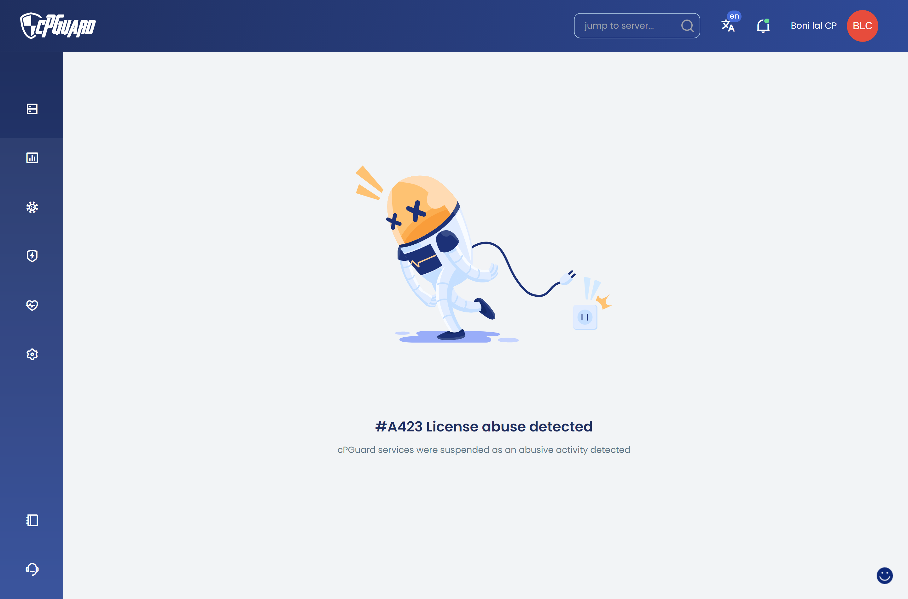

# Troubleshooting App Portal Errors

The cPGuard App Portal is a graphical user interface designed to communicate with the agent service running on your server. To display logs, update settings, or perform actions, the portal must establish a connection with the agent service on **TCP port 9098**.

For smooth operation, we expect an uninterrupted connection between the App Portal and your server. If this communication is blocked or the service is down, you may encounter the following errors.

---

## Quick Checklist (Before Anything Else)

Before troubleshooting a specific error, confirm the following:

1. Your server is online and reachable.
2. Your server firewall allows inbound access to port **9098** from the App Portal IPs.
3. Your cloud firewall (AWS / DO / Linode / Vultr / etc.) also allows port **9098** from the App Portal IPs.
4. Your license is valid and active.
5. The cPGuard agent service is running.

---

## App Portal IPs (Must Be Whitelisted)

Whitelist these IPs in your firewall(s) for TCP port `9098`:

- `137.184.200.210`
- `159.89.87.35`
- `167.99.149.179`


:::important

If you use cloud firewalls (AWS SG, DO Cloud Firewall, Linode Firewall, Vultr Firewall, Azure NSG, GCP Firewall), you must also allow these IPs there.

:::

---

## 1. Timeout Error (A-C28)

This error occurs when the App Portal attempts to connect to your server but receives no response within the expected timeframe.

**Common Causes:**

* Our App Portal IPs are not whitelisted in your server-level firewall (CSF/iptables).
* A network-level or Cloud Firewall is dropping the packets.

**How to Fix:**

1. **Whitelist IPs:** Ensure the IPs of the App Portal servers list above are whitelisted
2. **Cloud Firewalls:** If you are using AWS, Azure, GCP, DigitalOcean, or Linode, you **must** add an "Inbound Rule" in your Cloud Console to allow TCP traffic on port 9098 from the IPs above.
3. **CSF Users:** While cPGuard attempts to whitelist these during installation, you can manually verify by checking `/etc/csf/csf.allow`.

---

## 2. Connection Refused (A-C7)

A "Connection Refused" error typically means the server reached your machine, but the agent service wasn't there to answer, or the port is strictly closed.

**How to Fix:**

1. **Check License Status:** The agent service may stop if the license is invalid. Run:
```bash
cpgcli license --status
```


2. **Verify Service Status:** Ensure the cPGuard service is actually running on the server:
```bash
cpgcli cloud --status
```

---

## 3. Cannot Resolve Host (A-C6)

This error indicates a DNS failure or a routing issue where the App Portal cannot find the IP address associated with your server hostname.

**How to Fix:**

* **Check DNS:** Ensure your server's hostname is correctly pointed to your server IP.
* **Connectivity:** Verify your server is online and reachable via a standard `ping`.

---

## 4. License Abuse

This error is triggered when our system detects footprints of unauthorized or "cracked" license keys.




**How to Fix:**

* Ensure your license was purchased directly from the official cPGuard website or an authorized distributor.
* Remove any "GPL" or "Nulled" versions of plugins/software that might be interfering with the licensing system.


---
## 5. Server Not Found / No Access (404)

A 404 error indicates that the specific server resource you are trying to reach is no longer available to the App Portal.

**Common Causes:**

* **Server Deleted:** The server has been terminated or deleted from your hosting provider but still exists in your Portal list.
* **Access Revoked:** Your user account no longer has the required permissions to manage this specific server.
* **Hostname Change:** The server was re-registered under a different hostname or IP, leaving the old entry orphaned.

**How to Fix:**

* Refresh your server list in the App Portal.
* If the server has been decommissioned, please remove it from your cPGuard Dashboard to stop further monitoring attempts.

---

## 6. Port 9098 Already in Use

In rare cases, another service might be bound to port 9098, preventing the cPGuard agent from starting.

**How to Fix:**

* Run the following command to see what is using the port:
```bash
netstat -tulpn | grep 9098

```

* If another service is using it, you must stop that service or reconfigure it to use a different port.

---


:::info
If you have verified all the above steps and the error persists, please collect your agent logs and contact our support team at **support@opsshield.com**
:::
