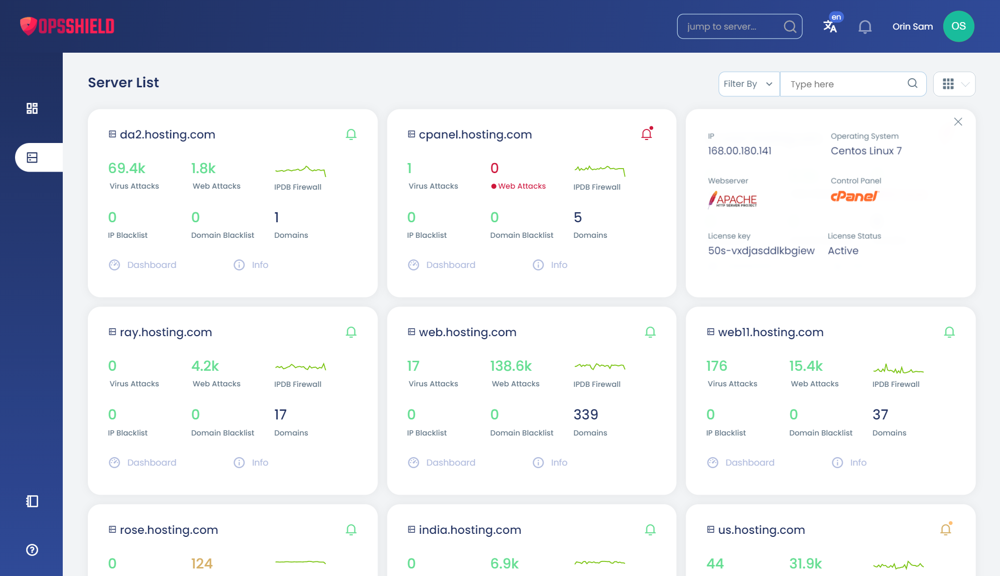
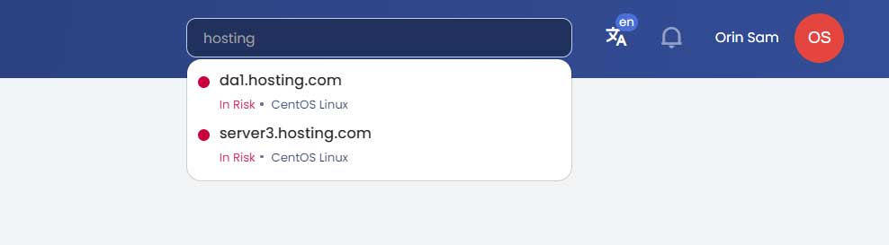

A centralised App Portal is available at [app.opsshield.com](https://app.opsshield.com) giving you a single place to view, manage, and monitor all your servers without having to log in to each server's control panel individually.

{/* comment */}

## What is the App Portal?

The App Portal is a graphical interface that communicates with the cPGuard agent service running on each of your servers. Its core purpose is to **decouple server management from individual control panels**. So whether you run one server or fifty, everything is accessible from one login.

:::tip
The App Portal works across all supported control panel types. You manage cPGuard through the portal regardless of whether your servers run cPanel, DirectAdmin, Plesk, or cPGuard X Standalone.
:::

---

## Accessing the App Portal

Visit **[https://app.opsshield.com](https://app.opsshield.com)** and log in with your OpsShield account credentials.

---

## Portal Navigation Overview

The App Portal has two distinct navigation states depending on whether you have a server open or not.

### Default View : No Server Selected

Before selecting a server, the main navigation shows two items:

| Section | Description |
|---|---|
| **Consolidated Dashboard** | An at-a-glance overview of security status across all your servers |
| **Server List** | A full list of all servers linked to your account |
| **Mass Operations** | Perform actions across multiple servers simultaneously |

### Per-Server View : After Opening a Server

Once you open a server from the server list, the navigation expands to show the full range of cPGuard features for that server

---

## Switching Between Servers

You can switch between servers at any time without returning to the server list manually.

### Quick Search (Keyboard Shortcut)

Press the **`/`** key anywhere in the portal to open the Quick Search bar. Type the server name or IP to locate and switch to it instantly, ideal when managing a large number of servers.

### Via the Navigation Menu

Alternatively, navigate back to the **Server List** from the main menu, locate the server, and open it from there.

---

## Why Use the App Portal?

| Without App Portal | With App Portal |
|---|---|
| Log in to each server's control panel separately | Single login manages all servers |
| Switch between multiple browser tabs or sessions | Switch servers instantly with Quick Search (`/`) |
| No consolidated view across servers | Unified dashboard shows all servers at a glance |
| Security logs scattered across individual panels | All logs accessible from one interface |

---

## Summary

The cPGuard App Portal at [app.opsshield.com](https://app.opsshield.com) is the recommended way to manage cPGuard across multiple servers. With a consolidated dashboard, per-server feature access, and fast server switching via Quick Search, it significantly reduces the overhead of managing security across a fleet of servers.
