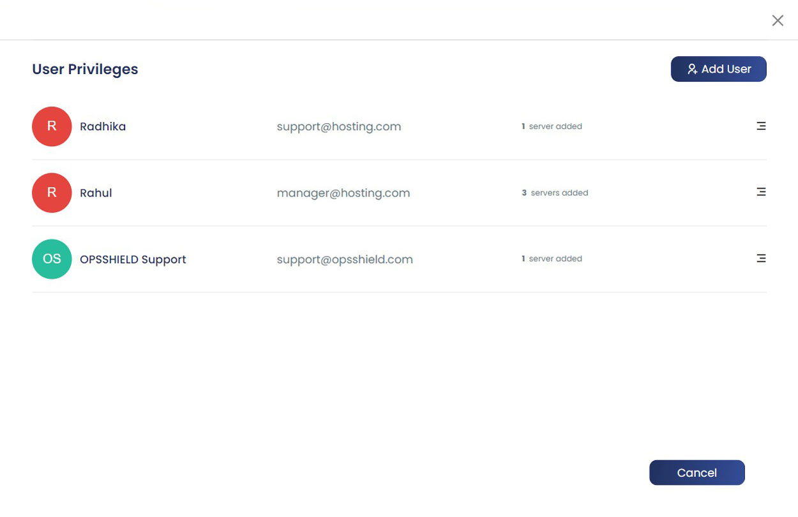
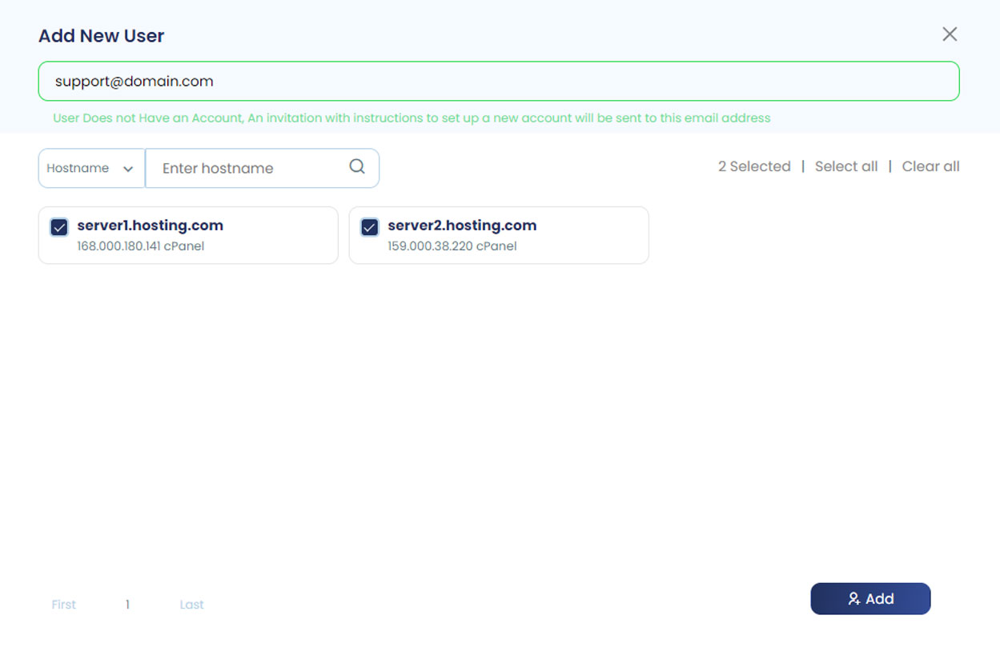
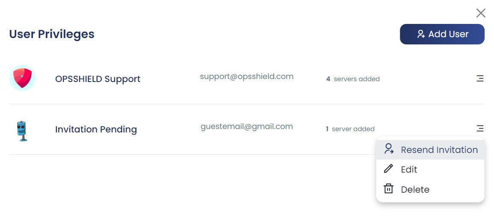

The cPGuard App Portal supports multi-user access, allowing the license owner to grant other team members access to specific servers without sharing account credentials. This makes it easy to manage access for system administrators, developers, or support staff across your server fleet.

{/* comment */}

## How User Access Works

By default, all servers are attached to the **license owner's account**. The license owner can selectively assign access to individual servers or all servers to other users who have an OpsShield account.

:::warning Access Delegation Rules
Only the **server owner (license owner)** can assign server access to others. A user who has been granted access to a server **cannot** further delegate that access to another user.
:::

---

## How to Access User Management

1. Click on your **name or profile picture** in the top-right corner of the App Portal.
2. Select **Users** from the dropdown menu.

This opens the user management section where you can add new users and manage existing ones.

---

## Adding a New User

To grant portal access to a team member:

1. Click the **Add User** button.
2. Enter a **valid email address** for the user.
3. **Select the servers** you want to grant them access to.
4. Click **Add**.

### What Happens Next

The flow differs depending on whether the user already has an OpsShield account:

| User Status | What Happens |
|---|---|
| **Existing OpsShield account** | The user receives a confirmation request and must accept it to gain access |
| **No OpsShield account** | The user receives an invitation email with a link and instructions to create a new OpsShield account |

---

## Resending an Invitation Email

If an invitation email was not received or delivered, the server owner can resend it:

1. Go to the **Users** section.
2. Locate the user in the list.
3. Click the **Resend Invitation** option next to their entry.

:::tip
If the user still does not receive the email after resending, ask them to check their spam or junk folder, or verify that the email address entered was correct.
:::

---

## Managing Existing User Access

After a user has been added, you can modify their access at any time from the **User Privileges** page. Available actions include:

| Action | Description |
|---|---|
| **Modify server access** | Add or remove which servers the user can see and manage |
| **Suspend access** | Temporarily revoke access without deleting the user |
| **Delete access** | Permanently remove the user's access to your servers |

---

## User Access — Summary of Rules

| Rule | Detail |
|---|---|
| **Who can add users?** | License owner only |
| **Who can users access?** | Only servers the license owner has explicitly assigned to them |
| **Can users share access?** | No — access delegation is not permitted |
| **Can access be modified?** | Yes — add/remove servers, suspend, or delete at any time |
| **What account does the user need?** | A valid OpsShield account (can be created via invitation) |

---

## Summary

The user management feature in the cPGuard App Portal provides a secure way to give team members access to specific servers without exposing your primary account credentials. Access is fully controlled by the license owner and can be adjusted, suspended, or revoked at any time from the User Privileges page.

