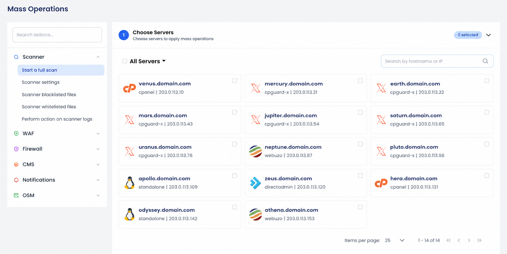
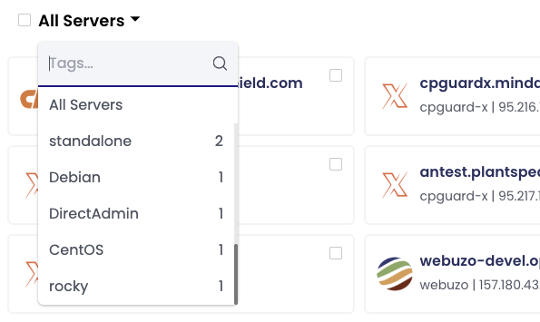
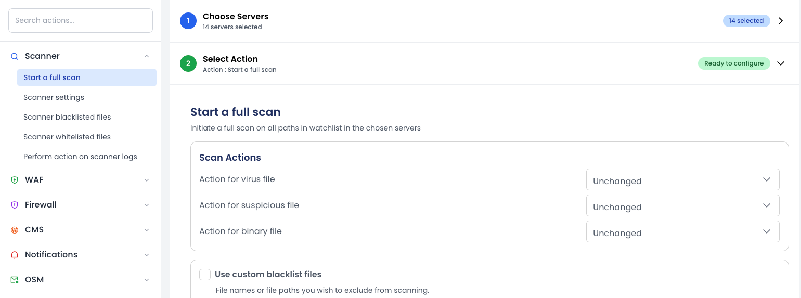

# Mass Operations

The **Mass Operations** feature in the cPGuard App Portal allows you to perform actions across multiple servers from a single interface. This helps administrators manage large server environments more efficiently without repeating the same task on each server individually.

Mass Operations is useful for applying security changes, configuration updates, firewall actions, and other administrative tasks consistently across your infrastructure.

---

## Why Use Mass Operations?

Managing servers one by one becomes time-consuming as your infrastructure grows. Mass Operations helps you:

- Apply actions across multiple servers simultaneously
- Maintain consistent security and configuration policies
- Respond quickly to security incidents
- Reduce manual repetitive work
- Manage production, staging, or testing environments more efficiently

---

## Accessing Mass Operations

Mass Operations is available from the **overall server view** in the App Portal.

1. Open the cPGuard App Portal
2. Go to the main sidebar
3. Click **Mass Operations**

---

## Using Mass Operations

### 1. Select Servers

Choose the servers where you want to apply the action.

You can:

- Select individual servers
- Select all servers
- Search servers by hostname or IP address
- Filter servers using tags

### Filter Servers Using Tags

If you manage many servers, tags make it easier to quickly target a specific group. Click the **"All Servers"** dropdown above the server list to filter servers by tag.

Examples:

- Production
- Testing
- Region-specific groups
- Customer groups

:::tip
Filtering by tags helps reduce mistakes and makes bulk operations faster and more organized. Learn more in the [Tagging Servers](/app-portal/tagging-servers) documentation.
:::

---

### 2. Choose an Action

After selecting servers, choose the operation you want to perform from the left-side action menu.

Available actions may vary depending on enabled cPGuard features and installed modules.

Examples include:

- Start a malware scan
- Block an IP address
- Allow or deny a country
- Update firewall settings
- Manage scanner configurations
- Perform actions on logs

---

### 3. Provide Required Information

Some actions require additional input before execution.

Examples:

- IP address to block or whitelist
- Country code or country name
- Scan configuration values
- Firewall rule parameters

Carefully review the entered values before applying the action.

---

### 4. Apply the Operation

Click **Apply** to start the operation on all selected servers.

The App Portal will:

- Send the request to each selected server
- Display execution progress
- Show successful and failed operations
- Provide a final execution summary

This allows you to monitor the operation in real time and identify any servers that require attention.

---

## Common Use Cases

### Security Response

- Block a malicious IP address across all production servers
- Disable access from specific countries during an attack
- Apply emergency firewall rules

### Server Administration

- Run malware scans across all servers
- Update scanner or firewall configurations
- Apply policy changes to staging or development servers

### Environment Management

- Perform changes only on tagged servers
- Apply updates to regional server groups
- Manage test environments separately from production

---

## Best Practices

- Use tags to organize servers before performing bulk operations
- Review selected servers carefully before applying changes
- Start with a small server group when testing new configurations
- Monitor the execution report after applying actions
- Avoid running large operations during peak traffic hours when possible

