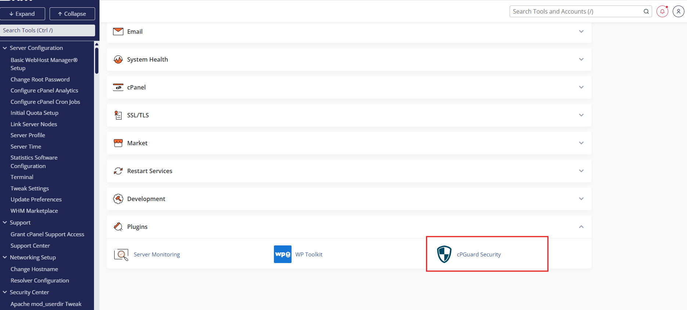
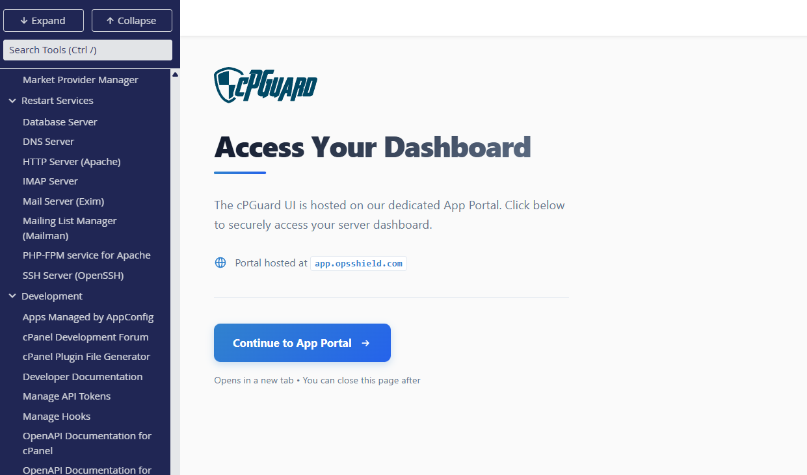
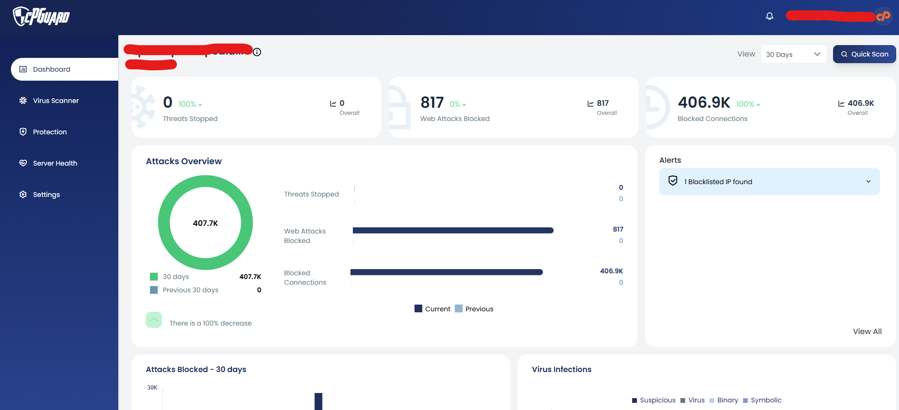
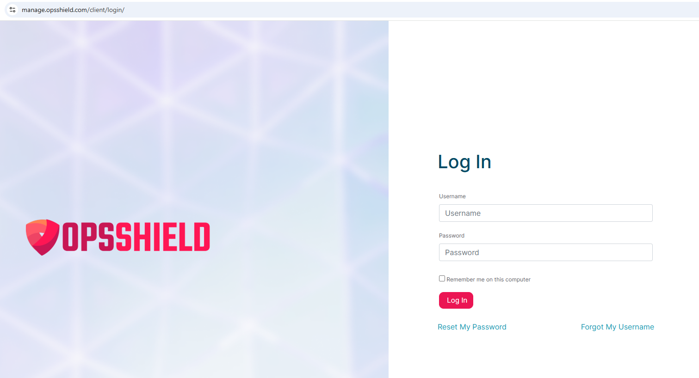

# Single Sign-On from control panels

Managing server security shouldn't mean juggling multiple sets of credentials. The **Single Sign-On (SSO)** feature in the cPGuard Admin Plugin lets administrators jump straight into the cPGuard interface from their hosting control panel. No separate login required.

{/* comment */}

## What Is SSO in cPGuard?

SSO allows a trusted control panel session to authenticate into cPGuard automatically. When an administrator clicks the cPGuard option inside their hosting control panel, they are logged in seamlessly without entering a username or password again.

Authentication is validated at the server level and fully respects the permission boundaries of the control panel.

---

## Supported Control Panels

The SSO feature in the cPGuard Admin Plugin is available on the following hosting control panels:

- **cPanel / WHM**
- **DirectAdmin**
- **Webuzo**

---

## Controlling SSO via CLI

SSO is managed through the cPGuard command-line interface (CLI). You can enable or disable it with a single command.

### Enable SSO

```bash
cpgcli panel-integration --admin-sso enable
```

### Disable SSO

```bash
cpgcli panel-integration --admin-sso disable
```

---

## How SSO Works When Enabled

Here's the step-by-step flow when SSO is active:

1. The admin or client **logs in to their hosting control panel** (cPanel, DirectAdmin, or Webuzo).
2. They click the **cPGuard Security** option inside the control panel.


3. They are redirected to a page with a **"Continue to App Portal"** button.


4. After clicking it, a brief **"Please wait, redirecting to cPGuard…"** screen is shown.


5. The user is **automatically logged in** to the cPGuard App Portal. No username or password needed and Authentication is handled entirely via the existing control panel session.




:::tip
SSO makes it particularly convenient for administrators who are already logged into their control panel and need to quickly check or configure cPGuard security settings.
:::

---

## Access Scope Under SSO

SSO access is intentionally **scoped and restricted** for security:

| Access Aspect | Behaviour |
|---|---|
| Server access | Only the server the user came from |
| Global server list | Not visible |
| Other servers | Cannot be viewed or managed |
| Authentication required | None. Session is inherited |

This restricted scope makes SSO safe for client-level usage while keeping the experience seamless.




---

## How It Works When SSO Is Disabled

When SSO is disabled, the flow is slightly different:

1. The user clicks **cPGuard Security** in their control panel.
2. They are redirected to the **"Continue to App Portal"** page.
3. After clicking, they are taken to the cPGuard App Portal login screen.
4. They must manually enter their **App Portal username and password** to proceed.

:::note
Disabling SSO does not affect cPGuard's functionality — it only requires users to authenticate manually with their App Portal credentials instead of using the control panel session.
:::

---

## SSO vs Manual Login — Quick Comparison

| Feature | SSO Enabled | SSO Disabled |
|---|---|---|
| Login required | <span style={{color: 'red', fontWeight: 'bold'}}>No</span> | <span style={{color: 'green', fontWeight: 'bold'}}>Yes</span> |
| Authentication source | Control panel session | App Portal credentials |
| Access scope | Current server only | Based on account permissions |
| Best for | Admins & clients needing quick access | Environments requiring stricter auth control |

---

## Summary

SSO in cPGuard streamlines access by removing the need for separate credentials when navigating from a trusted control panel session. It can be toggled on or off at any time using the CLI, giving administrators full flexibility over their authentication setup.

---