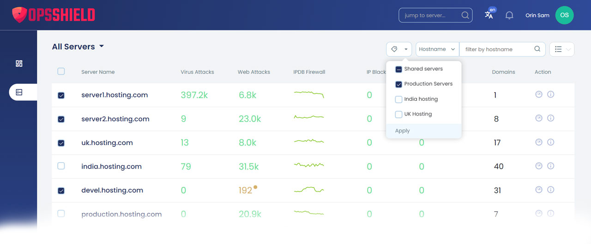
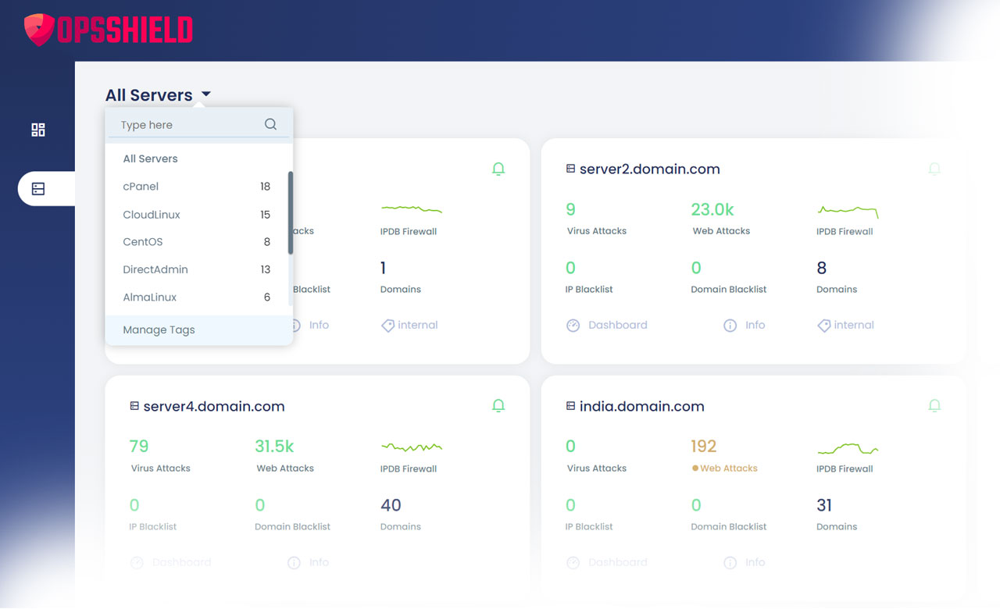
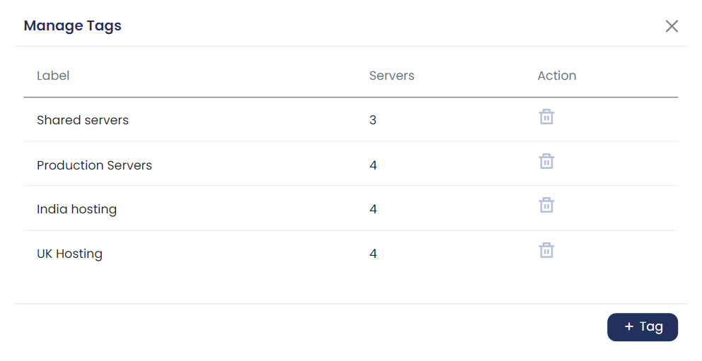

# How to Tag and Organize Servers

When you're managing a large fleet of servers, finding the right one quickly can become a challenge. **cPGuard's tagging feature** lets you group servers using custom labels, making it easy to classify, filter, and access them based on any criteria you choose.

{/* comment */}

## What Are Tags?

Tags are simple labels you assign to one or more servers to organize them into logical groups. They are the quickest way to bring structure to your server list — whether you're managing a handful of machines or hundreds across different environments and clients.

---

## Assigning Tags to Servers

To assign tags manually:

1. Go to the **Server List** page in the cPGuard App Portal.
2. Switch to **List View** (the default is grid view) — you need list view to select multiple servers.
3. Select the servers you want to tag.
4. Open the **Tags dropdown** (located next to the filter element) and choose one or more tags to apply.

:::note
You must **create a tag first** via the Manage option before you can assign it to any server.
:::

---

## Automatic Tagging

cPGuard also tags servers **automatically** based on the operating system and control panel detected on each machine. These system-generated tags are dynamically populated and cannot be manually edited or assigned. You can still use them to filter your server list just like any custom tag.

---

## Filtering Servers by Tag

Once your servers are tagged, filtering is fast:

1. On the **Server List** page, click the **title/tag section** at the top.
2. A list of all available tags will appear, along with the count of servers under each tag.
3. Click any tag to instantly view only the servers assigned to it.

This makes it trivial to, for example, pull up all production servers or all servers in a specific region with a single click.

---

## Managing Tags

To create or delete tags:

1. Click the **Manage** option in the tags area.
2. A modal window will appear where you can:
   - **Create** new tags
   - **Delete** existing tags

Keep your tag list clean and purposeful — removing unused tags helps avoid clutter as your server count grows.

---

## Planning Your Tagging Strategy

Before assigning tags to all your servers, it's worth taking a moment to plan. A well-thought-out tagging structure saves time and prevents confusion down the line, especially when managing servers for multiple clients or teams.

Here are some common tagging approaches:

| Category | Example Tags |
|---|---|
| Environment | `production`, `staging`, `development` |
| Region | `us-east`, `eu-west`, `ap-southeast` |
| Server type | `dedicated`, `shared`, `VPS` |
| Application | `wordpress`, `magento`, `custom-app` |
| Owner | `client-a`, `client-b`, `internal` |

You can also assign **multiple tags** to a single server if it fits more than one category — for example, a server could be tagged both `production` and `eu-west`.

---

## Summary

| Action | How To |
|---|---|
| Assign tags | Server List (List View) → Select servers → Tags dropdown |
| Create / delete tags | Tags area → Manage option |
| Filter by tag | Server List → Click tag title → Select tag |
| Automatic tags | Applied by system based on OS and control panel |

---

