The Laravel Application feature enables users to quickly create and deploy Laravel applications with a streamlined installation process.

Laravel applications can be installed in two ways:

- **Website Management → Tools → Applications**, where users can deploy a Laravel application to an existing website. 

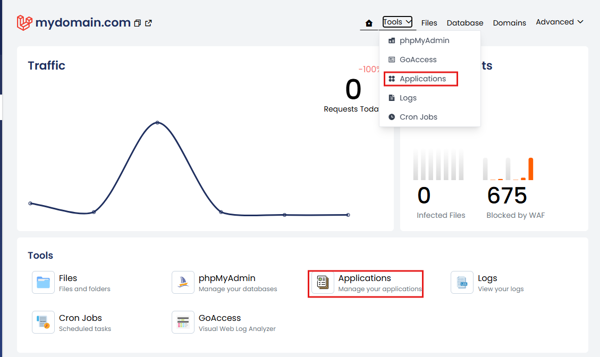

- **During new website creation**, by selecting Laravel as the application type, allowing the application to be deployed automatically as part of the website setup.

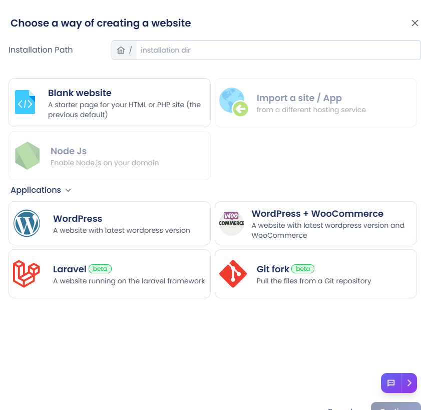

## Installing a Laravel Application

This section explains how to install a Laravel application using the Applications feature.

1. Navigate to **Website Management**, select the desired website, open **Tools**, click **Applications**, and then click **+ Add Application** to create a new application.

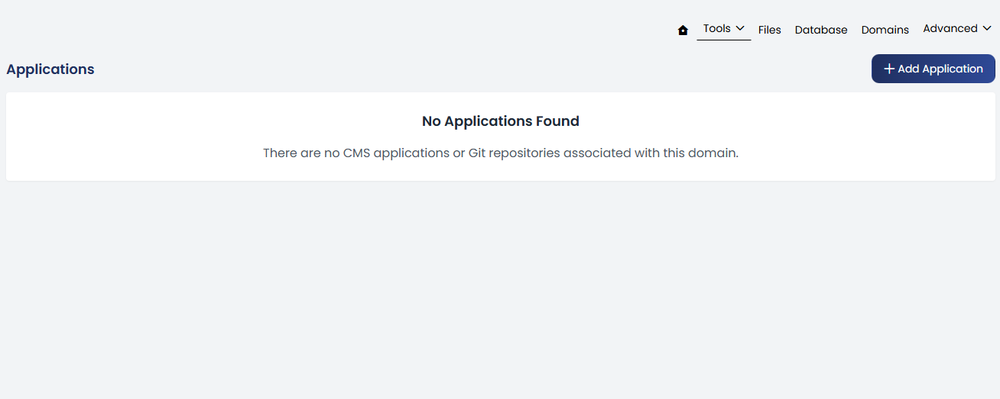

2. From the list of available application types, select **Laravel **. Specify the **Installation Directory** where you want the Laravel application to be deployed and and click **Continue**.

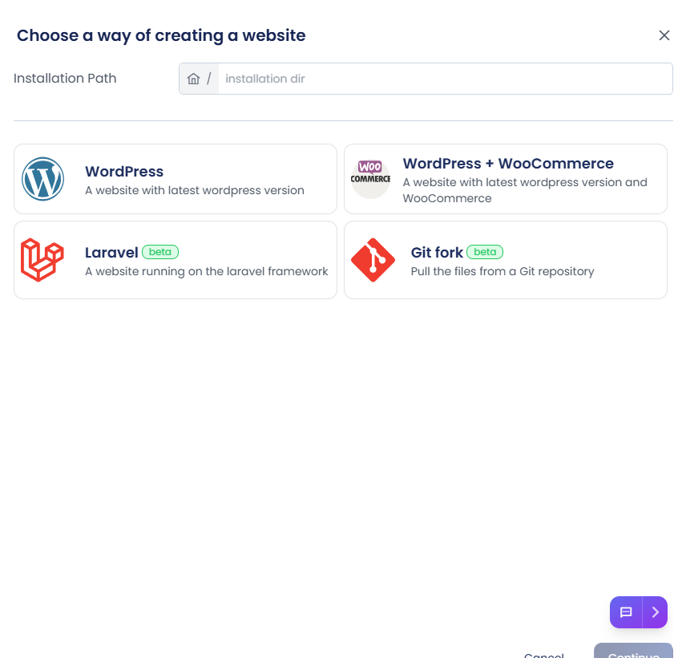

3. To accommodate different development workflows and project requirements, the platform offers multiple installation methods. Users can choose the option that best fits their deployment strategy.

   a. **PHP Composer** – Install a fresh Laravel application using Composer.

   b. **Laravel Git** – Clone and deploy an existing Laravel application from a Git repository, with Laravel-specific deployment options.

   c. **Git Repository** – Deploy an application from a standard Git repository, providing flexibility for custom project structures.

Choose the option that best suits your project requirements:

  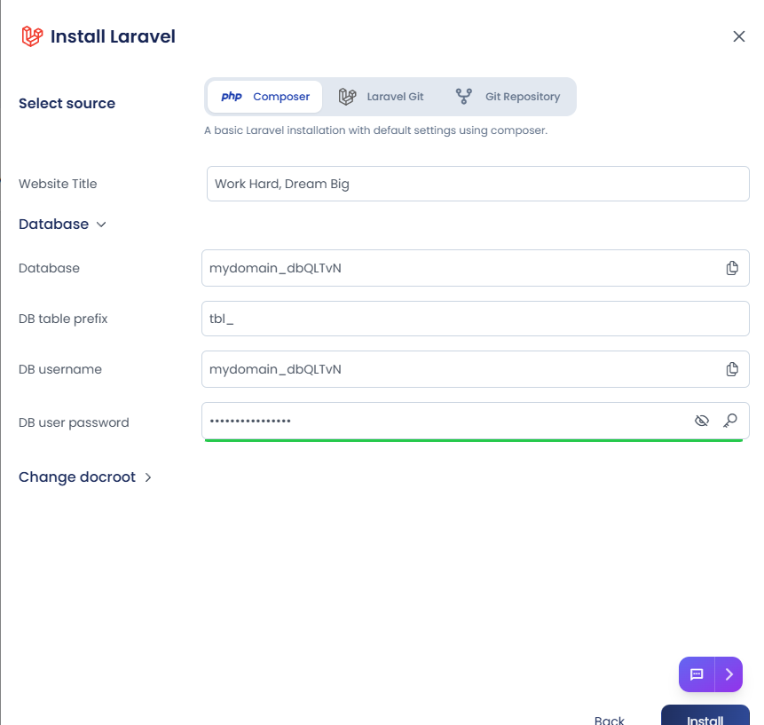

---
  ### PHP Composer
The **PHP Composer** installation method deploys a fresh Laravel application by downloading the latest Laravel framework and its dependencies using Composer. This method creates the default Laravel project structure and automatically configures the application for deployment.

1. From the **Installation Source** list, select **PHP Composer**.

2. Configure the application by providing the following details:

   - **Website Title** – Enter a title for your Laravel application.
   - **Database** – Enter the name of the database to be created.
   - **Database Table Prefix** *(Optional)* – Specify a table prefix if required.
   - **Database Username** – Enter the database username.
   - **Database User Password** – Enter a password for the database user.
   - **Document Root (DocRoot)** – By default, this is set to `/home/<domain>/laravel/public`.
   - **Select Domain** – Select the domain or subdomain on which the Laravel application will be deployed.

   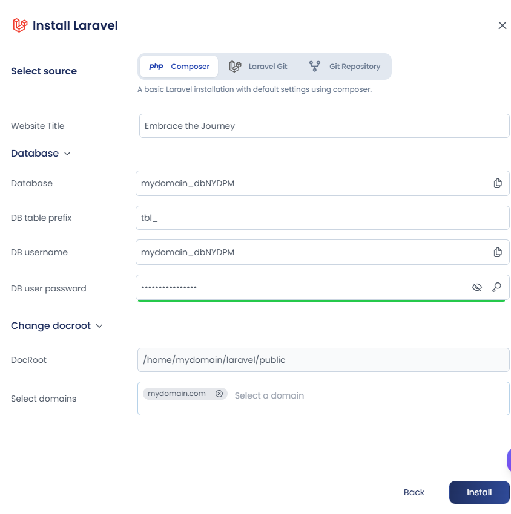

3. Review the configuration and click **Install** to begin the installation.

   The installation progress is displayed in real time. Once the installation completes successfully, an **Installation Completed** message is displayed, and you are redirected to the **Applications** page.

   If the installation fails, the progress window displays the step at which the failure occurred along with the corresponding error message to assist with troubleshooting.

   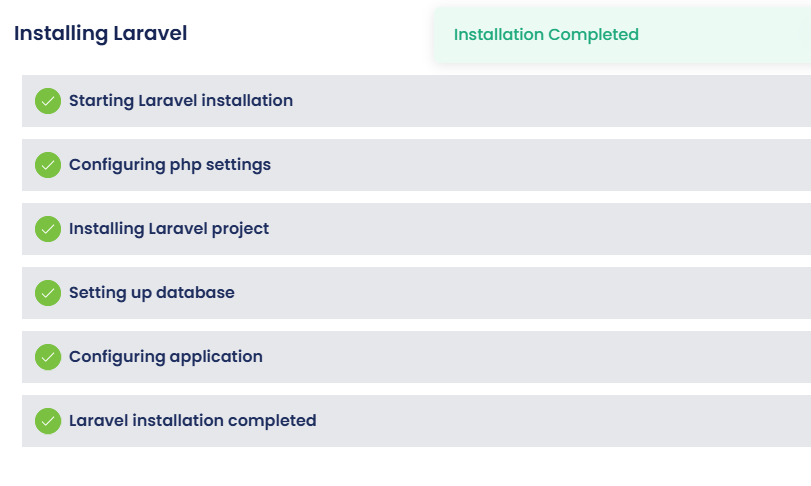

During the installation, the system automatically performs the following tasks:

- Downloads the latest Laravel framework using Composer.
- Installs all required PHP dependencies.
- Creates the standard Laravel project directory structure.
- Creates and configures the specified database and database user.
- Configures the application's document root to point to the Laravel `public` directory.
- Completes the initial Laravel setup, making the application ready for development or deployment.

After the installation is complete, the Laravel application is accessible through the selected domain.

To manage the application, navigate to the **Applications** page and click **Manage**. From there, you can:

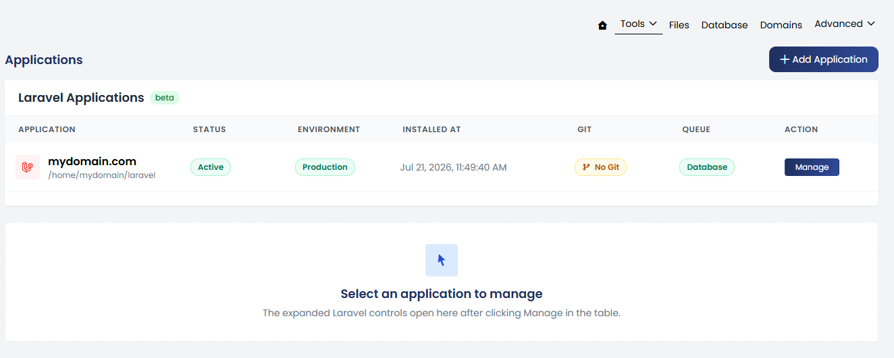

- View application details.
- Update the application configuration.
- Monitor the application's status.
- Manage the application's deployment.
  
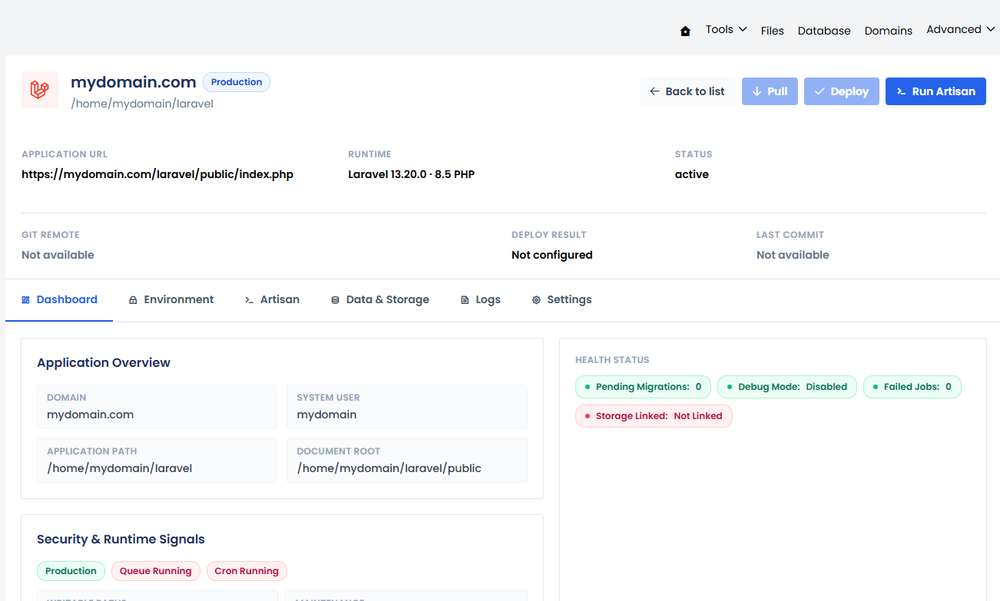

  ### Laravel Git 

The Laravel Git installation method deploys a fresh Laravel application by cloning the selected version of the Laravel framework directly from the official Laravel Git repository. This method provides the standard Laravel project structure while allowing you to choose the framework version and optionally perform post-installation tasks.

1. From the **Installation Source** list, select **Laravel Git**.
2. Configure the application by providing the following details:
   - **Choose Version** – Select the Laravel framework version to install. From the version drop-down, you can select the desired Laravel version to be deployed.
   - **Run Laravel Migrations** *(Optional)* – Enable this option to automatically execute the default Laravel database migrations after the installation is complete.
   - **Run Composer Install** *(Optional)* – Enable this option to automatically install all required PHP dependencies defined in the project's `composer.json` file.
3. Configure the database settings:
   - **Database** – Enter the name of the database to be created for the application.
   - **Database Table Prefix** – *(Optional)* Specify a table prefix if required.
   - **Database Username** – Enter the database username.
   - **Database User Password** – Enter the password for the database user.
4. Under **Change DocRoot**, verify the Document Root (DocRoot).
5. From **Select Domains**, choose the domain or subdomain on which the Laravel application will be deployed.
6. Review the configuration and click **Install** to begin the installation.

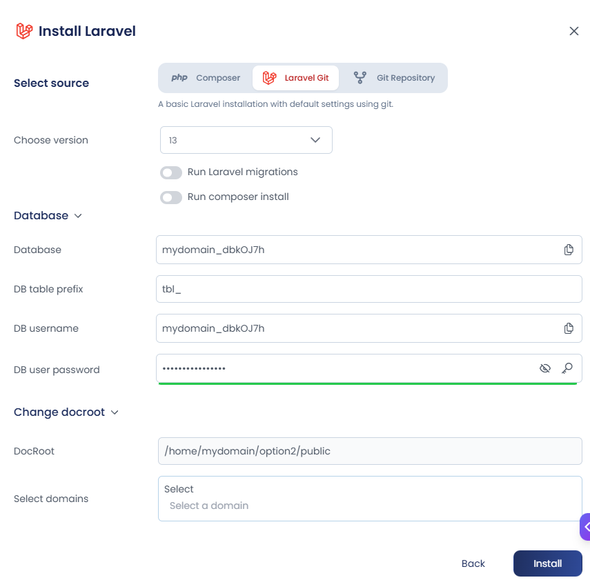

During the installation, the system automatically performs the following tasks:

- Clones the selected Laravel version from the official Laravel Git repository.
- Creates the standard Laravel project directory structure.
- Automatically creates and configures the specified database and database user.
- Executes Laravel database migrations if **Run Laravel Migrations** is enabled.
- Installs all required Composer dependencies if **Run Composer Install** is enabled.
- Configures the application document root to the Laravel public directory.

Once the installation is complete, the Laravel application will be accessible through the selected domain. You can then manage the application by clicking Manage from the Applications page, where you can view application details and perform management tasks such as updating the configuration, monitoring the application, and managing its deployment.

### Git Repository 

The Git Repository installation method allows users to deploy a Laravel application from an existing Git repository. This option provides flexibility to install custom Laravel projects or applications maintained in a private or public Git repository.

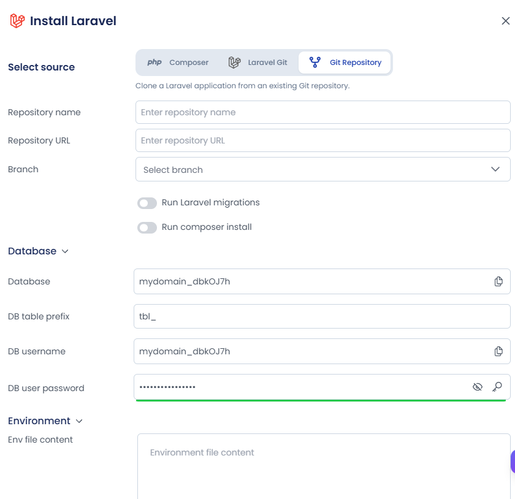
1. From the **Installation Source** list, select **Git Repository**.
2. Configure the repository details:
   - **Repository Name** – Enter a name to identify the Git repository.
   - **Repository URL** – Enter the URL of the Git repository from which the Laravel application will be cloned.
   - **Branch** – Select the Git branch that should be deployed. This allows you to install a specific version or development branch of the application.
3. Configure additional Laravel deployment options:
   - **Run Laravel Migrations** *(Optional)* – Enable this option to automatically execute Laravel database migrations after the application is deployed.
   - **Run Composer Install** *(Optional)* – Enable this option to install all required PHP dependencies defined in the application's `composer.json` file.
4. Configure the database settings:
   - **Database** – Enter the name of the database to be created for the application.
   - **Database Table Prefix** – *(Optional)* Specify a table prefix if required.
   - **Database Username** – Enter the database username.
   - **Database User Password** – Enter the password for the database user.
5. Configure the application environment:
   - **Environment File Content** – Add the required Laravel environment configuration (`.env`) content for the application.
   - You can either manually enter the environment variables, upload an existing environment file, or use the **Sample .env** option as a reference.

   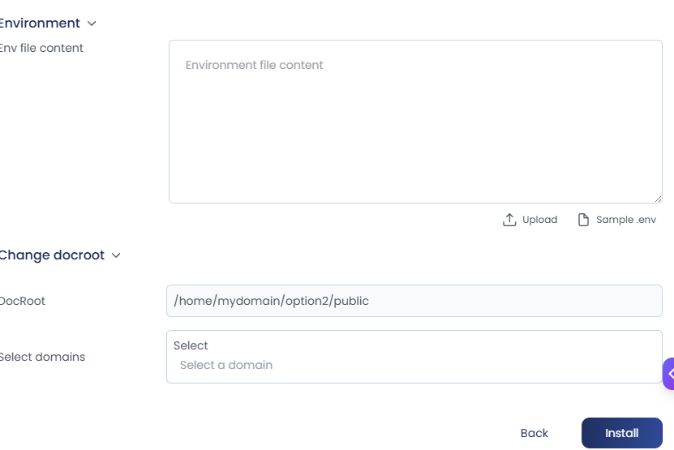

6. Under **Change DocRoot**, verify the Document Root (DocRoot).
7. From **Select Domains**, choose the domain or subdomain on which the Laravel application will be deployed.
8. Review the configuration and click **Install** to begin the installation.

During the installation, the system automatically performs the following tasks:

- Clones the Laravel application from the specified Git repository.
- Checks out the selected branch.
- Creates the required Laravel application structure.
- Automatically creates and configures the specified database and database user.
- Applies the provided environment configuration.
- Executes Laravel migrations if **Run Laravel Migrations** is enabled.
- Installs required Composer dependencies if **Run Composer Install** is enabled.
- Configures the application document root to the Laravel public directory.

## Managing a Laravel Application

After the Laravel application is installed, click **Manage** from the Applications page to access the Laravel application management interface. The management page provides tools to monitor, configure, deploy, and maintain the Laravel application.

The top section displays key application information, including:

- **Application URL** – The URL where the Laravel application is accessible.
- **Runtime** – Displays the Laravel version and configured PHP version.
- **Status** – Shows the current application status.
- **Git Remote** – Displays the configured Git repository information, if available.
- **Deploy Result** – Shows the latest deployment status.
- **Last Commit** – Displays the details of the latest deployed Git commit.

The application management page also provides quick actions:

- **Pull** – Fetches the latest changes from the configured Git repository.
- **Deploy** – Deploys the latest application changes based on the configured deployment settings.
- **Run Artisan** – Provides quick access to execute Laravel Artisan commands.

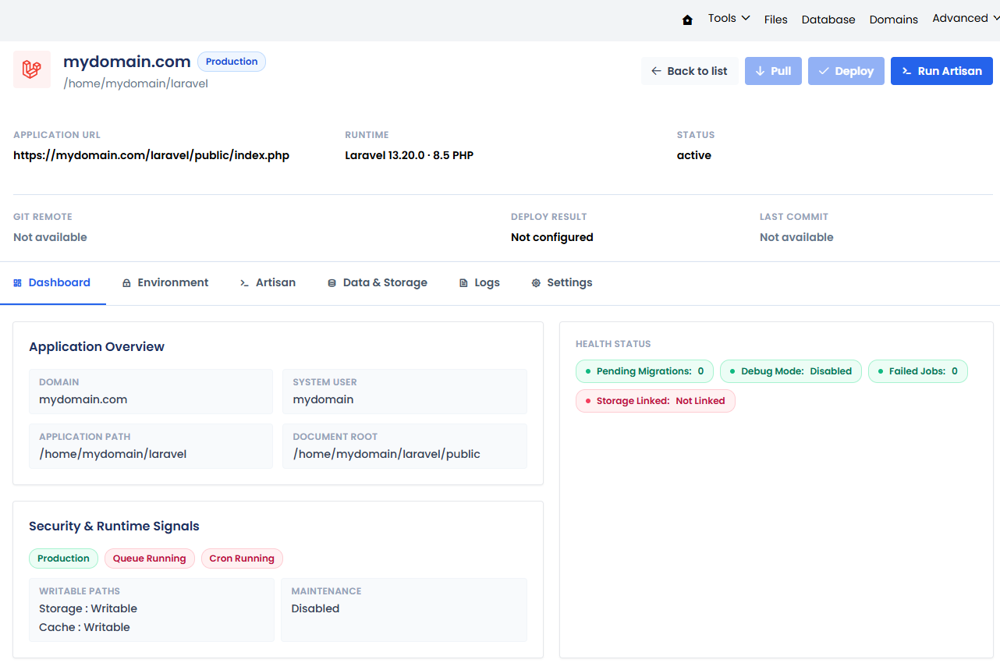

The following sections are available for managing the Laravel application:

### Dashboard

The Dashboard provides an overview of the Laravel application, including:

- Application domain and system user.
- Application path and document root.
- Application health status, including:
  - Pending migrations.
  - Debug mode status.
  - Failed jobs.
  - Storage link status.
- Security and runtime information, including:
  - Application environment.
  - Queue status.
  - Cron status.
  - Writable storage and cache paths.
  - Maintenance mode status.

### Environment

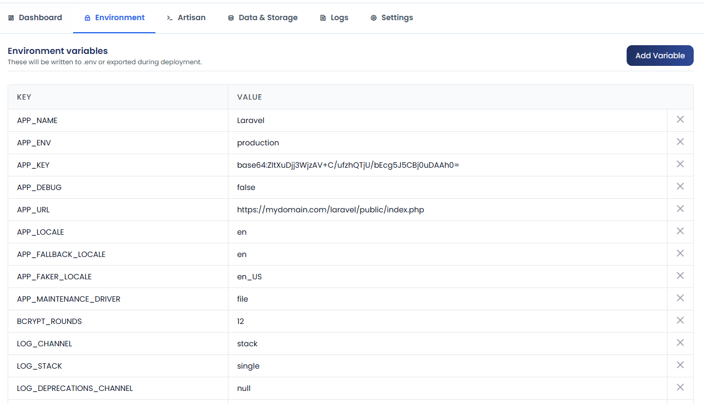

The Environment tab allows you to manage the application's environment variables. You can add, edit, or remove variables that are stored in the application's `.env` file.

### Artisan

The Artisan tab provides an interface to execute Laravel Artisan commands directly from the panel. It allows you to run custom commands and provides quick actions for common Laravel operations such as:

- Clearing application cache.
- Clearing configuration cache.
- Optimizing the application.
- Checking migration status.
- Viewing scheduled tasks.
- Managing failed jobs.

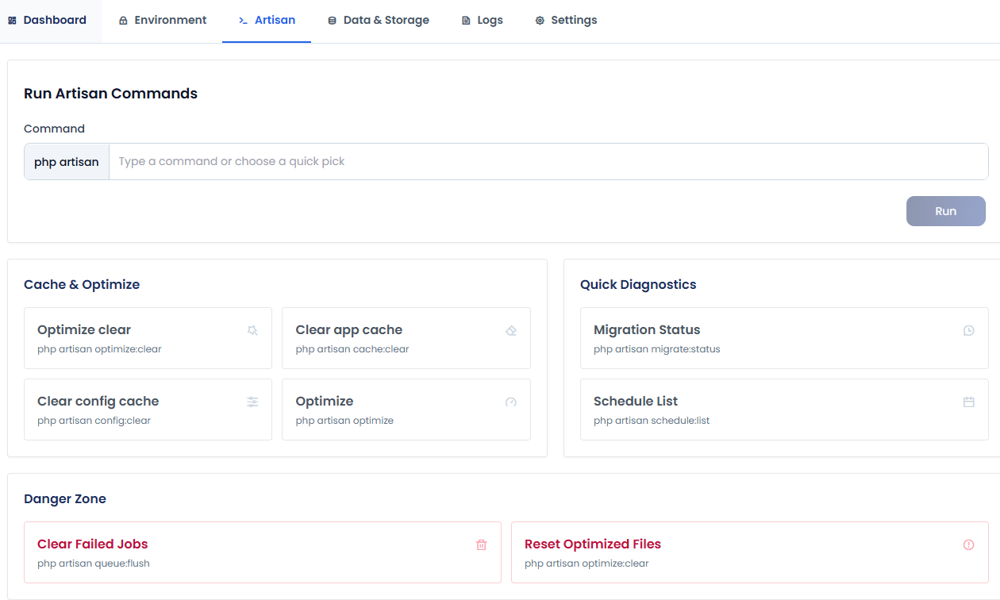

### Data & Storage

The Data & Storage tab provides database and storage management options, including:

- Viewing database connection details.
- Checking migration status.
- Running Laravel migrations.
- Verifying storage and cache permissions.
- Creating the public storage link.

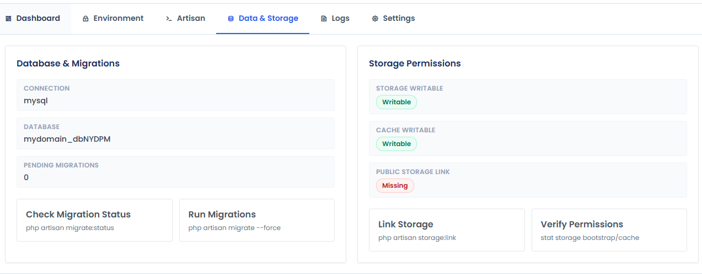

### Logs

The Logs tab allows you to review recent Laravel application events and filter logs based on severity for easier troubleshooting.

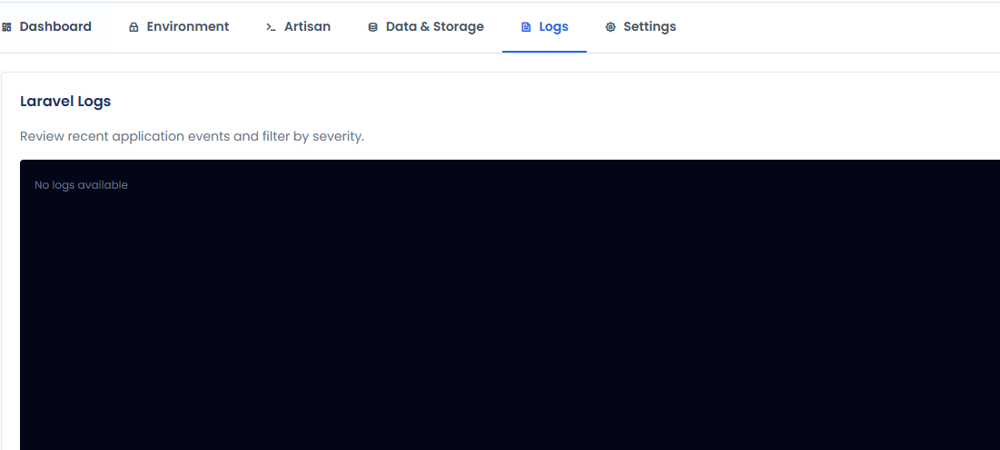

### Settings

The Settings tab provides application configuration and maintenance options, including:

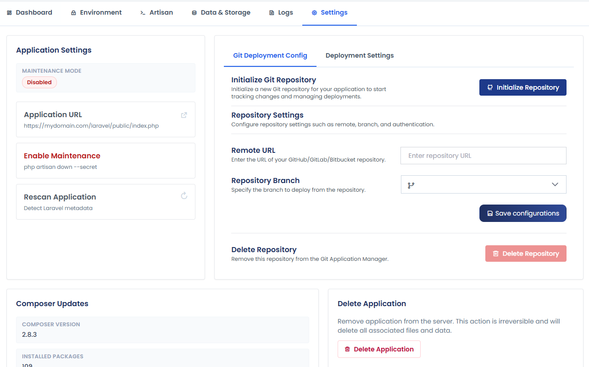

- Enabling or disabling maintenance mode.
- Viewing the application URL.
- Rescanning the application to detect Laravel metadata.
- Managing Git deployment configuration:
  - Initializing a Git repository.
  - Configuring remote repository URL.
  - Selecting the deployment branch.
  - Managing repository settings.
- Managing Composer dependencies:

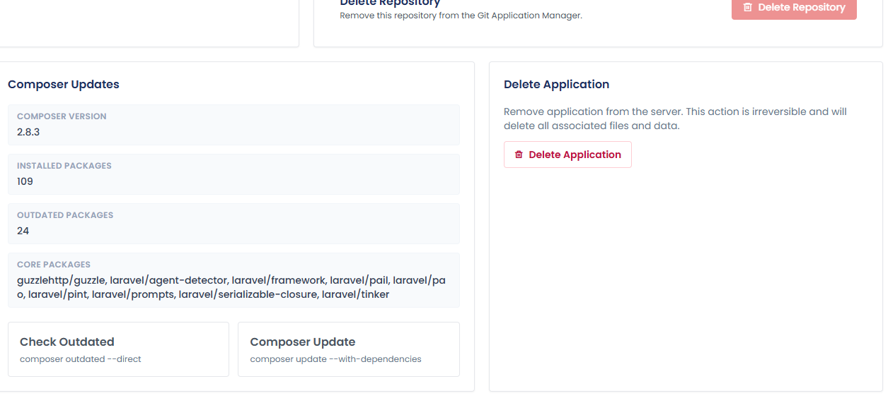

  - Viewing Composer version.
  - Checking installed packages.
  - Checking outdated packages.
  - Updating Composer dependencies.
- Deleting the Laravel application from the server.
