# Deploy a Website with Node.js

cPGuardX provides built-in support for deploying and managing Node.js applications directly from the control panel. Users can enable Node.js for a domain and deploy applications without manually configuring the Node.js runtime, process manager, or reverse proxy.

## Deployment Methods

Node.js applications can be deployed in two ways:

| Method | Description |
|---|---|
| **During new website creation** | Select **Node.js (Beta)** as the application type and deploy the application as part of the website setup. |
| **For an existing website** | Go to **Website Management → Tools → Applications** and deploy a Node.js application to the website. |

---

## Deploying a Node.js Application

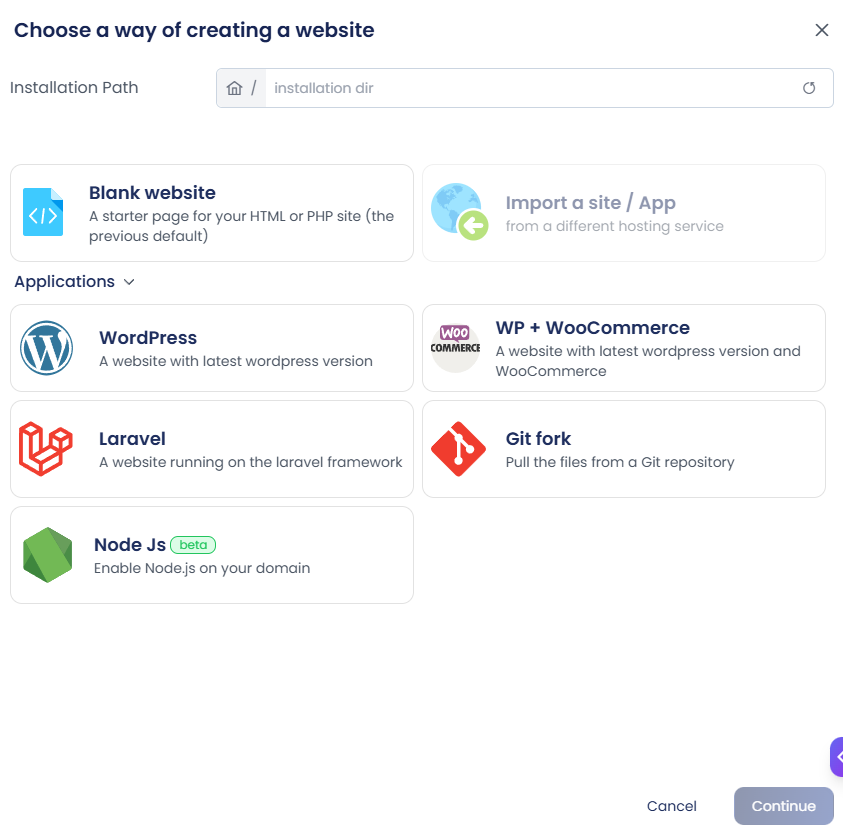

When creating a new website, select **Node.js (Beta)** as the application type and continue with the website setup. You can then choose the application source:

1. [**Starter App**](./node-install#1-deploying-from-a-starter-app) – Create a new cPGuardX-managed Node.js application.
2. [**Git Repository**](./node-install#2-deploying-from-a-git-repository) – Deploy an application from a remote Git repository.

### 1. Deploying from a Starter App

Select **Starter App** to create a new Node.js application managed by cPGuardX, then configure the following options.

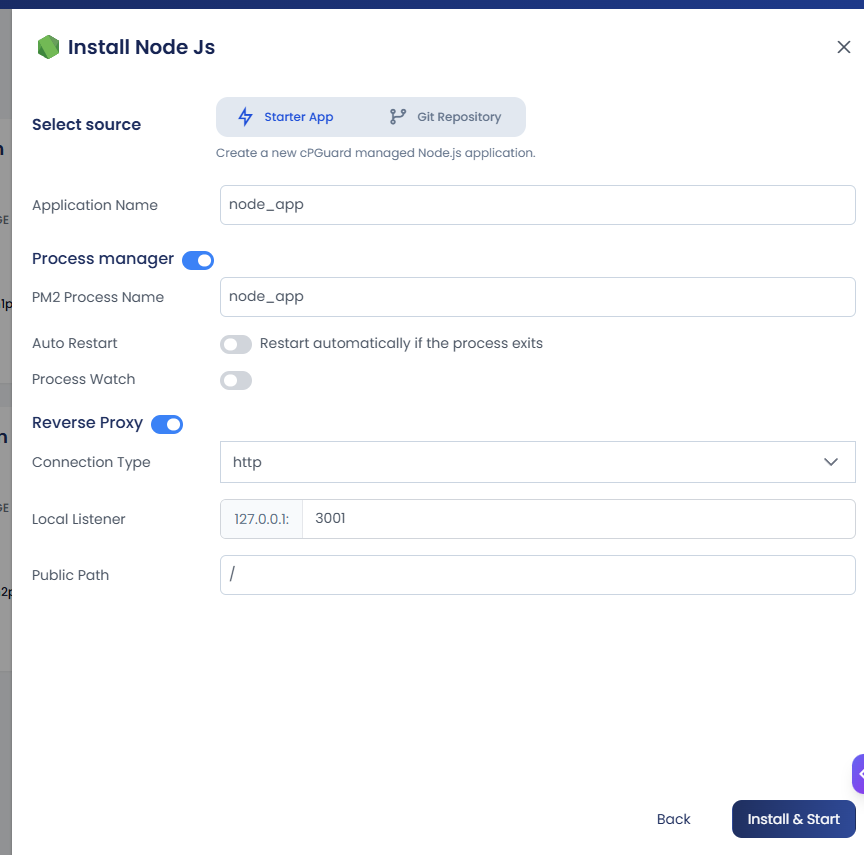

:::note
      The details for **Application name**, [**Process Manager**](../operations/process-manager.md), and [**Reverse proxy rules**](../website-management/reverse-proxy.md) are filled in automatically. If you want to change any of them, you can edit the values. Otherwise, click **Install and Start**.
      :::

cPGuardX displays the deployment progress while the application is being installed. Once the process is complete, a confirmation message is displayed and the application is added to the list of deployed applications.

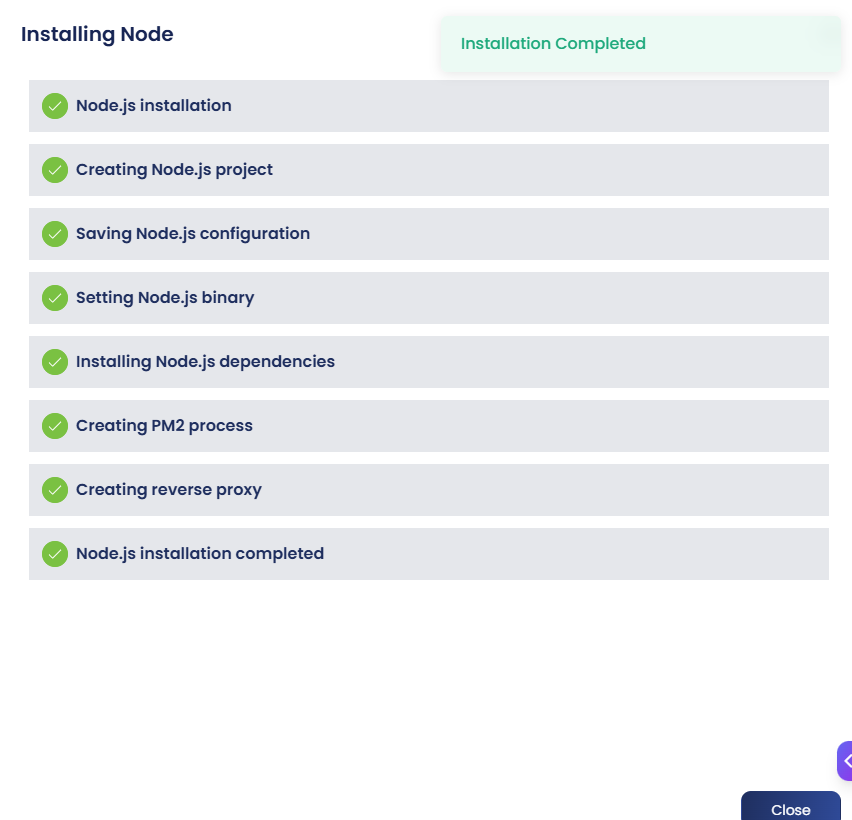

### 2. Deploying from a Git Repository

When creating a Node.js application, select **Git Repository** as the application source and configure the following.

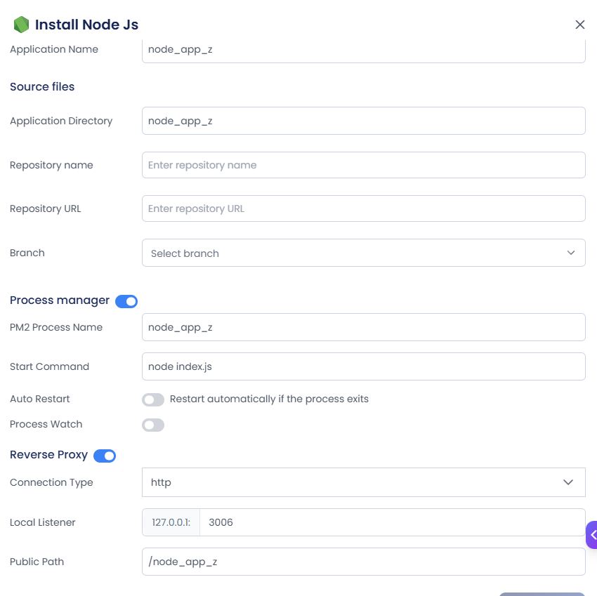

Enter the repository details:

* **Repository Name** – The name of the repository.
* **Repository URL** – The remote URL of the Git repository.
* **Branch** – Select the branch to deploy from the drop-down list.
* **Start Command** – The command used to start the application. It is detected automatically from the application's entry file and loaded into the field, for example `node index.js`, `node app.js`, or `node server.js`, depending on how the application is set up.

After entering the repository details, click **Install and Start**.

Once the process is complete, a confirmation message is displayed and the application is added to the **Applications** list.

## Managing a Node.js Application

After deployment, installed applications are listed under the **Applications** section. Click **Manage** next to an application to open its management interface.

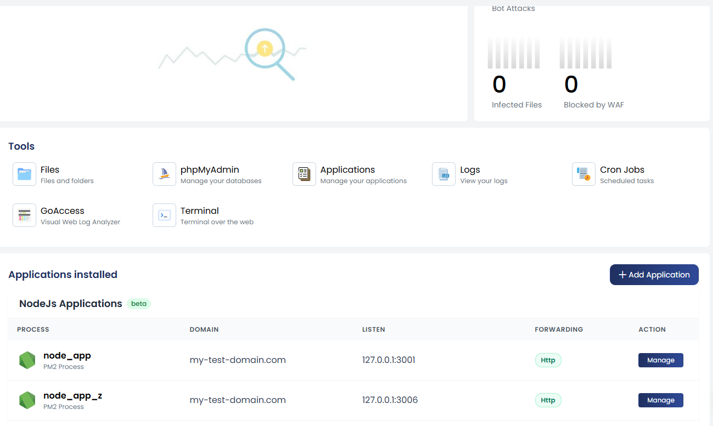

The **Manage** page displays a summary of the deployed Node.js application, including:

* **Application Path** – The filesystem path where the Node.js application is located.
* **Runtime Stack** – The Node.js and NPM versions used by the application.
* **Git Repository** – Shows whether the application is connected to a Git repository.


The following action buttons are also available at the top of the page:

* **Deploy** – Deploys the application using the saved deployment configuration.
* **Terminal** – Opens a terminal so you can access the application's directory and run commands directly from the control panel.

:::note
      The **Deploy** button on the application's management page works only after the deployment configuration has been set up and saved.
      :::


The **Git Repository** field displays different values depending on how the application was deployed:

* **Starter App** – The field displays **Not connected**.
* **Git Repository** – The field displays the connected repository URL.

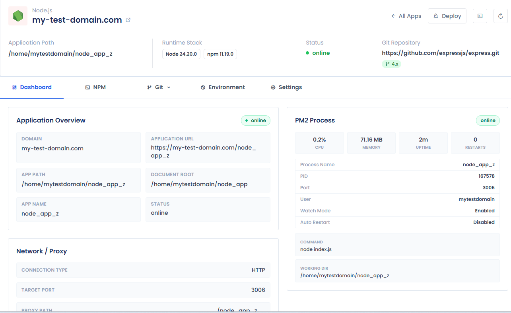

The management interface provides the following sections:

| Section | Description |
|---|---|
| **Dashboard** | Runtime overview, proxy details, and PM2 process status. |
| **NPM** | Package management tools. |
| **Environment** | Environment variable configuration. |
| **Settings** | Process, forwarding, and deployment configuration. |
| **Git** | Repository and deployment management. *Available only for applications deployed from a Git repository.* |

:::note
      Applications deployed from a Git repository include an additional **Git** tab in the management interface.
      :::

### Dashboard

The Dashboard provides an overview of the Node.js application and its current runtime status.

#### Application Overview

The Application Overview displays the key details of the deployed application, including the domain it is attached to, the public application URL, the application path, the document root of the website, the application name, its current status, and the runtime stack in use.

#### Network / Proxy

The Network / Proxy section shows how incoming requests are routed to the application. It displays the configured connection type, the target port the proxy forwards to, the proxy path, and the current proxy status.

#### PM2 Process

The PM2 Process section provides a detailed view of the running application process. It displays the process status, CPU and memory usage, uptime, restart count, process name, process ID (PID), port, website user, watch mode, auto restart status, start command, and working directory. Together, these details allow you to monitor the Node.js process and verify that the application is running correctly.


### NPM

The **NPM** section provides package management tools for the application.

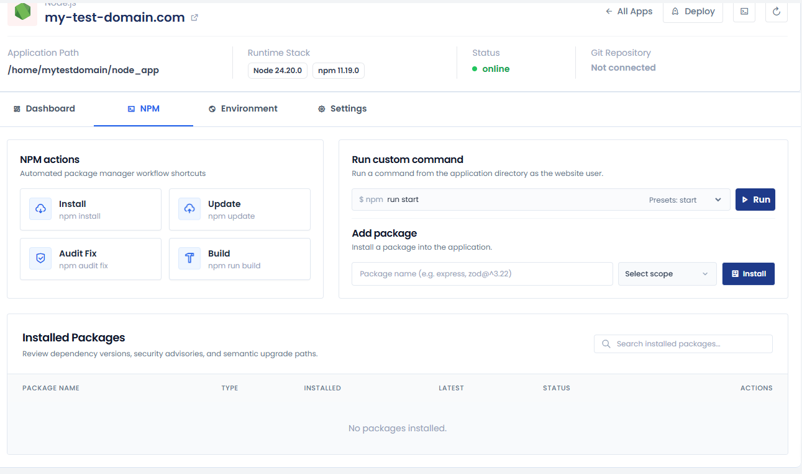

#### NPM Actions

Common NPM operations can be run directly from the control panel with just one click. The available actions are **Install**, **Update**, **Audit Fix**, and **Build**.

#### Run Custom Command

You can run any NPM command from the application directory as the website user. For convenience, the interface provides presets for commonly used commands, including Start, Dev, Test, Build, and Lint.

#### Add Package

You can install additional packages into the application and choose the installation scope that suits your needs. **Production** installs the package as a runtime dependency using `--save`, **Development** installs it as a development dependency using `--save-dev`, and **Global** installs it globally using `--global`.

#### Installed Packages

The Installed Packages section lets you review the application's dependencies. 

### Environment

The **Environment** section allows users to configure environment variables used by the Node.js application.

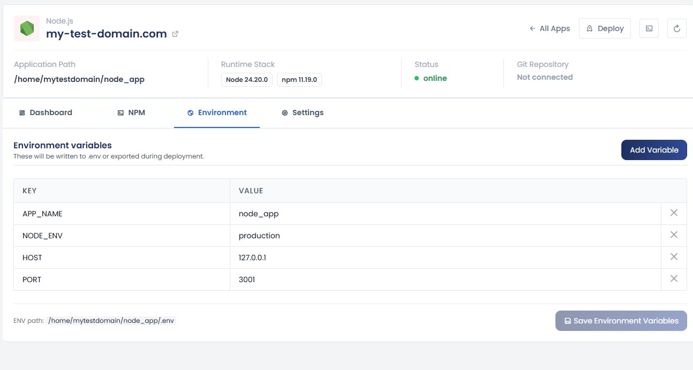

Each variable is defined by:

- **KEY**
- **VALUE**

These variables are written to the application's `.env` file or exported during deployment. For example, the environment file may be located at:

```
/home/mytestdomain/node_app/.env
```

Click **Save Environment Variables** after adding or modifying variables.

### Settings

The **Settings** section allows users to modify the application's process, forwarding, deployment configuration and delete application.

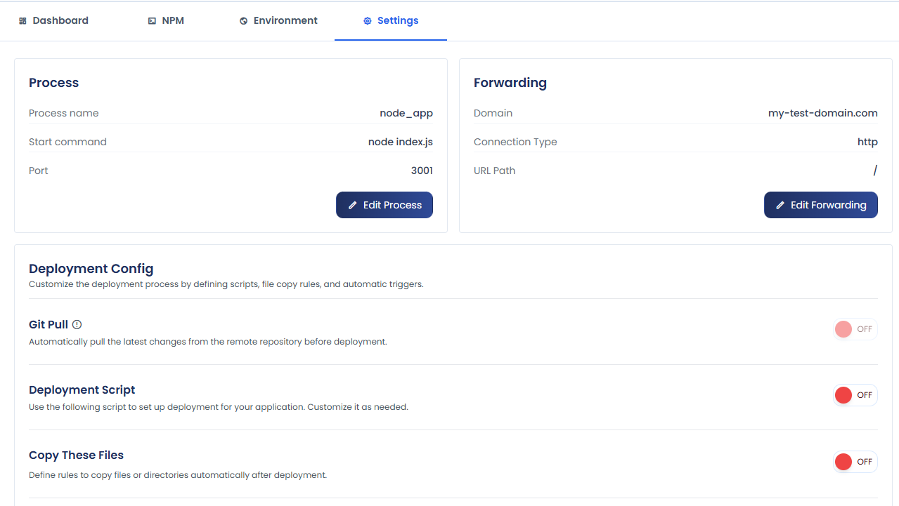

#### Process

The Process card shows the PM2 process name, the start command, and the port the application runs on. Click **Edit Process** to change these values.

#### Forwarding

The Forwarding card shows the domain, connection type, and URL path used to forward requests to the application. Click **Edit Forwarding** to change these values.

#### Deployment Config

Use the Deployment Config section to customize the deployment process with **Git Pull**, **Deployment Script**, and **Copy These Files**. Enable the options you need, then click **Save configurations** to apply them.

#### Initialize Git Repository

If the application is not connected to a Git repository, click **Initialize Repository** to start tracking changes and managing deployments.

#### Remove Application

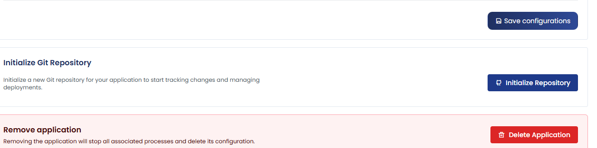

Click **Delete Application** to remove the application. This stops all associated processes and deletes the application's configuration.

:::warning
      This action cannot be undone.
      :::

### Git

The Git section is available only for applications deployed from a Git repository.

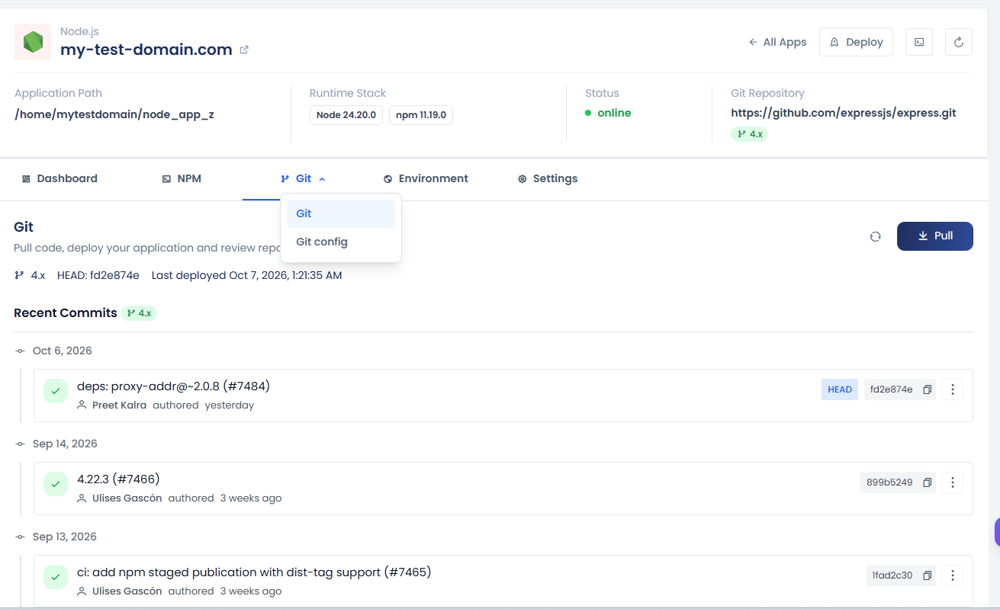

The **Git** section allows users to manage the application's Git repository and deployment activity. Users can:

- Pull the latest code from the repository.
- Deploy the application.
- Review repository activity.
- View the current HEAD commit.
- View the last deployment time.

#### Git Configuration

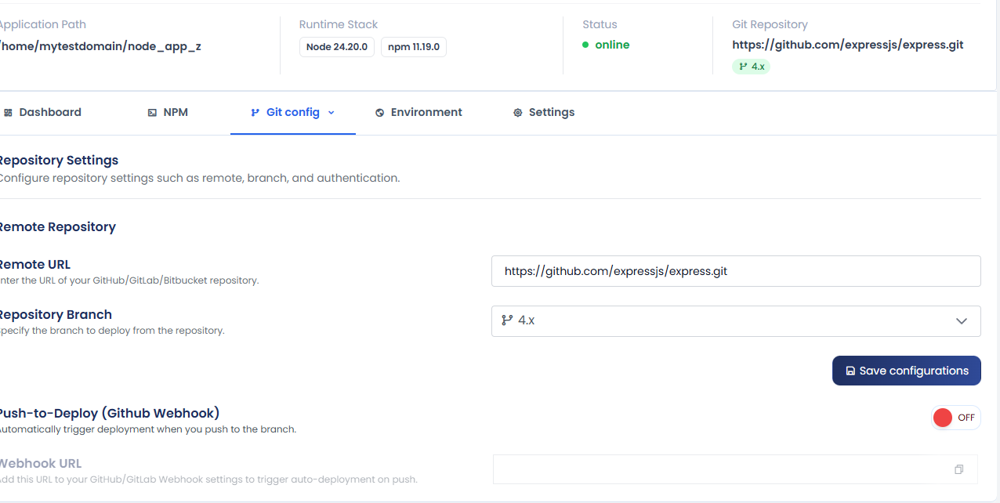

The **Git Config** section allows users to configure the application's remote repository.

| Option | Description |
|---|---|
| **Remote URL** | The URL of the GitHub, GitLab, or Bitbucket repository. |
| **Repository Branch** | The branch to deploy from. |

Click **Save Configurations** to save the repository settings.

#### Push-to-Deploy

The **Push-to-Deploy** feature triggers deployments automatically when changes are pushed to the configured repository branch.

To set it up:

1. Enable **Push-to-Deploy**.
2. Copy the generated **Webhook URL**.
3. Add the URL to the webhook settings of the corresponding GitHub, GitLab, or Bitbucket repository.

When a push is received through the configured webhook, cPGuardX automatically triggers the application deployment.

#### Delete Repository

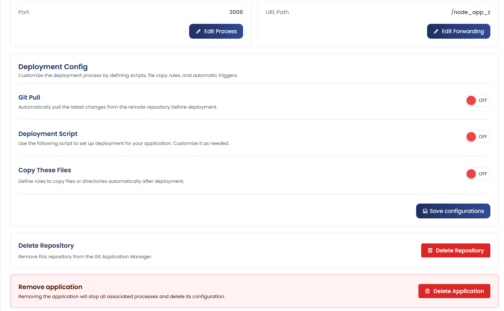

Remove this repository from the Git Application Manager.


