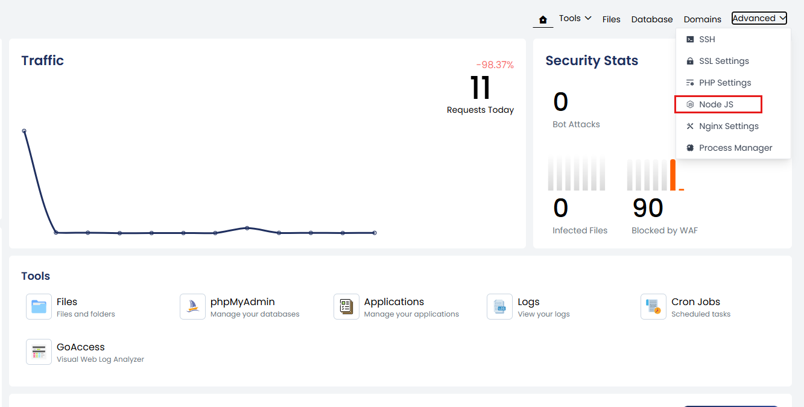
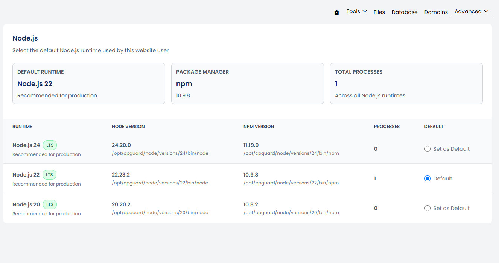

Node.js allows JavaScript applications to run on the server. In cPGuard X, each website can use one default Node.js version.

Website owners can select the Node.js runtime version, create and supervise long-running application processes, and route domain requests to their Node.js application using reverse proxy rules.

## Node.js Version Management

Node.js applications may require a specific Node.js runtime version. cPGuard X allows you to view the available Node.js versions and select the default runtime for the website.

Go to:

**Website Management → Advanced → Node.js**



The Node.js page displays the currently selected default runtime and the available Node.js versions.



The panel displays information such as:

- Node.js version
- npm version
- Total number of processes using the runtime
- Current default runtime

The **Default Runtime** is the Node.js version selected for the website user.

From the available Node.js versions, select the version required by your application and click Set as Default. The selected version becomes the default Node.js runtime for the website.

:::note
      The required Node.js version depends on the application and its dependencies. Check the application's requirements before selecting a runtime.
      :::

### Node.js Application Management

Some Node.js applications need to run continuously and typically listen on a private port, such as:

```text
127.0.0.1:3000
```

These applications generally require two features:

* [**Process Manager**](../operations/process-manager.md) — Keeps the application running.
* [**Reverse proxy rule**](../website-management/reverse-proxy.md) — Connects a domain or path to the application's port.

cPGuard X also allows you to manually create and configure the application files before creating the managed process.

## Manual Node.js Application Setup

Use this workflow when you want to run a Node.js application manually in cPGuard X.

### 1. Select the Node.js Version

Open:

**Website Management → Advanced → Node.js**

Select the Node.js version required by the application and set it as the default runtime.

---

### 2. Create the Application Files

Create the Node.js application in the website user's home directory.

For example:

```
/home/username/node-app/
```

The application entry point can be a JavaScript file such as:

```
index.js
```

Install the application's dependencies as required by the application.

---

### 3. Configure the Application Port

Configure the application to listen on a private IP address and port.

For example:

```
127.0.0.1:3000
```

The port selected here will be used later when creating the Process Manager entry and Reverse Proxy rule.

---

### 4. Create a Managed Process

Open **Process Manager** and create a process for the application.

For more information, refer to the documentation. [**Process Manager**](../operations/process-manager.md)

Common values:

| Field             | Value                    |
|-------------------|--------------------------|
| Name              | node-app                 |
| Working directory | /home/username/node-app  |
| Start command     | node index.js            |
| Listen port       | 3000                     |
| Auto restart      | Enabled                  |

The exact command depends on how the application is configured.

After saving, start the process and confirm that it shows as **Online**.

---

### 5. Create a Reverse Proxy Rule

Open **Reverse Proxy Rules** and create a forwarding rule from the public domain or path to the private port.

For example:

| Field           | Value            |
|-----------------|------------------|
| Domain          | app.example.com  |
| URL Path        | /                |
| Connection type | HTTP             |
| Target port     | 3000             |

After saving the rule, open the domain in a browser and confirm that the application loads.

For more information about Reverse Proxy Rules refer: [**Reverse proxy rule**](../website-management/reverse-proxy.md)