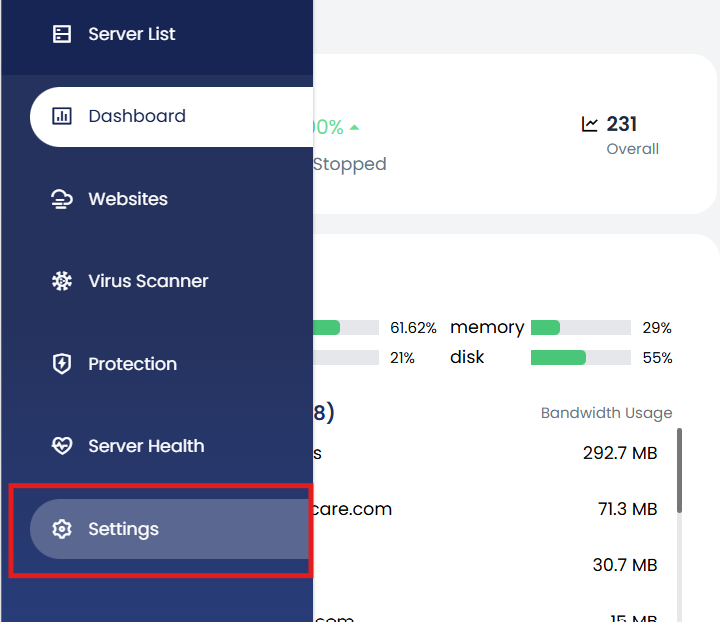
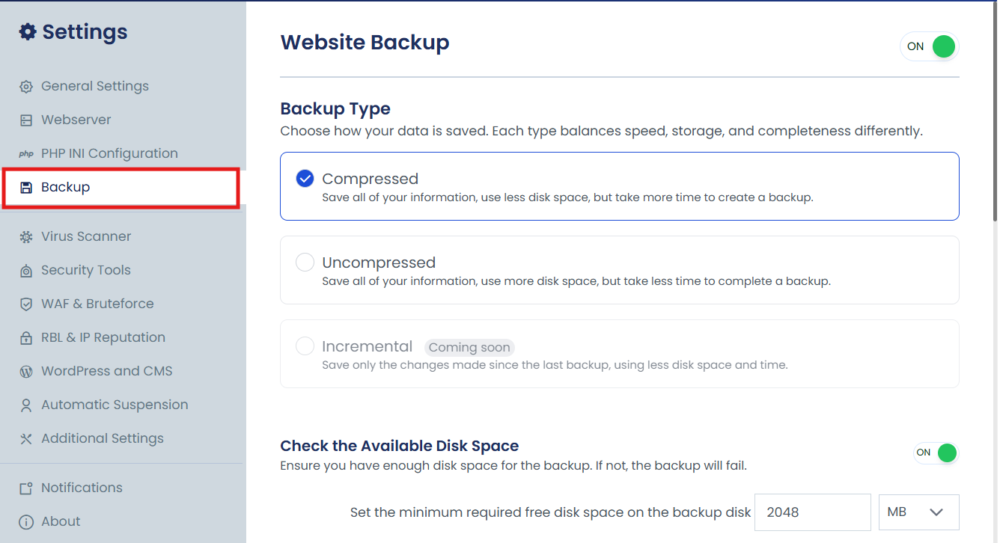
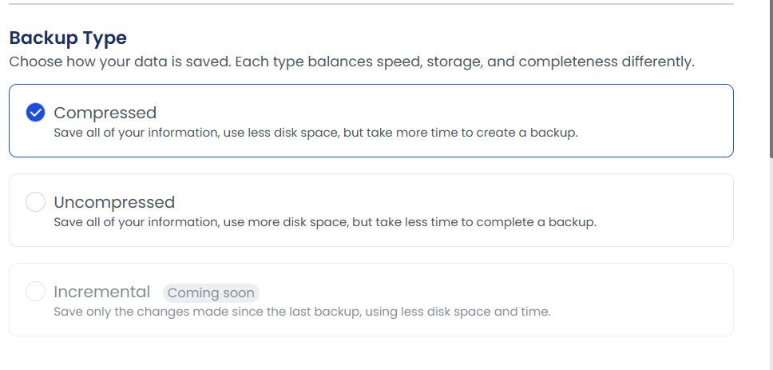
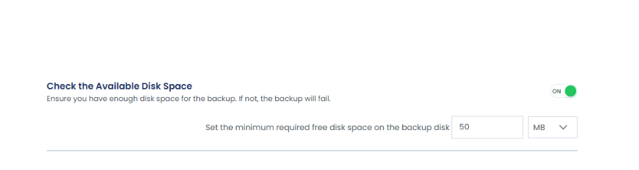
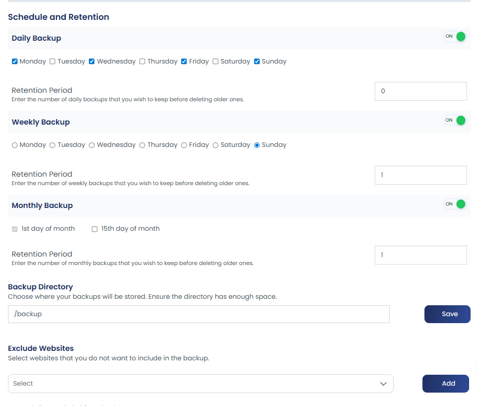
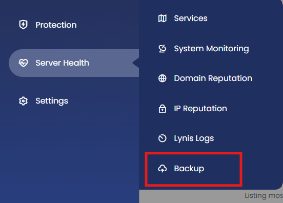
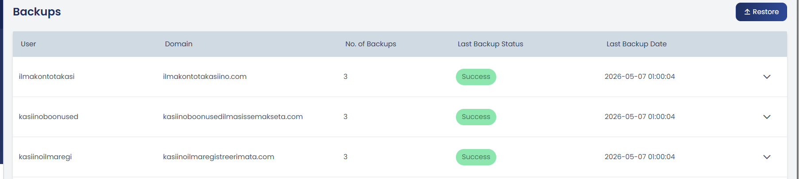
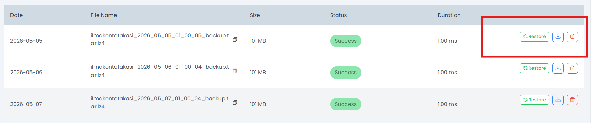

## Overview

Ensuring the safety of your website data is critical. The control panel provides flexible and automated backup options to help protect your websites from data loss. You can schedule **daily**, **weekly**, or **monthly** backups and define a **retention period** to manage how long the backups should be preserved.

Backups can be stored locally or on remote storage providers such as **Amazon S3**, **Google Drive**, **OneDrive**, and **SFTP** (via Rclone), ensuring better redundancy and disaster recovery.

## Scope

This guide covers the complete backup management process including:

- Configuring backup types and settings
- Scheduling automatic backups
- Managing disk space for backups
- Setting retention policies
- Viewing and managing existing backups
- Accessing remote backup options

## Prerequisites

- Access to the cPGuard X control panel with administrative privileges
- Sufficient disk space for storing backups
- Websites created within the control panel

## Steps / Usage

### Step 1: Configure Backup Settings

1. Login to your control panel and navigate to **Settings**.

2. Click on **Backup** under the **Settings** section.

3. Here, you can configure:
   - **Backup Type**: Select whether you want the backups to be stored in **compressed** or **uncompressed** format.
    
   

### Step 2: Enable Disk Space Management

Before initiating a backup, ensure that there is enough free disk space. Insufficient space will cause the backup to fail. You can:

- **Enable Disk Space Check** using a toggle in the settings.
- **Set a Minimum Free Disk Space Threshold** to ensure successful backups.

 

### Step 3: Set Backup Schedule and Retention

Configure the backup schedule and retention settings:

- **Backup Frequency**: Choose between daily, weekly, or monthly backups.
- **Retention Period**: Specify how many days or backup copies you want to retain.

  

### Step 4: Configure Backup Storage

Additional configuration options include:

- **Backup Storage Location**: By default, backups are saved in the `backup` directory. You can change this location based on your preference.
- **Exclude Specific Websites**: If there are websites you do not want to include in the backup, you can exclude them. By default, all websites will be backed up.

### Step 5: View and Manage Backups

Once backups are created, you can view them by going to **Server Health** > **Backup** in the control panel.

  

From here, you'll be able to see:

  

- The number of available backups
- Last backup date
- Backup size
- Duration and other details

The dropdown menu will display options such as:

  

- **Restore**: Restore a backup to your website
- **Download**: Download backup to local machine
- **Delete**: Remove a backup

### Step 6: Configure Remote Backups

You can configure remote backups to securely store your data on supported destinations. This provides an extra layer of security by storing backups off-site.

For detailed instructions on setting up remote backups, please refer to the [Remote Destinations](remote-destinations) guide.

## Notes / Defaults

- **Default Backup Location**: Backups are stored in the `backup` directory by default.
- **Default Backup Scope**: All websites are included in backups by default unless explicitly excluded.
- **Backup Formats**: Both compressed and uncompressed formats are supported based on your preference.
- **Retention**: You can define retention periods in days or by number of backup copies.
- **Remote Storage**: Integration with multiple cloud providers ensures flexibility in backup storage strategy.
- **Last Updated**: August 2025

## Troubleshooting

### Backup Fails Due to Insufficient Disk Space

- **Solution**: Enable the disk space check and set an appropriate minimum free disk space threshold to prevent this issue.
- Verify that your server has adequate storage capacity before initiating backups.

### Cannot Find Backup in View Backups Section

- **Solution**: Navigate to **Server Health** > **Backup** to view all available backups.
- Ensure backups have been created by checking the backup schedule settings.

