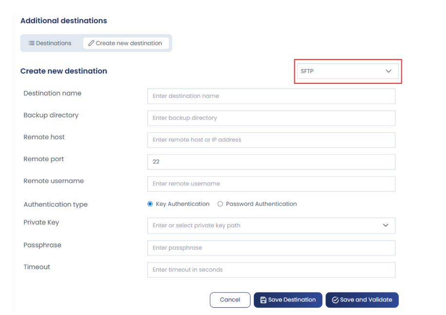
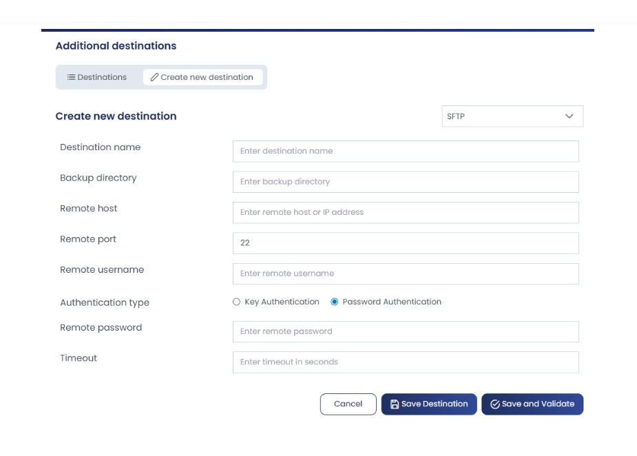

## Overview

Remote backups serve as an additional storage location for your backup files, complementing your local backup process. With remote backups, you can securely store copies of your sites on remote servers using **Rclone**. This ensures your data remains safe even if your primary server experiences issues.

## Accessing Remote Backup Configuration

To configure remote backups, navigate to:

**Settings > Backup > Additional Destinations**



From here, you can:
- View details of existing backup destinations
- Add new backup destinations by clicking **Create New Destination**

Remote backups allow you to securely store backup files outside of your server, ensuring data availability and redundancy.

## Available Remote Backup Options

Backups can be stored locally or on remote storage providers such as:

- **SFTP**
- **Amazon S3**
- **Google Drive**
- **OneDrive**

## Configuration Steps

### 1. Basic Connection Details



When adding a new backup destination, provide the following information:

| Parameter | Description |
|-----------|-------------|
| **Destination Name** | A friendly name for this backup destination (e.g., "Remote Server 1") |
| **Backup Directory** | The directory path where backups will be stored on the remote server |
| **Remote Host or IP Address** | The hostname or IP address of your remote server |
| **Remote Port** | SSH port (default: 22) |
| **Remote Username** | Username for authentication on the remote server |

### 2. Authentication Method

Choose one of two authentication methods:

#### Key Authentication (Recommended)

For key-based authentication, provide:

- **Private Key or Key Path**: The path to your private SSH key
- **Passphrase**: The passphrase for your key (if applicable)
- **Timeout**: The duration allowed for accessing the remote server. If the connection exceeds this timeout, it will be terminated.

:::tip
Use key authentication for enhanced security. Ensure your private key has proper permissions (typically `chmod 600`).
:::

#### Password Authentication

For password-based authentication, provide:

- **Remote Server Password**: The password for your remote server account
- **Timeout**: The duration allowed for accessing the remote server (same function as above)

### 3. Pre-Configuration Requirements

Before setting up your remote backup destination, ensure your remote server is properly configured:

:::warning Important
Your remote server **must** be configured in its SSH configuration file (`/etc/ssh/sshd_config`) to accept either:
- SSH key-based authentication, OR
- Password authentication

Choose the method that matches your cPGuard configuration.
:::

Common SSH configuration options:
```bash
# Enable SSH key authentication
PubkeyAuthentication yes

# Enable password authentication
PasswordAuthentication yes
```

### 4. Saving and Validating Your Configuration

After entering all required details, you have two options:

- **Save**: Saves the destination configuration directly
- **Validate and Save**: Tests the connection before saving to ensure all settings are correct

We recommend using **Validate and Save** to verify your configuration works properly before relying on it for backups.

## Best Practices

1. **Use Key Authentication**: SSH keys are more secure than passwords and better suited for automated backups
2. **Test Connectivity**: Always validate your backup destination configuration before relying on it
3. **Monitor Backup Status**: Regularly check that your backups are completing successfully on the remote server
4. **Proper Key Management**: Store your private keys securely and use passphrases for additional protection
5. **Adequate Timeout**: Set appropriate timeout values based on your backup size and network speed
6. **Backup Directory Permissions**: Ensure the backup directory on the remote server has appropriate permissions for the SSH user

## Troubleshooting

### Connection Fails During Validation
- Verify the remote host and port are correct
- Confirm the remote username has SSH access
- Check that SSH is enabled on the remote server
- For key authentication, ensure the private key path is correct and readable

### Authentication Errors
- Verify the correct authentication method is selected
- For key auth: Check that the private key matches the public key on the remote server
- For password auth: Confirm the password is correct
- Ensure SSH key permissions are set correctly (`chmod 600`)

### Timeout Issues
- Increase the timeout value if your network is slow
- Check network connectivity between servers
- Verify firewall rules aren't blocking SSH connections

## Next Steps

Once your remote backup destination is configured and validated, your cPGuard system will be ready to store backups securely off-site. Configure your backup scheduling in the **Managing and Scheduling Website Backups** section to enable automated remote backups.

---
