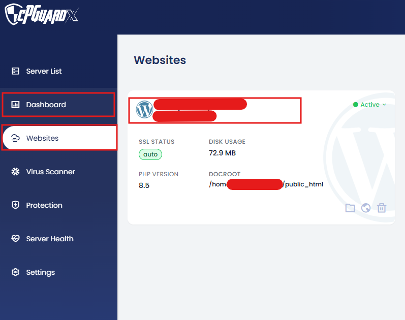
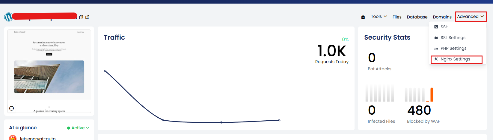
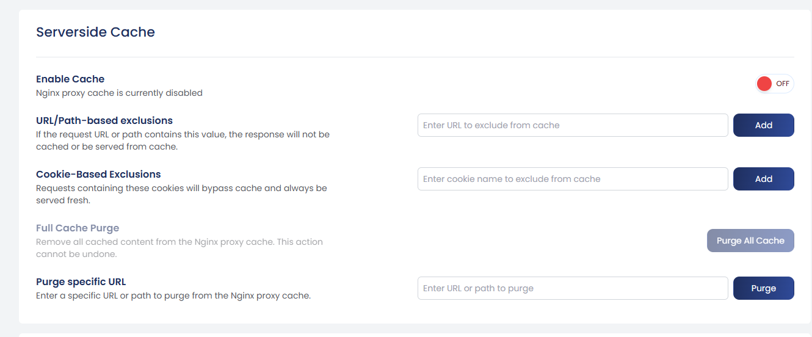
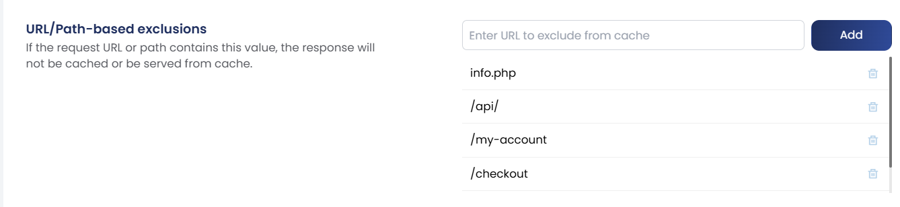

The **Nginx Proxy Cache** feature in cPGuard X improves website performance and reduces backend load by storing generated responses and serving them directly from memory or disk for subsequent requests. Instead of every visitor triggering PHP execution and database queries, frequently accessed content is delivered instantly from cache.

{/* comment */}

## Benefits of Nginx Server-Side Caching

| Benefit | Description |
|---|---|
| **Faster page load times** | Cached responses are served without hitting PHP or the database |
| **Reduced CPU and database usage** | Backend processing is skipped for cached requests |
| **Better traffic spike handling** | High concurrent visitors are served from cache without overloading the server |
| **Improved user experience** | Pages load significantly faster for all visitors |

:::tip No Plugin Required
This cache operates entirely at the **server level**. It works even if your application has no caching plugin installed — making it effective for any CMS or custom application.
:::

---

## Where to Find the Settings

Nginx Proxy Cache settings are managed **per website**. Navigate to:

**Dashboard → Websites → Select Website → Advanced → Nginx Settings → Server-side Cache**






---

## Available Cache Options




### 1. Enable Cache

Turns the Nginx proxy cache on or off for the selected website.

| Setting | Behaviour |
|---|---|
| **ON** | Responses are cached and served to visitors when eligible |
| **OFF** | Every request is passed directly to the backend — no caching |

:::note
When the cache is disabled, all exclusion rules and purge options have no effect.
:::

---

### 2. URL / Path-Based Exclusions




If a request URL contains a defined path or fragment, caching will be **skipped** for that request and it will always be served fresh from the backend.

Use this for dynamic or sensitive pages such as:

- `/cart`
- `/checkout`
- `/my-account`
- `/api/`

**Example:** If `/checkout` is added as an exclusion, any URL containing `/checkout` will never be served from cache.

#### Automatic Exclusions for WordPress

To prevent accidental caching of sensitive areas, the system **automatically bypasses** the following WordPress locations by default:

- `/wp-admin/`
- `/wp-login.php`

:::info
You do **not** need to add these WordPress paths manually as they are already excluded out of the box.
:::

---

### 3. Cookie-Based Exclusions

Requests that contain specific cookies will **bypass the cache** entirely.

This is especially useful for:

- **Logged-in users** — to ensure they always see personalised, up-to-date content
- **Active sessions** — such as users with items in a shopping cart
- **Personalised content** — where serving a cached response would show incorrect data

When a matching cookie is present in the request, Nginx skips the cache and passes the request directly to the backend.

---

### 4. Full Cache Purge

Deletes **all** cached files for the selected website at once.

:::danger Irreversible Action
A full cache purge **cannot be undone**. After purging, the first visitor to each page will trigger a fresh backend request to rebuild the cache.
:::

**When to use a full purge:**

- After deploying major site updates
- After changing the theme or design
- After making global content modifications that affect multiple pages

---

### 5. Purge Specific URL

Removes the cached version of a **single page or path** without affecting the rest of the cache.

**Examples:**
- `/blog/new-post`
- `/pricing`
- `/products/item-name`

**When to use targeted purge:**

| Scenario | Recommended Action |
|---|---|
| Edited a single blog post | Purge that specific URL |
| Updated one product page | Purge that product's URL |
| Changed pricing on one page | Purge `/pricing` only |
| Redesigned the entire site | Use Full Cache Purge instead |

Targeted purging is the preferred approach for routine content updates as it preserves the rest of the cache, keeping your site fast while still serving the latest version of the updated page.

---

## How the Cache Works — Overview

```
Visitor Request
      ↓
Is the URL/Cookie excluded?
      ↓ No              ↓ Yes
Is there a cached       Pass to Backend
response available?     (PHP + Database)
      ↓ Yes    ↓ No
Serve from   Pass to Backend → Cache the Response → Serve to Visitor
Cache
```

---

## Summary

The Nginx Proxy Cache in cPGuard X is a powerful, zero-configuration-required performance feature. By caching responses at the server level, it dramatically reduces backend load and delivers faster pages to your visitors. Use URL and cookie exclusions to ensure dynamic or personalised content is always served fresh, and use targeted URL purging for routine updates to avoid unnecessary full cache clears.
