From the **cPGuard X** dashboard, click on **Website**, then go to **Database**.

- To create new database, Click on **+ Add Database** and provide the required details:

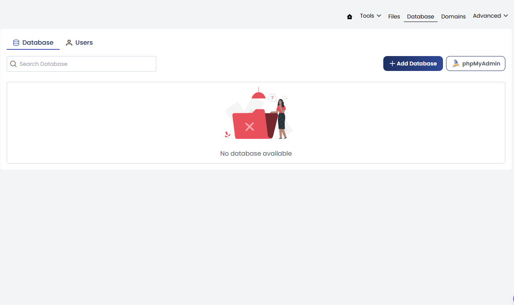

  - **Database Name**
  - **Username**
  - **Password**
  - **Privileges**

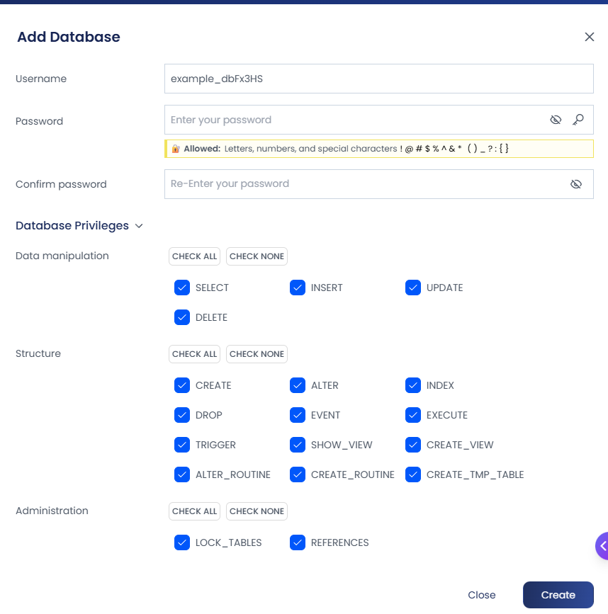

- Then click **Create**.

While creating a database, you can assign user privileges as required. Alternatively, you can also modify or assign privileges after the database has been created.

### To Update User Privileges

1. Navigate to the **database list**.
2. Click on the **Edit** icon next to the respective database/user (as shown in the image).

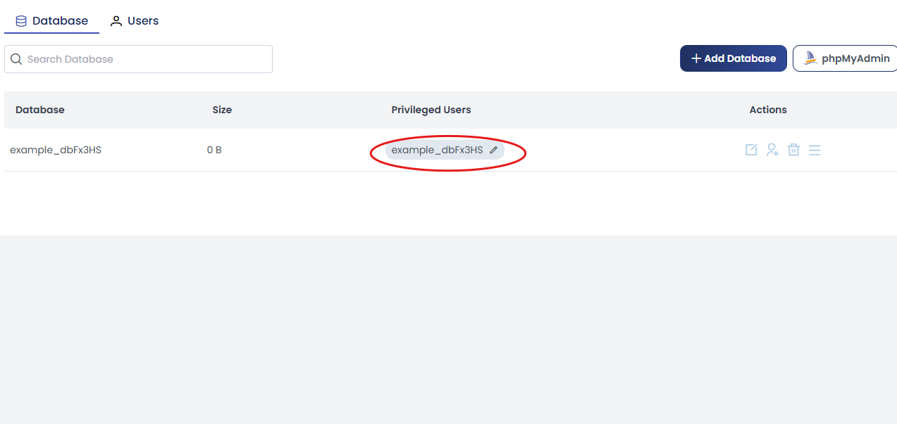

From here, you can:
- Modify user privileges  
- Update access permissions  
- Remove the user’s access to the database using the **Remove Database** option  

After making the required changes, click on **Update** to apply them.

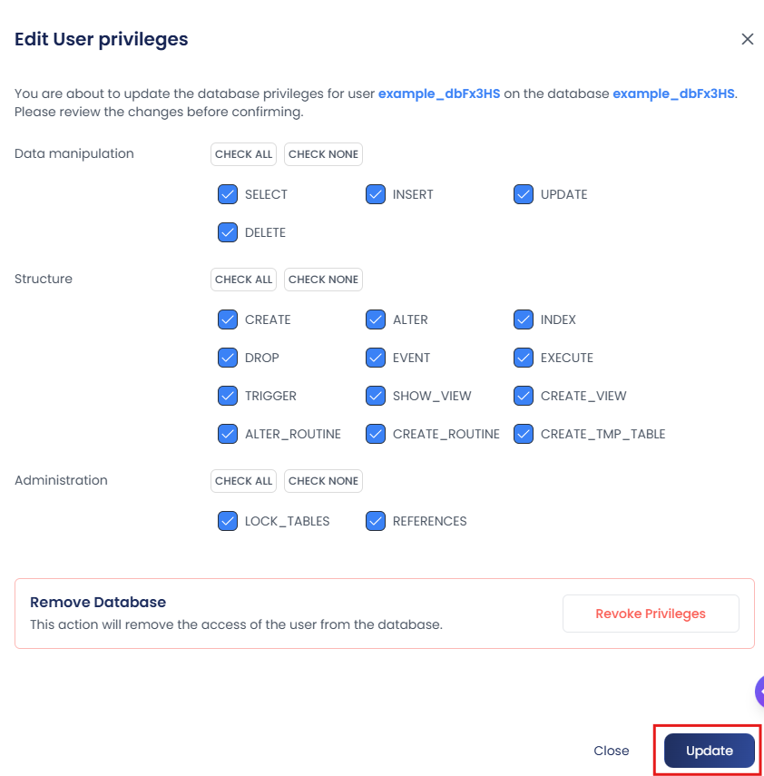

## Database Actions

In the **Actions** section, you have multiple options to manage your database.

---

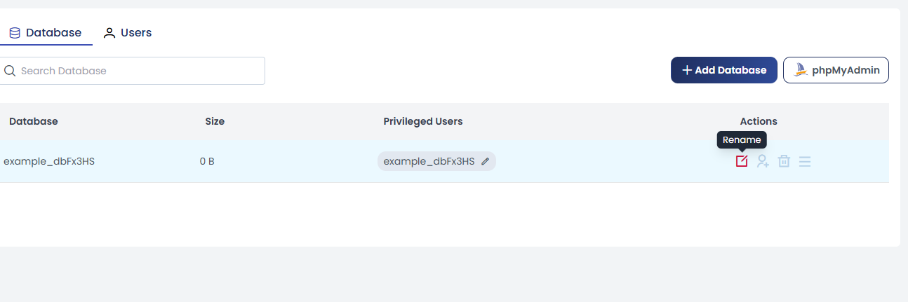

### Rename Database
- Click on **Rename**
- A pop-up window will appear showing the current database name
- Enter the new name you prefer
- Click on **Update** to apply the changes

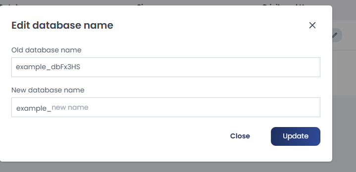
---

### Assign User

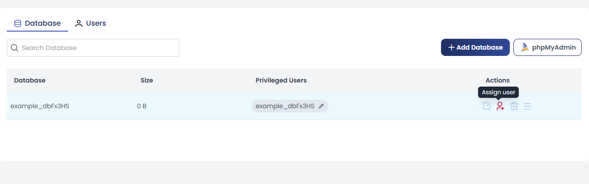

- Click on **Assign User**
- Select the user from the dropdown list
- Choose the required privileges
- Click on **Assign** to grant access

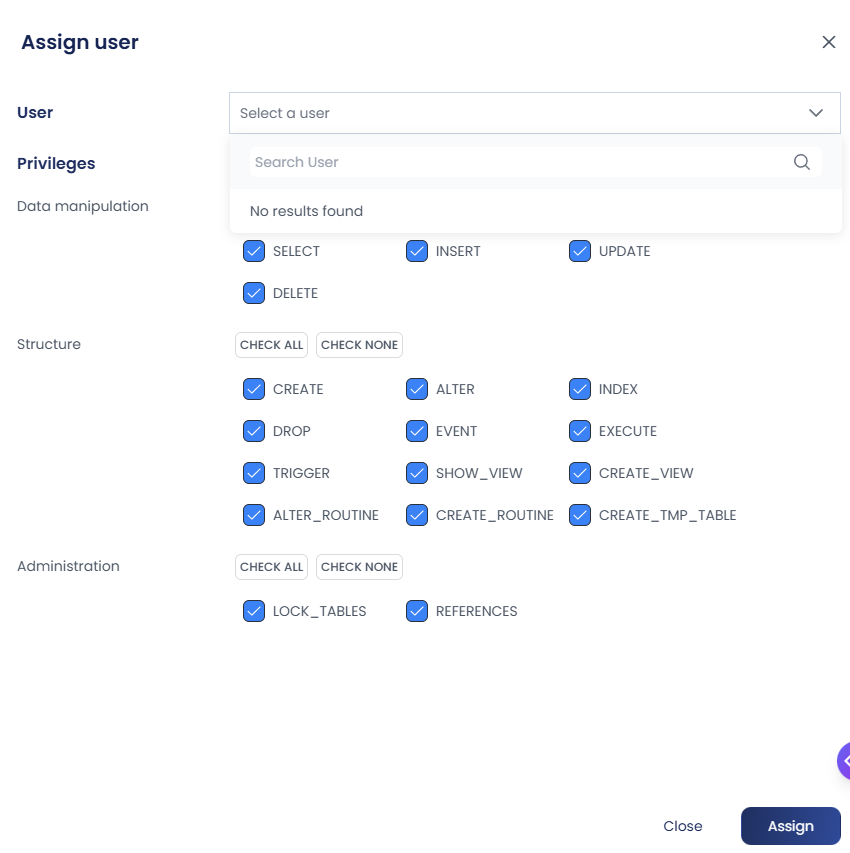
---

### Delete Database

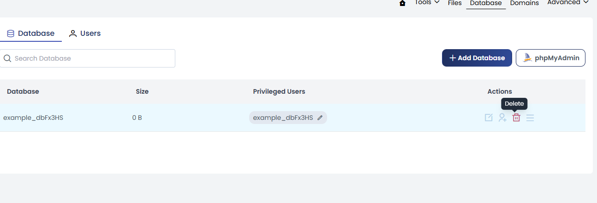

- Click on **Delete**
- A confirmation window will appear
- Click on **Delete** again to proceed

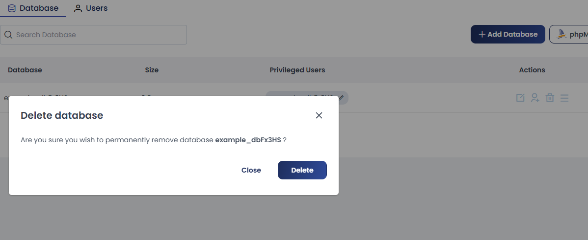

:::note 
This action will permanently delete the database.
:::

---

### More Actions

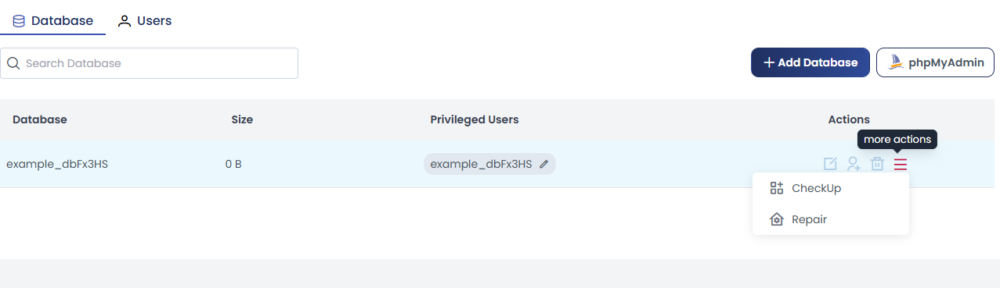

#### Check Database
This option is used to verify the integrity of the database and detect any issues.  
It is recommended when you notice performance issues or suspect database corruption.

- Click on **Check**
- Confirm by clicking **Proceed** in the confirmation window

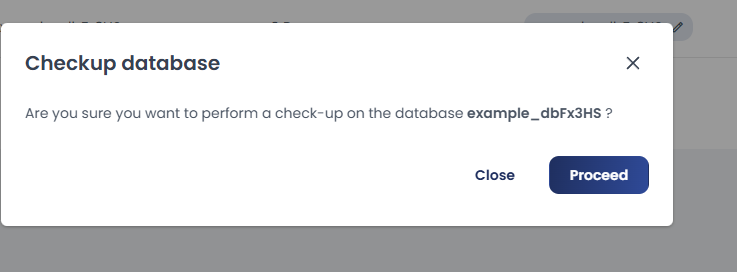
---

#### Repair Database
This option is used to fix corrupted or damaged database tables.  
Use this when errors are detected or after running a database check.

- Click on **Repair**
- Confirm by clicking **Proceed** in the confirmation window

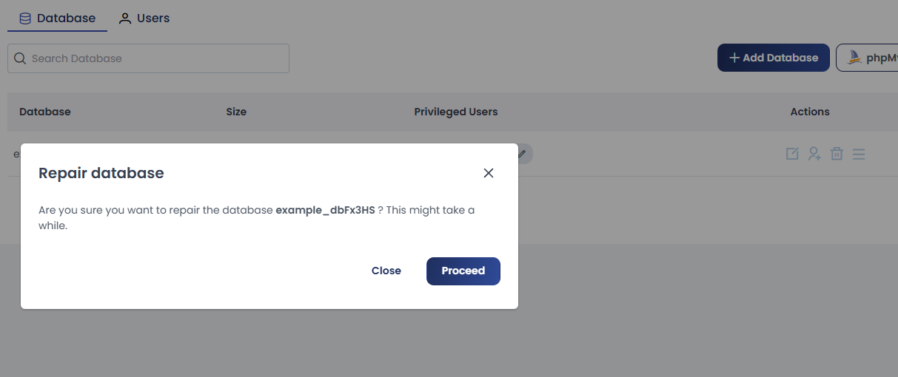
