This section allows you to view and manage database users. You can also create new users as needed.

---

### Add New User

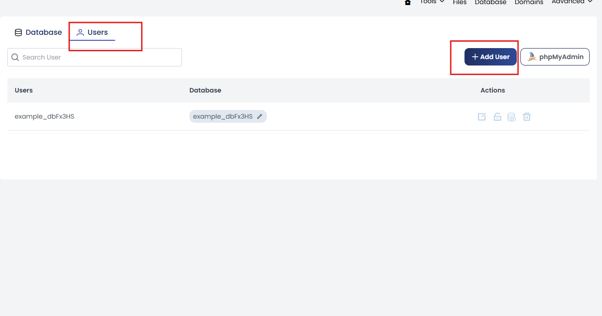

- Click on **+ Add User**
- Enter the username in the input field
- Set a password for the user
- Click on **Create User** to complete the process

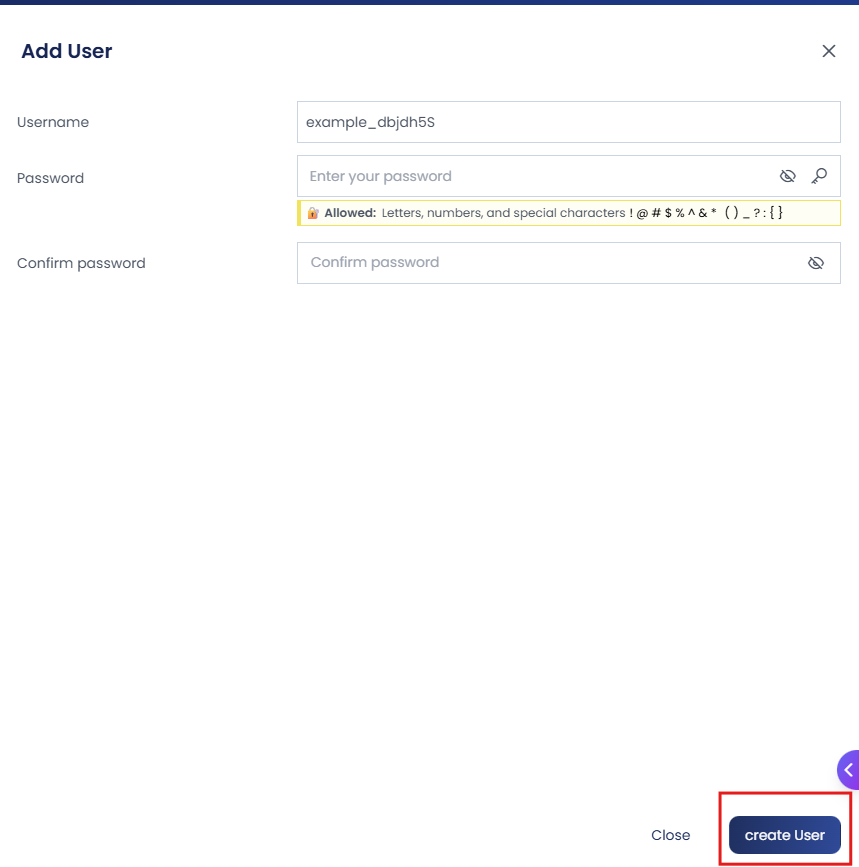

---

- All created users will be listed in this section

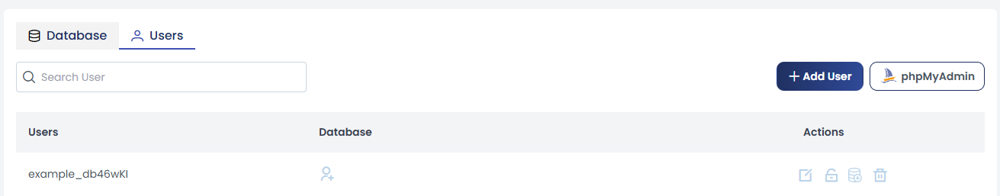

- If a database is not displayed for a user, it means it has not been assigned yet

- You can assign a database by clicking the **+ icon** under the database section (as shown in the image)

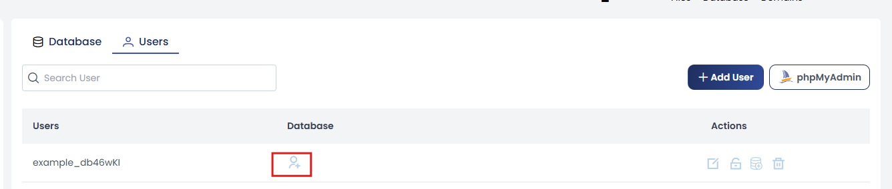

---

### Assign Database

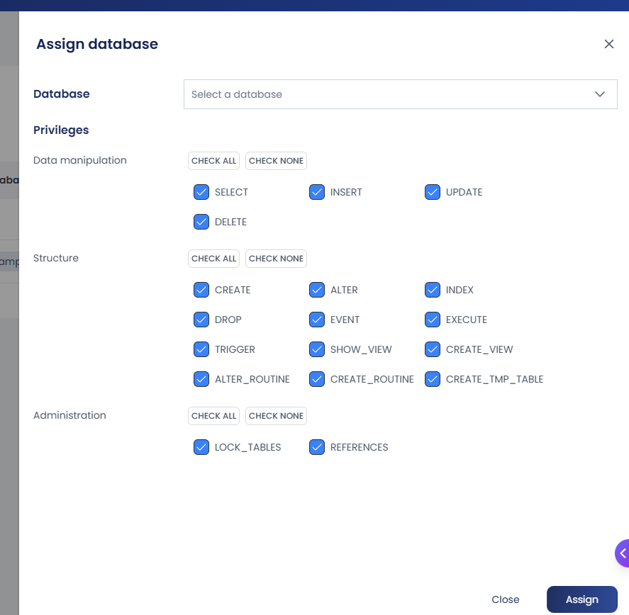

- In the **Assign Database** section, select the database from the dropdown list
- Grant the required privileges
- Click on **Assign** to apply the changes

---

## User Actions

In the **Actions** section, you can manage individual users with the following options:

---

### Rename User

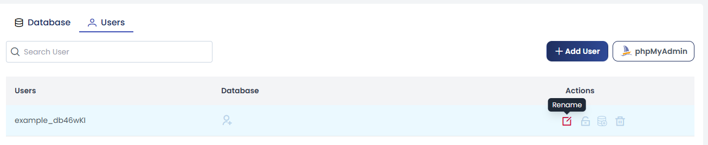

- Click on **Rename**
- Enter the new username in the popup window
- Click on **Proceed** to save changes

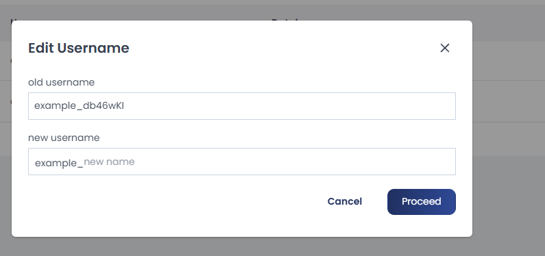

---

### Change Password

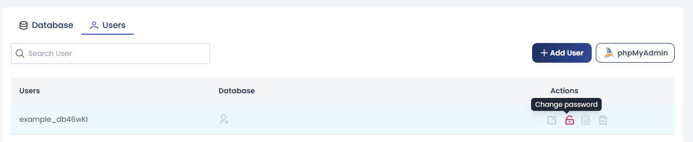

- Click on **Change Password**
- Enter the new password in the input field
- Click on **Proceed** to update the password

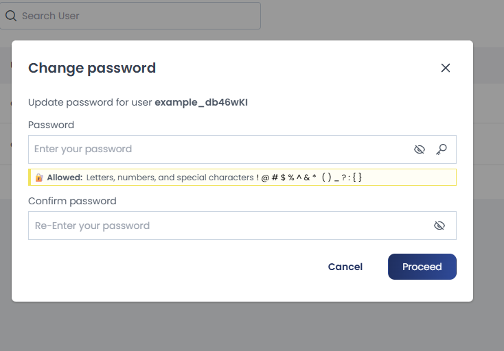

---

### Assign Database

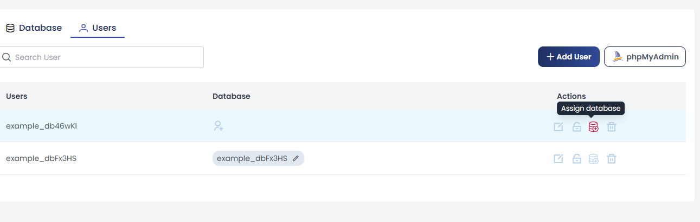

- Select a database from the dropdown list
- Assign required privileges
- Click on **Assign** to link the database to the user

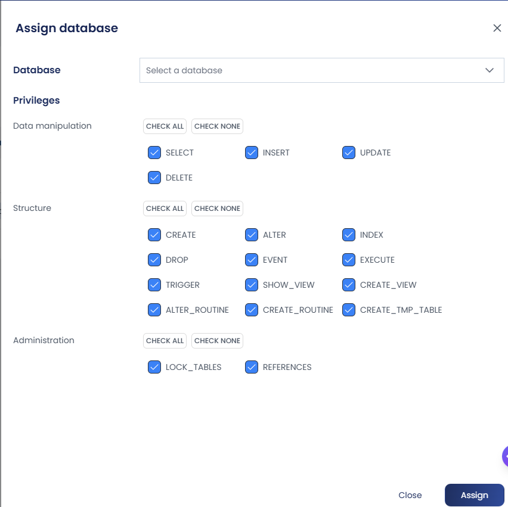

---

### Delete User

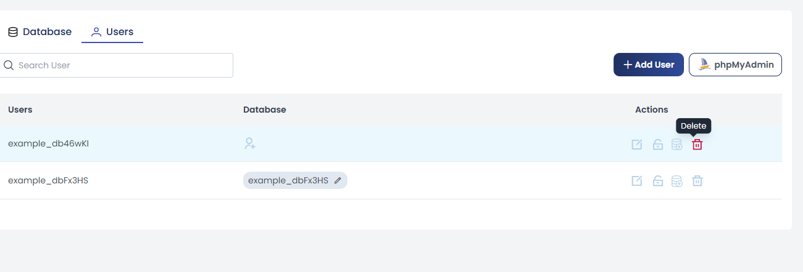

- Click on **Delete User**
- A confirmation popup will appear
- Click on **Delete User** again to permanently remove the user

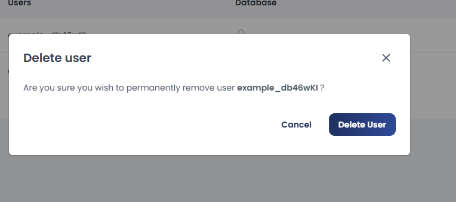
