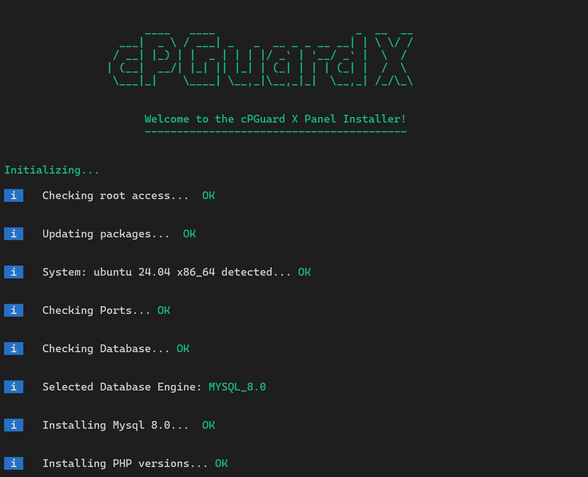
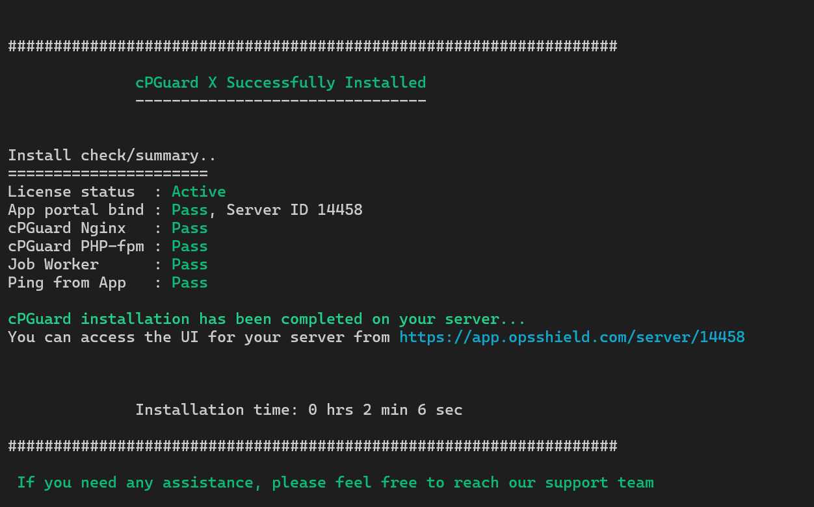

# Installing cPGuard X

This guide explains how to install **cPGuard X** on a supported Linux server.  
Ensure that your server meets the required system requirements before starting the installation.

:::note
      Installation must be performed on a clean Ubuntu server with root access and a valid license key.
      :::

---

## Step 1 : Update the Server

Before starting the installation, update your system packages.

```bash
apt update && apt upgrade -y
```

Make sure you are logged in as the **root user** before running the installation commands.

---

## Step 2 : Run the Installer

Download and execute the cPGuard X installer according to your database preference.

Replace **`LICENCE-KEY`** with your valid license key.

import Tabs from '@theme/Tabs';
      import TabItem from '@theme/TabItem';

<Tabs>
  <TabItem value="mysql80" label="MySQL 8.0 (Default)" default>
    Run in Terminal:
    ```bat
    cd /usr/local/src && rm -f cpguardx.sh && curl -o cpguardx.sh -L https://downloads.opsshield.com/cpguard/cpguardx.sh && bash cpguardx.sh LICENCE-KEY
    ```
  </TabItem>
  <TabItem value="mysql84" label="MySQL 8.4">
    Run in Terminal:
    ```bash
    cd /usr/local/src && rm -f cpguardx.sh && curl -o cpguardx.sh -L https://downloads.opsshield.com/cpguard/cpguardx.sh && DB_ENGINE='MYSQL_8.4' bash cpguardx.sh LICENCE-KEY
    ```
  </TabItem>
  <TabItem value="mariadb10" label="MariaDB 10.11">
    Run in Terminal:
    ```bash
    cd /usr/local/src && rm -f cpguardx.sh && curl -o cpguardx.sh -L https://downloads.opsshield.com/cpguard/cpguardx.sh && DB_ENGINE='MARIADB_10.11' bash cpguardx.sh LICENCE-KEY
    ```
  </TabItem>
  <TabItem value="mariadb11" label="MariaDB 11.4">
    Run in Terminal:
    ```bash
    cd /usr/local/src && rm -f cpguardx.sh && curl -o cpguardx.sh -L https://downloads.opsshield.com/cpguard/cpguardx.sh && DB_ENGINE='MARIADB_11.4' bash cpguardx.sh LICENCE-KEY
    ```
  </TabItem>
</Tabs>


During installation, the process will display **live logs in the terminal** so you can monitor the installation progress. 



---

## Step 3 : Access the Control Panel

If the installation completes successfully, a success message will be displayed at the end, along with the cPGuard X panel link for accessing the web interface. You can access the **cPGuard X control panel** using the link provided in the installation summary.




Alternatively, you can:

1. Log in to the **cPGuard App Portal**
2. Navigate to the **Server List**
3. Open the installed server to access the panel.

Now you can begin configuring websites, security features, and server settings through the cPGuard X control panel.
 

---

## Agent Connectivity Requirement

The **cPGuard App Portal** must communicate with the **cPGuard Agent** running on your server. The agent listens on the  **port 9098**

If your server uses a firewall, ensure that the following IP addresses are whitelisted.

```
137.184.200.210
159.89.87.35
167.99.149.179
```

These IP addresses must be allowed to connect to **port 9098** to maintain communication between the portal and the server agent. 

:::note
       If you are using cloud providers such as AWS, Azure, GCP, DigitalOcean, or Linode, make sure these IPs are also allowed in the cloud firewall rules.
      :::


---


## Need Help?

If you encounter any issues during installation, contact the **OPSSHIELD Support team** for assistance.

