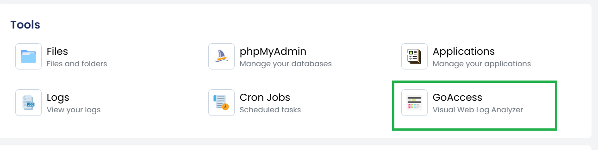
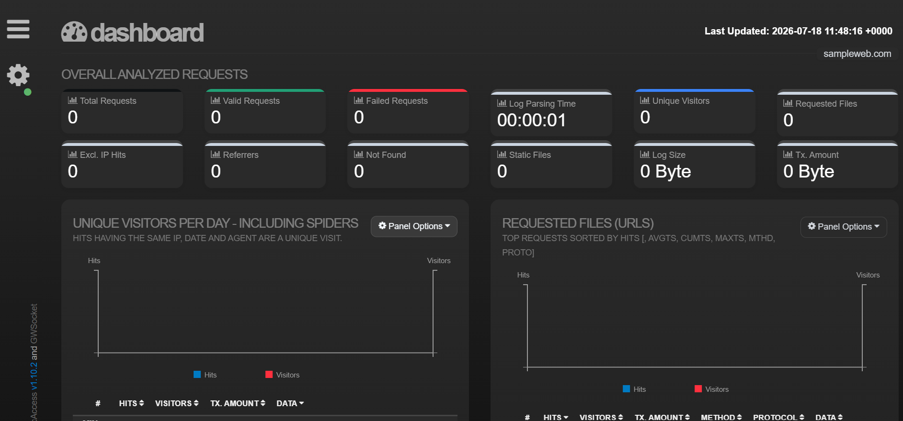

# Website Analytics with GoAccess

## Overview

**GoAccess** is a real-time web log analyzer that provides detailed insights into your website traffic. It generates interactive reports based on your web server access logs, allowing you to monitor visitor activity, requests, bandwidth usage, HTTP status codes, and more.

The GoAccess feature in **cPGuard X** enables you to quickly view website analytics without manually processing log files.

## Common Use Cases

You can use GoAccess to:

- Monitor website traffic in real time.
- Analyze visitor requests and page views.
- Identify the most frequently accessed pages.
- Review HTTP status codes (200, 301, 404, 500, etc.).
- Troubleshoot website errors using access logs.
- Detect unusual traffic patterns or suspicious requests.
- Monitor bandwidth usage and request statistics.

---

# How to Open GoAccess

Follow these steps to access the GoAccess report for a website.

## Step 1: Open the Websites Section

From the **cPGuard X Control Panel**, navigate to **Websites** using the sidebar or dashboard.

---

## Step 2: Select the Website

From the list of websites, select the website for which you want to view analytics.

---

## Step 3: Open the Tools Section

Within the selected website, navigate to the **Tools** section.

You will find the **GoAccess** option among the available website tools.

---

## Step 4: Launch GoAccess

Click **GoAccess** to open the website analytics dashboard.

The report will display statistics generated from the website's access logs.

---

# Available Information

Depending on your web server logs, GoAccess may display:

- Total visitors
- Total requests
- Unique visitors
- Requested URLs
- HTTP status codes
- Client IP addresses
- Operating systems
- Browsers
- Requested files
- Bandwidth usage
- Request methods (GET, POST, etc.)
- Daily and hourly traffic statistics

---

# Notes

- GoAccess generates reports using your website's access logs.
- The available data depends on the retention period of your web server logs.
- If the website has little or no traffic, the report may contain limited information.
- The report updates as new access log entries become available.