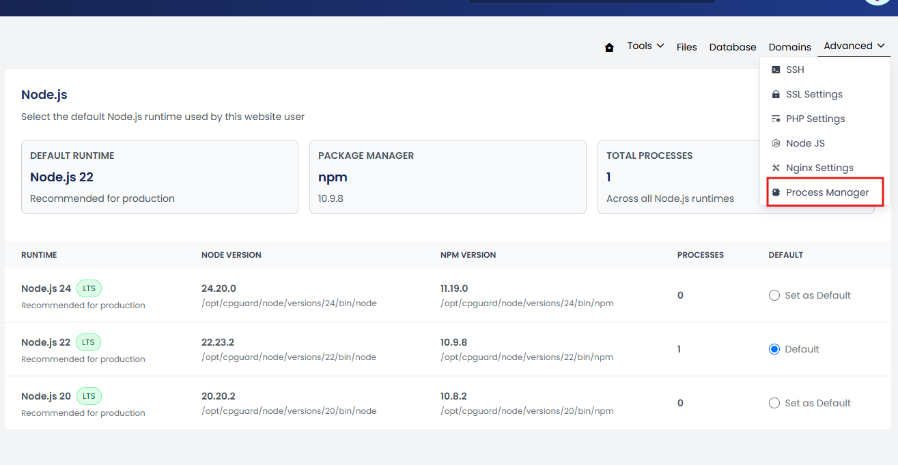
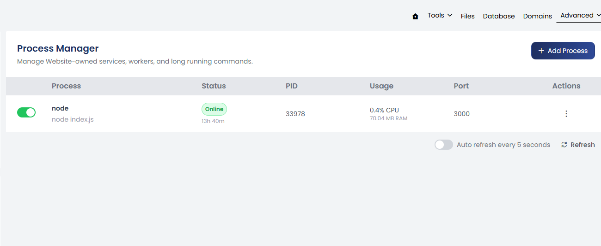
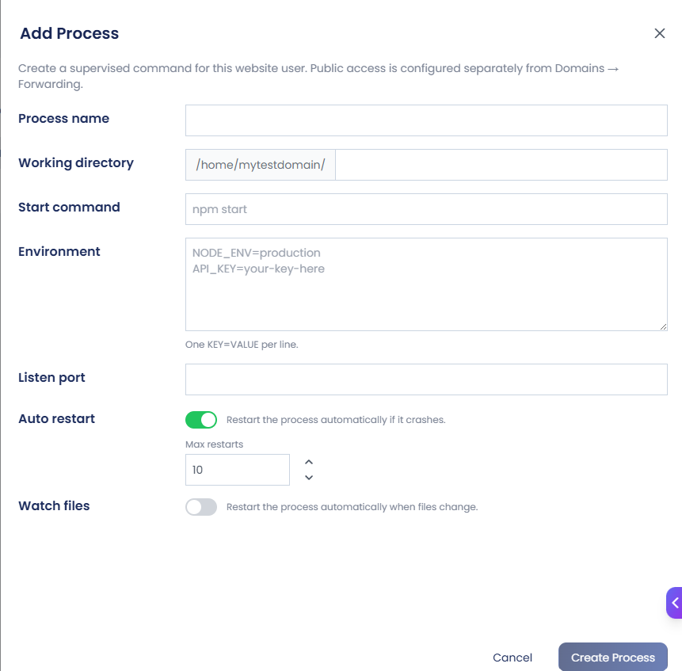

The Process Manager keeps long-running commands active for a website. cPGuard X uses PM2 for process management, but the feature is not limited to Node.js applications.

Use the Process Manager for services that must continue running after you close the terminal or leave the page.

Process Manager is available from:

**Website Management → Advanced → Process Manager**


---

The Process Manager displays the processes configured for the website, along with details such as the process name, command, status, running time, PID, CPU and memory usage, listening port, and available process actions.



The process list is automatically refreshed periodically.

---

### Add a Process

Click **+ Add Process** to create a supervised process.

The Add Process form contains the following options.



#### Process Name

Enter a descriptive name that helps identify the process.

Example:

```
node-app
```

#### Working Directory

Specify the directory from which the process should run.

Example:

```
/home/username/node-app/
```

The working directory should contain the application or files required by the start command.

#### Start Command

Specify the command used to start the application or service.

Examples:

```
node index.js
```

or:

```
npm start
```

The command should match the application's configuration.

#### Environment

Add environment variables required by the application or service.

Use one variable per line:

```
KEY=VALUE
```

For example:

```
NODE_ENV=production
PORT=3000
```

Environment variables allow applications to receive configuration without hard-coding those values in the application source.

#### Listen Port

Specify the port on which the application or service listens.

For example:

```
3000
```

The configured port should match the port used by the application.

If the application listens on:

```
127.0.0.1:3000
```

the Process Manager configuration should use port:

```
3000
```

This port can then be used as the target port in a Reverse Proxy rule.

#### Auto Restart

Enable **Auto Restart** to automatically restart the process if it crashes or exits unexpectedly.

This is useful for long-running services that should remain available without manual intervention.

#### Max Restarts

Specify the maximum number of automatic restart attempts.

This helps prevent a continuously failing process from being restarted indefinitely.

#### Watch Files

Enable **Watch Files** to automatically restart the process when monitored application files change.

This can be useful during development or for applications that require a restart after file changes.

After entering the required information, click **Create** to create the process.

---

### Managing Processes

After a process is created, it appears in the Process Manager list.

Use the three-dot menu under **Actions** to manage the process.

Available actions include:

- **Restart** – Restart the process.
- **Edit** – Modify the process configuration.
- **Delete** – Remove the process.
- **Error Logs** – View errors generated by the process.
- **Output Logs** – View the standard output generated by the process.

---

### Port Conflicts

Only one process can use the same IP address and port at the same time.

For example:

```
127.0.0.1:3000
```

If one process is already using this port, another process cannot start on the same IP and port.

If a port conflict occurs:

- Check which process is already using the port.
- Stop the process if it is no longer required, or
- Configure the new application to use a different port.
- Make sure the Process Manager and Reverse Proxy configurations use the new port.

