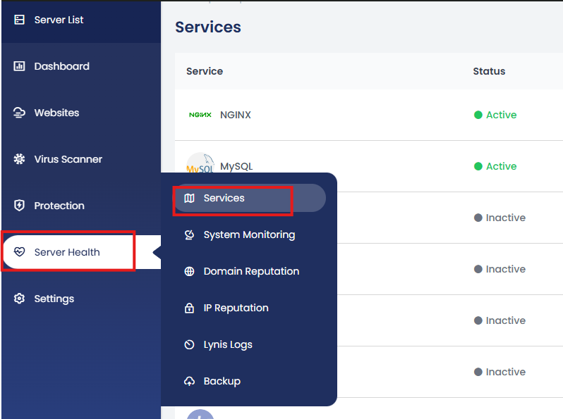
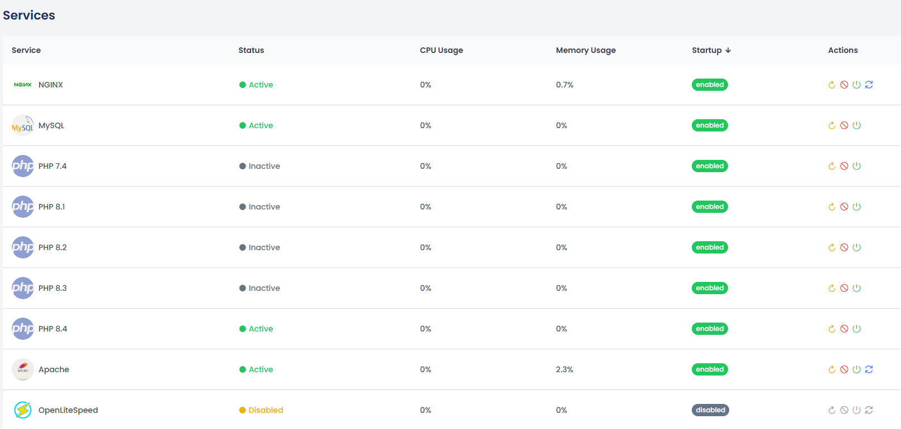

cPGuard X gives you full control over your server's key services directly from the control panel — no SSH or command-line access needed. You can start, stop, restart, and monitor services all from a single, easy-to-use interface.

{/* comment */}

## Supported Services

The control panel covers the following services:

| Service | Description |
|---|---|
| **Nginx** | High-performance web server and reverse proxy |
| **Apache** | Widely-used HTTP web server |
| **OpenLiteSpeed** | Lightweight, high-performance open-source web server |
| **MySQL** | Relational database management system |
| **PHP-FPM** | PHP FastCGI Process Manager (versions 7.4 to 8.4) |

---

## How to Access Service Management

From the main dashboard, navigate to:

**Server Health → Services**

This opens the **Services** page where all monitored services are listed along with their current status and resource usage.

---

## What You Can Do on the Services Page

### 1. Start, Stop, or Restart Services

Each service listed has an **Action** column with controls to:

- **Start** a service that is currently stopped
- **Stop** a running service
- **Restart** a service to apply configuration changes or resolve issues

This is particularly useful after making changes to configuration files, updating PHP settings, or troubleshooting an unresponsive service — without needing to run `systemctl` or `service` commands via SSH.

### 2. View Service Status

At a glance, you can see whether each service is currently **running** or **stopped**. This makes it easy to quickly identify any service that may have gone down unexpectedly.

### 3. Monitor CPU and Memory Usage

The Services page also displays **real-time CPU and memory usage** for each service. This helps you:

- Identify services consuming excessive resources
- Spot performance bottlenecks before they impact your websites
- Decide whether a service needs to be restarted or its configuration tuned

---

## Practical Use Cases

| Scenario | Action |
|---|---|
| PHP settings changed and need to apply | Restart the relevant PHP-FPM service |
| Website returning 502 Bad Gateway | Check if Nginx or PHP-FPM is running; restart if stopped |
| MySQL queries running slow | Check MySQL CPU/memory usage on the Services page |
| Switching web servers | Stop the current server, start the new one |
| Routine health check | Review all service statuses and resource usage at once |

---

## Summary

The **Server Health → Services** section in cPGuard X centralises service management and monitoring into a single, intuitive interface. Whether you need to restart PHP-FPM after a config change, check if MySQL is running, or investigate high CPU usage, everything is available without leaving the control panel.

