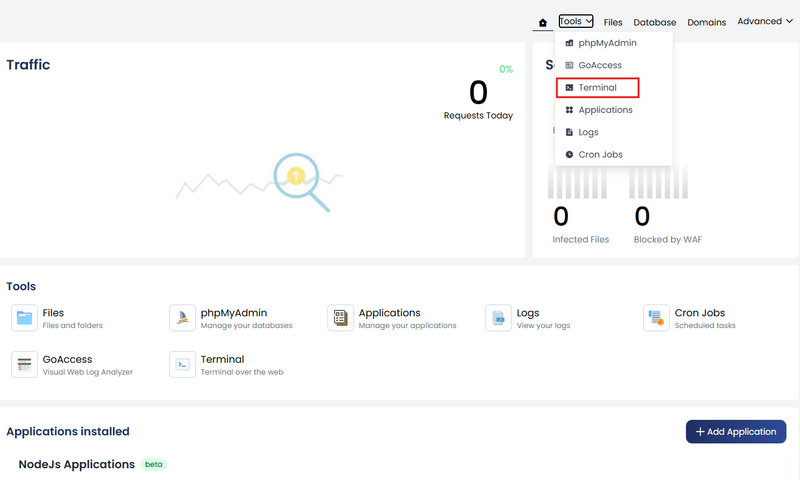
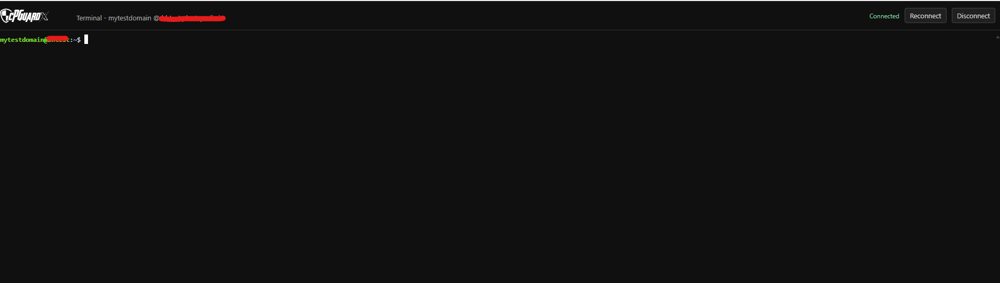

The cPGuardX panel provides a Terminal interface that gives you access to an in-browser terminal application. It allows direct command-line access to your hosting account, so you can run commands and manage your files and applications without using a separate SSH client.

## Accessing the Terminal

To open the Terminal, go to **Website Management → Tools → Terminal**.

