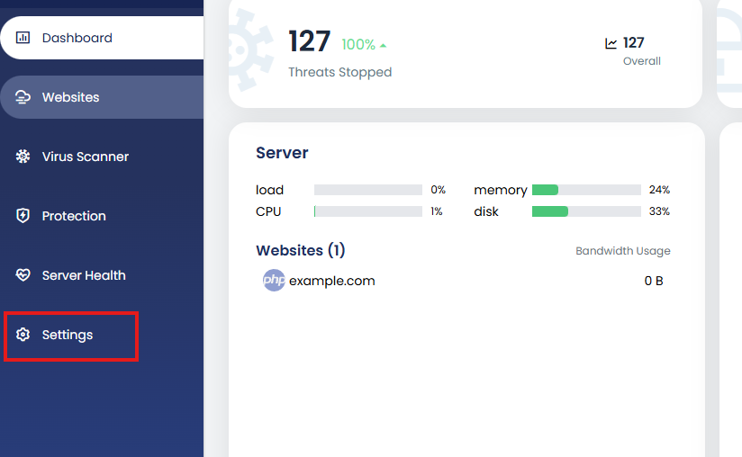
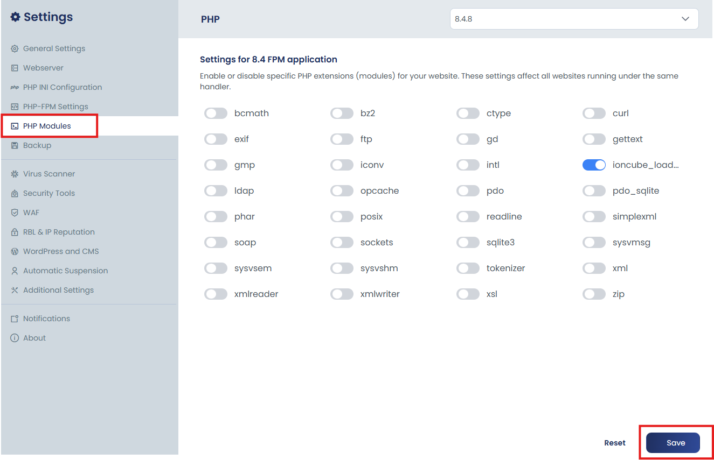

# Enable PHP Modules

cPGuard X lets you enable or disable PHP modules directly from the control panel GUI. No SSH access or manual `php.ini` editing required. The process is straightforward and includes an automatic PHP-FPM restart so your changes take effect immediately.

{/* comment */}

:::warning Webserver Compatibility
The PHP Extensions GUI is available **only** when using the **Nginx + Apache** stack. It is **not supported** with **OpenLiteSpeed (OLS)**.
:::

---

## What Are PHP Extensions?

PHP extensions (also called modules) are libraries that add extra functionality to PHP. Common examples include:

| Extension | Common Use Case |
|---|---|
| `mysqli` / `pdo_mysql` | MySQL database connectivity |
| `curl` | Making HTTP requests from PHP |
| `gd` / `imagick` | Image processing and manipulation |
| `mbstring` | Multibyte string handling (required by many CMS apps) |
| `zip` | Reading and writing ZIP archives |
| `opcache` | Bytecode caching for performance |
| `redis` / `memcached` | Object caching and session storage |
| `soap` | SOAP-based web service integration |
| `intl` | Internationalisation and localisation support |
| `xdebug` | PHP debugging and profiling |

Enabling only the extensions your applications need is good practice for both **performance** and **security**.

---

## Steps to Enable or Disable a PHP Module

### 1. Log in and Open Settings

Log into the **cPGuard X Control Panel** and click on **Settings** in the main menu.

### 2. Navigate to PHP Modules

Under the **Settings** section, select **PHP Modules**.

### 3. Select PHP Version and Toggle Modules

- From the **drop-down menu**, choose the PHP version for which you want to manage extensions.
- **Toggle** the required PHP module on or off as needed.
- Once all changes are made, click **Save** to apply them.

---

## What Happens After You Save

When you click **Save**, cPGuard X handles the rest automatically:

1. **Applies the selected modules** — the panel updates the PHP configuration to reflect your changes.
2. **Generates `extension.ini`** — the corresponding `.ini` file is created or updated to activate the selected extensions.
3. **Restarts PHP-FPM** — the related PHP-FPM service is restarted automatically, so no manual intervention is needed.

:::tip
Because PHP-FPM restarts automatically on save, your changes are live immediately. There is no need to manually restart any services after toggling extensions.
:::

---

## Managing Extensions Across Multiple PHP Versions

If your server runs multiple PHP versions (e.g., PHP 8.1, 8.2, and 8.3), note that **extensions are managed per PHP version**. An extension toggled for PHP 8.2 will not automatically apply to PHP 8.1 or 8.3.

Make sure to select the correct PHP version from the drop-down before making changes, especially in environments where different websites run different PHP versions.

---

## Summary

The PHP Modules section in cPGuard X provides a clean, toggle-based interface to manage PHP extensions per version without touching any config files manually. Combined with automatic PHP-FPM restarts, it makes extension management fast and reliable — ideal for both single-site setups and multi-PHP-version server environments.

---

## Related Guides

- [Managing PHP Settings in the Control Panel](/cpguard-x/php/php-settings) — per-domain `php.ini` and PHP-FPM tuning
- [Global PHP Settings via Panel Settings](/cpguard-x/php/global-php-settings) — server-wide PHP defaults
- [Install Additional PHP Modules Using PECL](/cpguard-x/php/install-modules-using-pecl) — for extensions not available in the GUI
