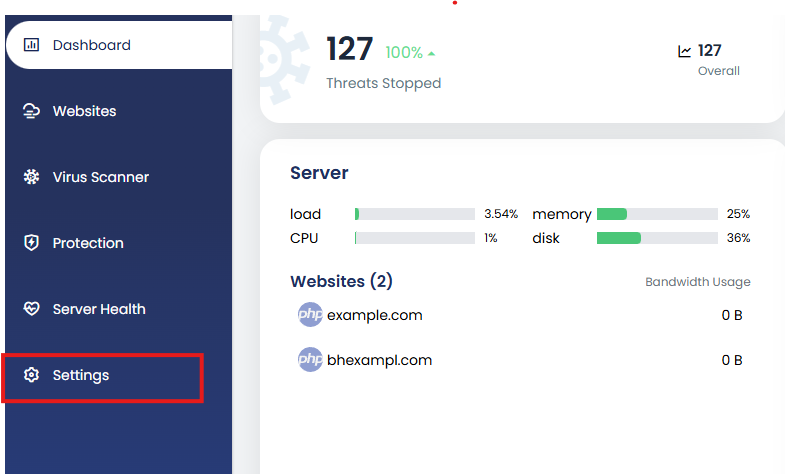
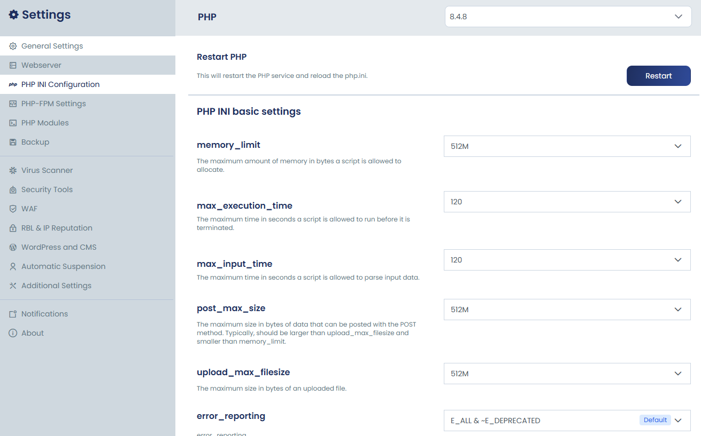
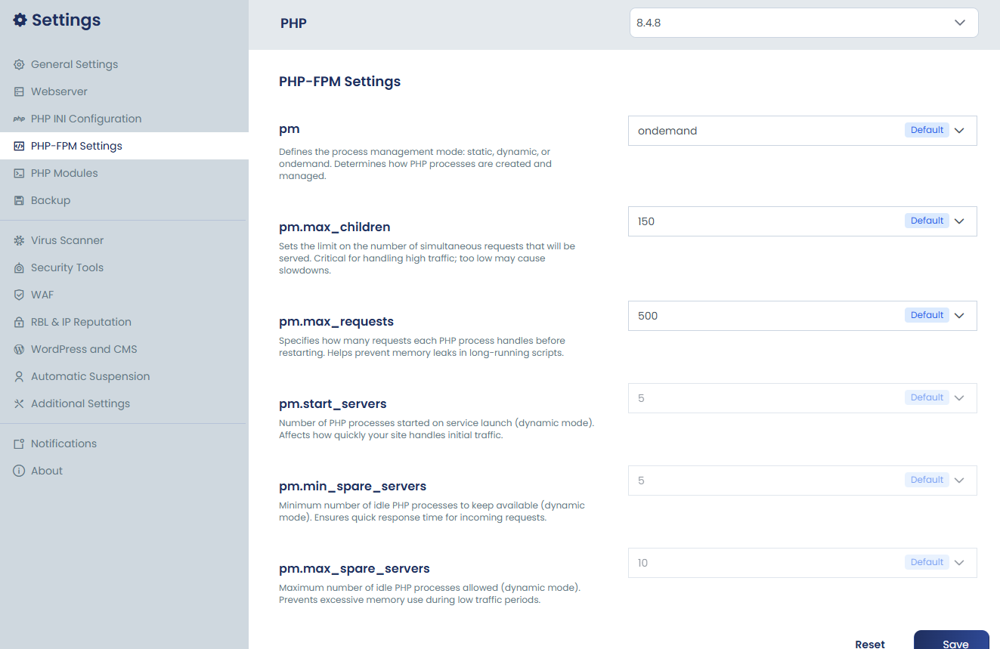

# Global PHP Settings via Panel Settings (Server-Wide)

cPGuard X provides flexible options to customize PHP behavior, allowing you to fine-tune settings based on your server's specific requirements. Understanding the two available configuration methods helps you manage PHP efficiently across single or multi-site environments.

{/* comment */}

## Two Ways to Configure PHP in cPGuard X

| Method | Scope | Best Used When |
|---|---|---|
| **Per-Domain Configuration** | Applies to a single website | Different sites need different PHP settings |
| **Global PHP Configuration** | Applies server-wide to all websites | You want consistent base settings across all sites |

This guide focuses on the **Global PHP Configuration** approach. For per-domain settings, refer to the [Per-Domain PHP Settings](/cpguard-x/php/php-settings) guide.

---

## What is Global PHP Configuration?

Global PHP settings act as **default base configurations** that apply to all websites hosted on the server. These defaults are used for:

- Newly created websites that haven't been individually configured
- Consistent server-wide PHP behavior without per-site overrides
- Centralised management of `php.ini` values and PHP-FPM process settings

:::note
Global settings can always be overridden at the individual website level through the per-domain PHP settings interface.
:::

---

## Steps to Configure Global PHP Settings

### Step 1 : Access Panel Settings

Log in to your **cPGuard X control panel** and navigate to the **Settings** section from the main dashboard.

### Step 2 : Locate the PHP Configuration Options

Under **Settings**, you will find two PHP-related configuration sections:

- **PHP INI Configuration** — for managing `php.ini` directives server-wide

- **PHP-FPM Settings** — for managing process management parameters server-wide

### Step 3 : Adjust Directives and Save

Modify the PHP directives and FPM parameters as required. Common directives you may want to configure include:

**PHP INI Configuration** 

| Directive | Description |
|---|---|
| `memory_limit` | Maximum amount of memory a PHP script may consume |
| `max_execution_time` | Maximum time (in seconds) a script is allowed to run |
| `max_input_time`  | Maximum time in seconds a script is allowed to parse input data |
| `post_max_size` | Maximum size of POST data PHP will accept |
| `upload_max_filesize` | Maximum size of an uploaded file |
| `error_reporting` | Set the level of error reporting |
| `display_errors` | Whether to display errors in the browser output |
| `log_errors` | Enable the logging of PHP errors |
| `allow_url_fopen` | Allows PHP file functions to retrieve data from remote locations over FTP or HTTP |
| `file_uploads` | Allows uploading files over HTTP |
| `short_open_tag` | Allows the short form of the PHP's open tag |
| `opcache.enable` | Enables the opcode cache |
| `disable_functions` | This directive allows you to disable certain functions |

**PHP-FPM Settings**

| Directive | Description |
|---|---|
| `pm` | Defines the process management mode: static, dynamic, or ondemand |
| `pm.max_children` | Sets the limit on the number of simultaneous requests that will be served |
| `pm.max_requests`  | Specifies how many requests each PHP process handles before restarting |
| `pm.start_servers` | Number of PHP processes started on service launch |
| `pm.min_spare_servers` | Minimum number of idle PHP processes to keep available |
| `pm.max_spare_servers` | Maximum number of idle PHP processes allowed |

Once you have made the necessary changes, click **Save** to apply the configuration.

:::info
These global settings will take effect across **all websites** on the server unless a specific website has its own PHP settings configured at the domain level.
:::

---

## Global vs Per-Domain: How Overrides Work

cPGuard X uses a straightforward override hierarchy. Which means If a website has its own PHP settings configured, those take priority over the global defaults. If no per-domain settings exist, the global configuration applies automatically.

---

## Summary

The Global PHP Settings feature in cPGuard X gives server administrators a single place to define consistent, server-wide PHP defaults. This is particularly useful when managing multiple websites and wanting to ensure a reliable baseline configuration without needing to configure each site individually.

For more granular control on a per-site basis, see [Per-Domain PHP Settings](/cpguard-x/php/php-settings).
