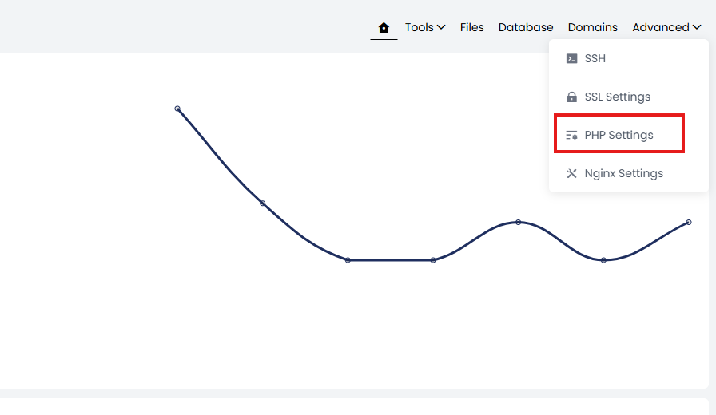
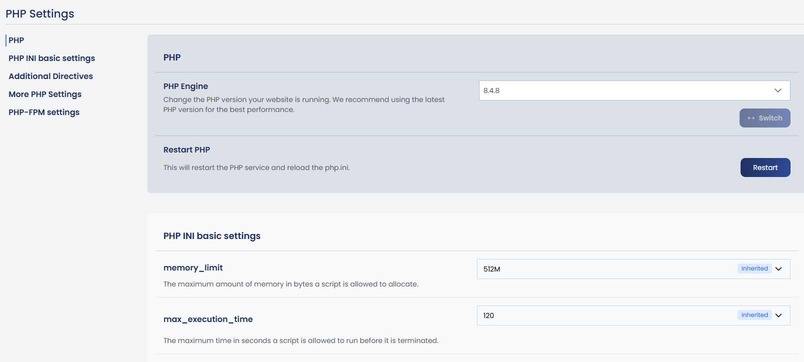
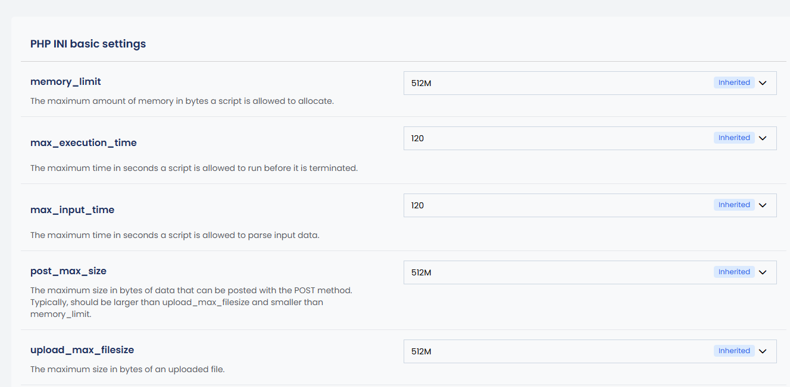
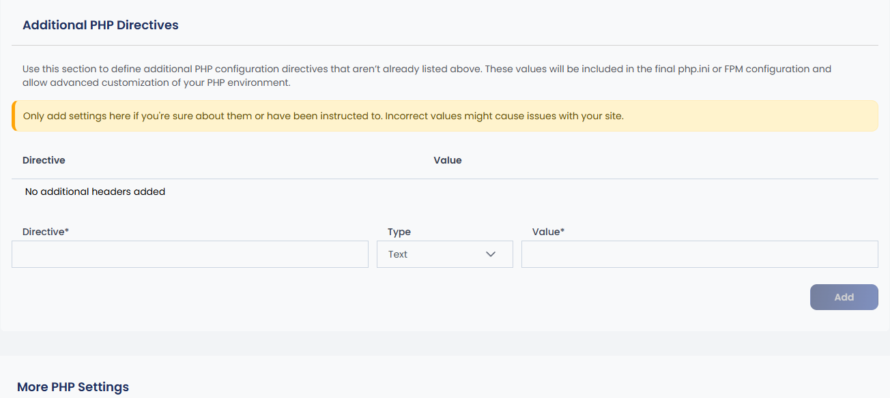
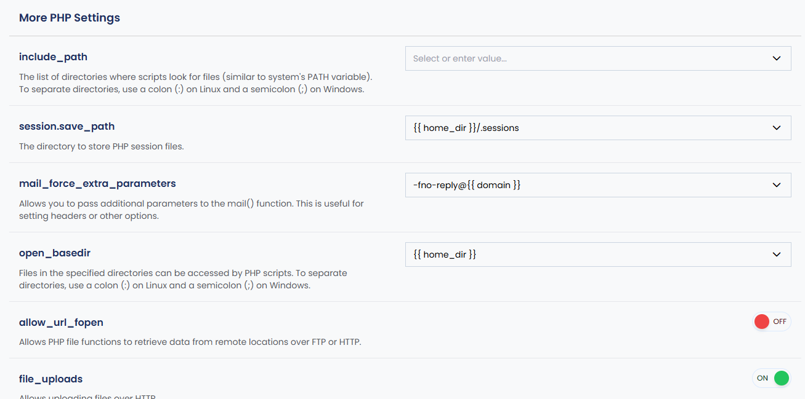
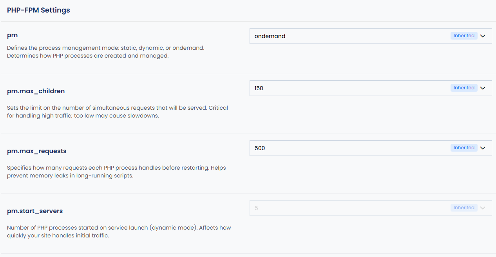

# Managing PHP Settings in the Control Panel

The cPGuard X control panel lets you easily manage PHP settings on a per-website basis. This includes switching the PHP version, editing `php.ini` values, configuring PHP-FPM process management, and setting additional directives for performance and compatibility.

{/* comment */}

## Steps to Edit PHP Settings

Follow these steps to navigate to the PHP Settings section for any website:

1. Log into the **Control Panel** and click on **Websites**.

2. Select the website for which you want to update the PHP settings.

3. On the website details page, click on **Advanced**.

4. Under the Advanced section, click on **PHP Settings**.

You'll now see all available PHP configuration options for that website.

---

## Available Options in PHP Settings

### a. Change PHP Version

Switching the PHP version for a website is straightforward:

1. Click the dropdown under **PHP Engine**.
2. Select the desired PHP version.
3. Click the **Switch** button.

:::tip
We recommend using the latest stable PHP version for better performance and security.
:::

:::note
If you need to manually restart PHP, an option is available within the PHP Settings section. When you change any PHP value through the panel, the PHP service will restart automatically to apply the changes.
:::

---

### b. Edit `php.ini` Values

You can modify basic PHP configuration values such as `memory_limit`, `upload_max_filesize`, and others:

- Values are displayed in editable fields.
- After making changes, click **Save**.
- The system will automatically restart the related PHP service to apply the new settings.

---

### c. Additional PHP Directives

This section allows you to manually add custom PHP configuration settings:

- Enter them in the **Additional configuration directives** box.
- Use this section only if you are confident in the changes or have been specifically advised to do so.

:::warning
Incorrect settings here may cause errors or negatively affect website performance.
:::

---

### d. More PHP Settings

The **More PHP Settings** section provides advanced configuration options that control how PHP behaves on your website. Key settings available include:

| Directive | Purpose |
|---|---|
| `include_path` | Define paths for PHP to search for included files |
| `session.save_path` | Set the directory where session data is stored |
| `mail.force_extra_parameters` | Force extra parameters when sending mail |
| `open_basedir` | Restrict PHP file access to specified directories |
| `allow_url_fopen` | Enable/disable URL-based file access |
| `file_uploads` | Enable or disable file uploads via PHP |
| `short_open_tag` | Enable or disable the short PHP open tag (`<?`) |
| `opcache.enable` | Enable or disable OPcache for performance |
| `disable_functions` | Disable specific PHP functions for security |

These settings play an important role in ensuring **security**, **compatibility**, and **performance**.

:::caution
Use this section only if you are familiar with these options or have specific instructions — incorrect changes may affect your website's functionality.
:::

---

### e. PHP-FPM Settings

The **PHP-FPM Settings** section allows you to fine-tune how PHP processes are managed for each individual website. This is especially important for optimizing server performance on high-traffic sites.

#### Process Management Mode (`pm`)

The `pm` directive defines how PHP worker processes are created and handled. Three modes are available:

| Mode | Description |
|---|---|
| `static` | A fixed number of PHP processes are always running |
| `dynamic` | Processes are created and destroyed based on demand |
| `ondemand` | Processes are only created when a request comes in |

#### Key PHP-FPM Parameters

| Parameter | Description |
|---|---|
| `pm.max_children` | Maximum number of child PHP processes allowed |
| `pm.start_servers` | Number of processes created when PHP-FPM starts |
| `pm.min_spare_servers` | Minimum number of idle processes to keep available |
| `pm.max_spare_servers` | Maximum number of idle processes allowed |
| `pm.max_requests` | Number of requests a process handles before restarting |

Tuning these parameters helps balance **server resource usage** and **response performance**, particularly when running multiple websites or under heavy load.

---

## Summary

The PHP Settings section in cPGuard X gives you granular, per-website control over your PHP environment. Whether you're upgrading the PHP version, tweaking memory limits, or fine-tuning FPM process pools, all configuration is accessible through a clean GUI without needing to manually edit server config files.

For server-wide PHP defaults, refer to the [Global PHP Settings](/cpguard-x/php/global-php-settings) guide.
