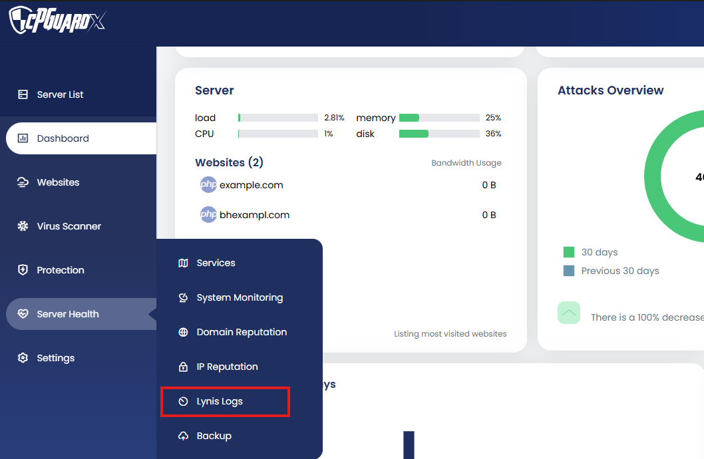
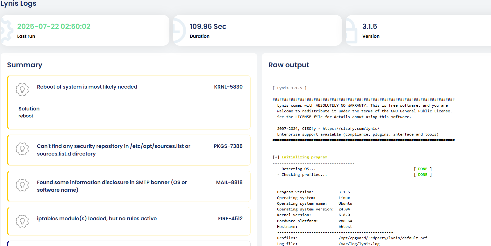

cPGuard X now integrates **Lynis** as a powerful security auditing tool, replacing the traditional Rootkit Scanner. Lynis is a battle-tested, open-source security auditing tool for Linux and Unix-based systems, widely used for identifying vulnerabilities and improving server hardening.

{/* comment */}

## What is Lynis?

Lynis performs in-depth security scans of your Linux server examining system settings, running services, installed software, and critical configuration files. It surfaces misconfigurations, missing patches, and weak security practices that could expose your server to risk.

Unlike reactive security tools that respond to threats after they occur, Lynis is **proactive**. it helps you find and fix weaknesses before they can be exploited.

### What Lynis Scans For

| Category | Examples |
|---|---|
| **System configuration** | Insecure kernel parameters, weak file permissions |
| **Services and daemons** | Unnecessary running services, misconfigured SSH |
| **Authentication** | Weak password policies, PAM configuration |
| **Software and patches** | Outdated packages, missing security updates |
| **File integrity** | World-writable files, SUID/SGID binaries |
| **Networking** | Open ports, firewall rule gaps |
| **Logging and auditing** | Missing or insufficient audit trails |

---

## How Lynis Works in cPGuard X

Lynis is fully integrated into the cPGuard X control panel and runs as an **automated daily security scan**. No manual setup or command-line interaction required.

### Automated Daily Scans

- Scans are run **automatically once every 24 hours** from the server side.
- Users **cannot manually trigger scans**. This ensures consistent, scheduled audits without risk of scan conflicts or resource spikes from multiple simultaneous runs.

:::info
The automated approach means your server is continuously assessed for security posture without any action needed on your part.
:::

---

## Accessing Lynis Scan Results

Navigate to: **Server Health → Lynis Logs**

The Lynis Logs interface displays the following for each scan:

| Field | Description |
|---|---|
| **Last scan time** | When the most recent audit was completed |
| **Scan duration** | How long the scan took to run |
| **Lynis version** | The version of Lynis used for the scan |
| **Full raw output** | The complete audit log from the scan |

---

## Understanding Scan Results

### Warnings and Suggestions

All findings from each scan are summarised into two categories for quick review:

- **Warnings** — issues that represent a more immediate security concern and should be addressed promptly
- **Suggestions** — lower-priority recommendations to improve the overall security posture of the server

Each finding includes a **linked solution article** to guide you through the remediation steps. So you're never left wondering what to do about a finding.

:::tip Coming Soon
An upcoming update will sort warnings and suggestions **by criticality**, making it even easier to prioritise and address the most urgent issues first.
:::

---

## Lynis vs Traditional Rootkit Scanner

| Feature | Rootkit Scanner | Lynis |
|---|---|---|
| **Primary focus** | Detecting rootkits and known malware | Broad security auditing and hardening |
| **Scope** | Malware detection | System config, services, patches, auth, networking |
| **Recommendations** | Limited | Actionable suggestions with solution articles |
| **Scheduling** | Manual or cron-based | Automated daily (built into cPGuard X) |
| **Output detail** | Basic | Full raw audit log with categorised findings |

Lynis provides a significantly broader and more actionable view of your server's security posture compared to a traditional rootkit scanner alone.

---

## Summary

The integration of Lynis into cPGuard X brings enterprise-grade, automated security auditing to your server without any additional configuration. Daily scans, clear categorisation of findings, and linked remediation articles make it straightforward to keep your server hardened and compliant over time.

Access your scan results anytime at **Server Health → Lynis Logs** to stay on top of your server's security posture.
