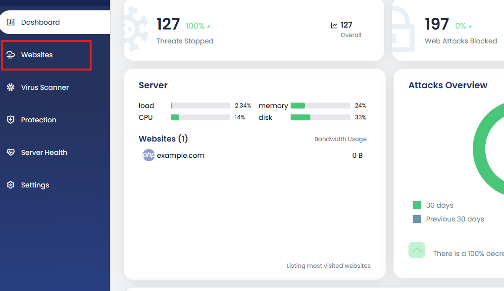
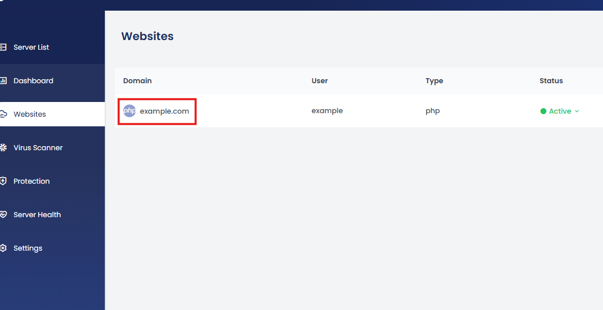
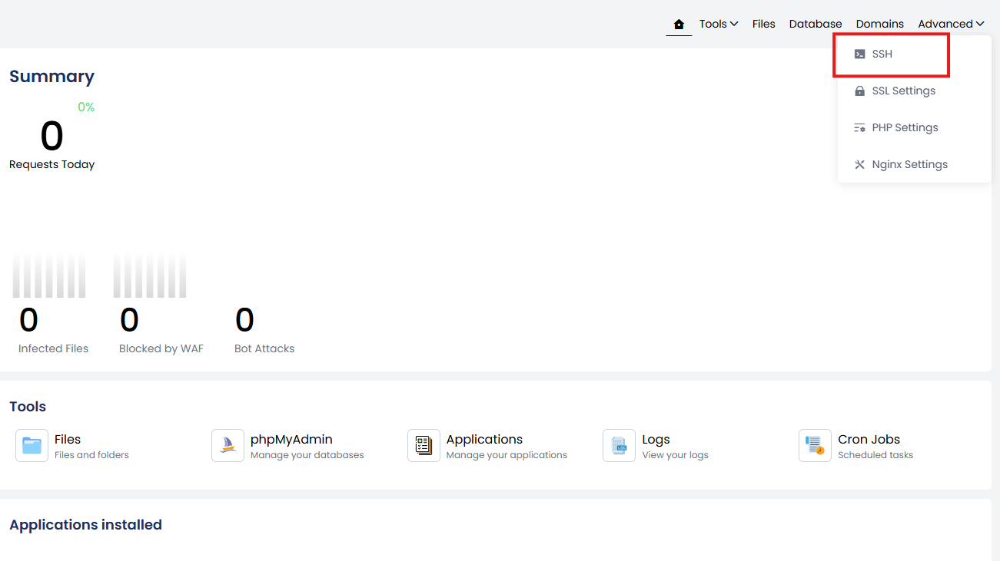
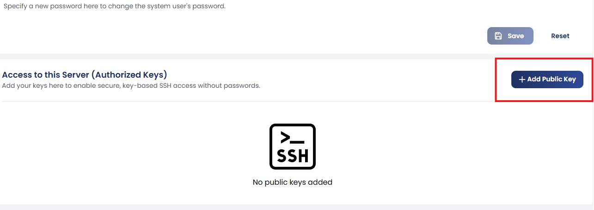
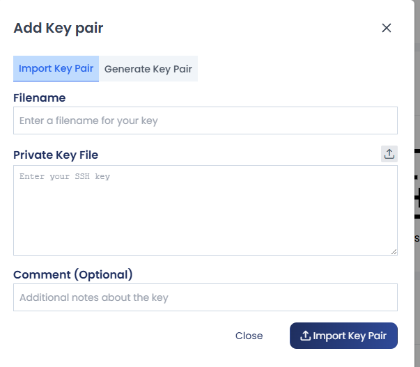
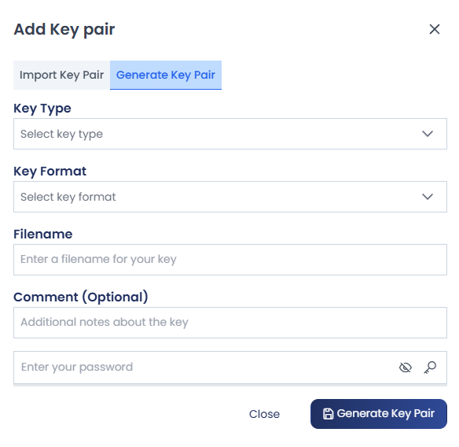
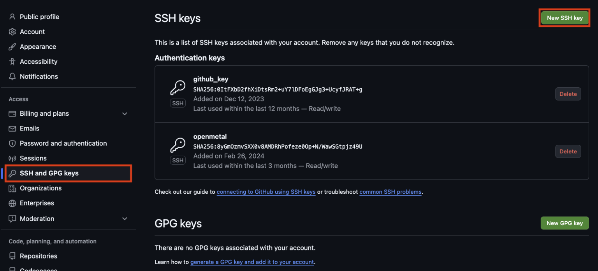

# SSH Authentication & GitHub Integration

To manage your server securely, it is recommended to use **SSH key-based authentication** instead of passwords. SSH keys improve security and allow passwordless login to the server. 

The cPGuard X control panel provides an interface to add SSH keys and configure outgoing SSH connections for services such as **GitHub repositories**.

---

## Accessing SSH Settings

Follow these steps to access SSH configuration in the control panel:

1. Log in to the **cPGuard X control panel**.
2. Navigate to **Websites**.


3. Select the website you want to manage.


4. Open the **Advanced** dropdown menu.


5. Click **SSH** to open the SSH configuration page for the website.


6. On the SSH page, click **+ Add Public Key** to add a new key.


7. Paste your **public SSH key** in the provided field.


8. Click **Create**.

Once the key is added, you can connect to the server via SSH using the corresponding **private key** from your local machine.

---

## Connecting to External Services (GitHub)

In some situations, the server must connect to external systems such as:

- GitHub
- Git repositories
- Deployment systems

To allow this, the server needs an **SSH key pair**.

### Steps to Configure

1. Go to the **SSH** section in the control panel.
2. Click **+ Add SSH Key**.
3. Either:
   - Import an existing SSH key, or
   

   - Generate a new SSH key pair.
   


This key pair can then be used for **outgoing SSH connections from the server to external platforms like GitHub**.

---

## Example: Using SSH with GitHub

After generating a key pair:

1. Copy the **public key**.
2. Add it to your GitHub account under:

```
GitHub → Settings → SSH and GPG Keys → New SSH Key
```


Once added, the server will be able to authenticate with GitHub repositories securely.

---

## Benefits of SSH Authentication

Using SSH keys provides several advantages:

- Eliminates password-based login
- Stronger authentication mechanism
- Secure Git repository access
- Suitable for automated deployments

---

## Summary

With cPGuard X you can:

- Add **SSH public keys for server login**
- Generate **SSH keys for outbound connections**
- Integrate servers with **GitHub repositories**
- Improve server security using **key-based authentication**

Using SSH keys is the recommended method for secure server access and automated repository integration.