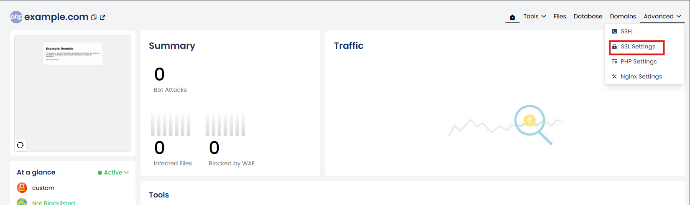
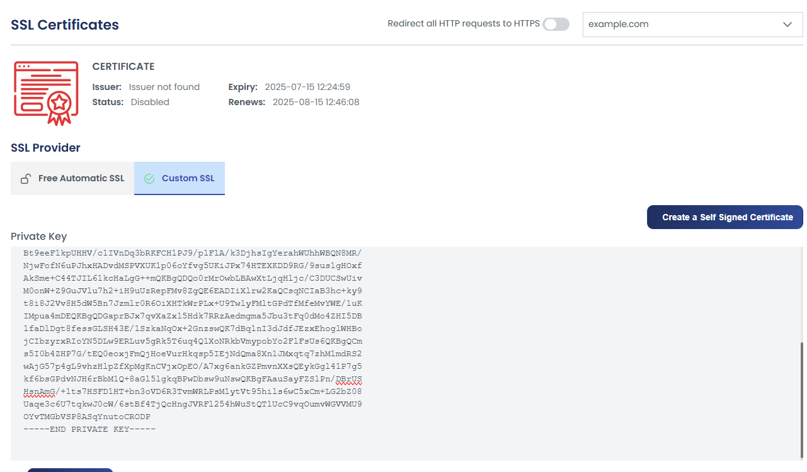
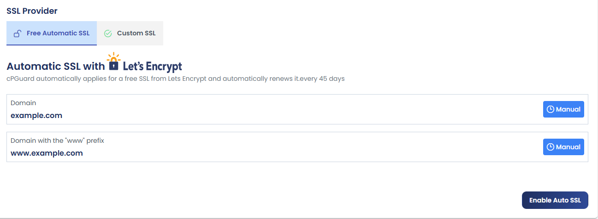
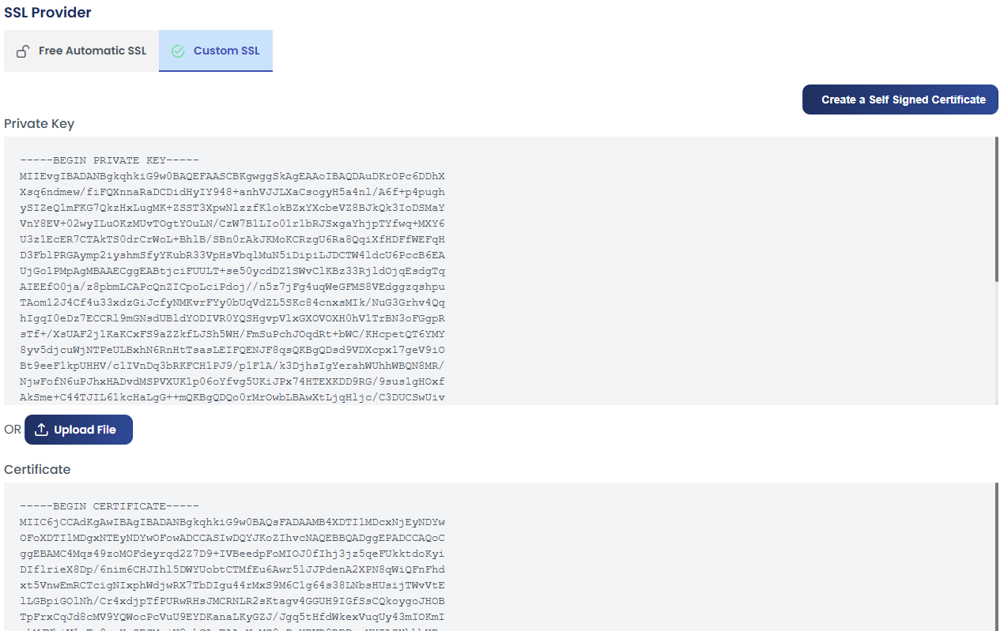
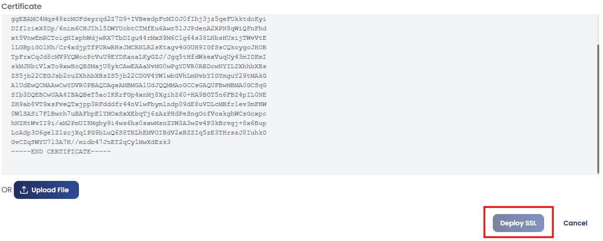
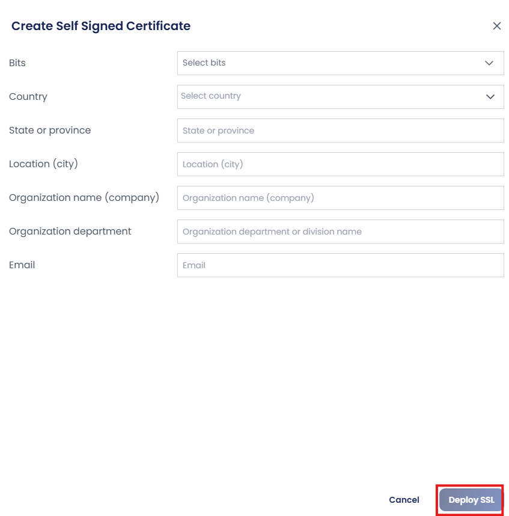

# Managing SSL Certificates in cPGuard X Control Panel

Securing your website with SSL is essential for encrypted communication, user trust, and compliance with modern security standards. The **cPGuard X control panel** offers three flexible SSL options to suit different needs — free automatic SSL via Let's Encrypt, custom SSL using your own certificate, and self-signed certificates for development or internal use.

---

## SSL Options at a Glance

| SSL Type | Best For | Renewal |
|---|---|---|
| **Free Auto SSL** (Let's Encrypt) | Production websites, blogs, e-commerce | Automatic every 45 days |
| **Custom SSL** | Wildcard certs, EV/OV certificates, CDN-issued certs | Manual — managed by you |
| **Self-Signed Certificate** | Development, internal tools, testing environments | Manual |

---

## How to Access SSL Settings

All three SSL options are accessed from the same location in the control panel. Follow these steps to reach the SSL Settings page:

**Step 1** : Log in to the control panel and navigate to **Websites**.

**Step 2** : Select the website for which you want to manage SSL.

**Step 3** : On the website details page, click **"Advanced"**.

**Step 4** : From the Advanced dropdown, select **SSL Settings**.

You will now see the SSL Settings page with all three certificate options available.

---

## Option 1 : Free Automatic SSL (Let's Encrypt)

The **Free Auto SSL** option automatically issues and installs a **Let's Encrypt** certificate for your domain. Renewal happens automatically every **45 days** with no manual action required after initial setup.

This is the recommended option for most public-facing websites.

**To enable Free Auto SSL:**

1. In the SSL Settings page, locate the **Free Automatic SSL** section.
2. Enter your **domain name** in the provided field.
3. Click **Enable Auto SSL**.

The certificate will be issued and installed automatically. Your website will begin serving traffic over HTTPS immediately after the process completes.

:::tip
Make sure your domain's DNS is correctly pointing to your server before enabling Auto SSL. Let's Encrypt verifies domain ownership via HTTP challenge — if DNS is not resolving to the server, certificate issuance will fail.
:::

:::note
Let's Encrypt certificates are valid for **90 days** but are automatically renewed by cPGuard X every **45 days** (well before the expiry date) ensuring your site never experiences an SSL expiry outage.
:::

---

## Option 2 : Custom SSL Certificate

If you have a purchased SSL certificate such as a **wildcard certificate**, an **Extended Validation (EV)** certificate, or a certificate issued by a CDN provider — you can install it directly using the **Custom SSL** option.

**To install a Custom SSL certificate:**

1. In the SSL Settings page, locate the **Custom SSL** section.
2. Provide your certificate and private key using one of two methods:
   - **Upload** the certificate and key files directly, or
   - **Paste** the certificate and private key content into the provided text fields
3. Click **Deploy SSL** to install and activate your custom certificate.

:::note
Ensure you provide the **full certificate chain** (including any intermediate certificates) along with your private key. An incomplete chain may cause browser trust errors even though the certificate itself is valid.
:::

:::warning
Keep your **private key secure** at all times. Never share it or store it in publicly accessible locations. If your private key is compromised, revoke the certificate immediately and reissue it from your certificate authority.
:::

---

## Option 3 : Self-Signed Certificate

A **self-signed certificate** provides encryption but is not trusted by browsers by default. Visitors will see a security warning when accessing the site. This option is suitable for:

- **Development environments** where browser warnings are acceptable
- **Internal tools and staging servers** accessed only by your team
- **Testing SSL configurations** before deploying a production certificate

**To generate a Self-Signed Certificate:**

1. In the SSL Settings page, locate the **Generate a Self-Signed Certificate** section.
2. Fill in the required details:
   - Organisation name
   - Country code
   - Any other requested fields
3. Click **Deploy SSL** to generate and install the self-signed certificate.

:::warning
**Do not use self-signed certificates on public production websites.** Browsers will display a "Your connection is not private" warning to all visitors, which significantly damages user trust and can deter legitimate traffic.
:::

---

