We provide a convenient Graphical User Interface (GUI) within the control panel that allows you to manage essential Nginx settings without needing to manually edit configuration files. This guide will walk you through configuring index files, static file handling, cache expiry, CORS rules, and custom HTTP headers.

All changes made in this section are automatically validated and applied in real-time. The Nginx service is safely reloaded in the background.

## Accessing Nginx Settings

To configure Nginx settings:

1. Log in to your control panel. Click on **Websites**.

2. Select the website you want to manage.

3. Navigate to the **Advanced** tab or section.

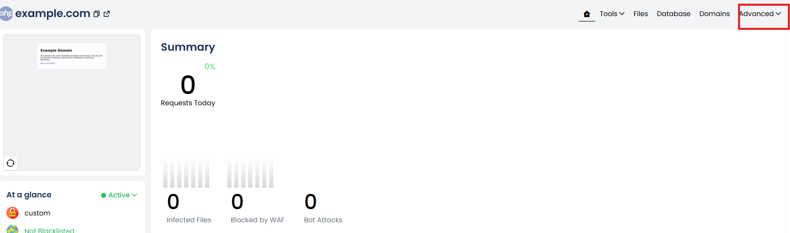

4. Scroll down to locate the **Nginx Settings** area.

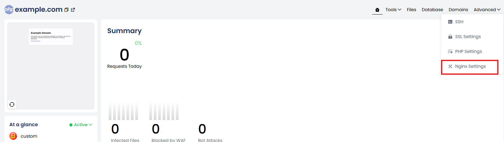

In our control panel, we offer both **Default** and **Custom** Nginx settings.

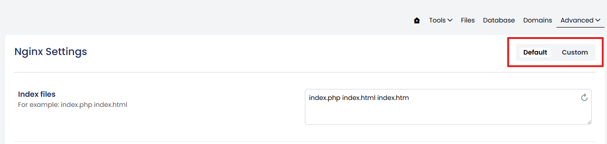

### Default Nginx Settings

When a website is created, a default Nginx configuration is automatically generated. This configuration can be easily managed through the control panel — there’s no need to manually access or edit the `.conf` file.

The following default settings are available for editing directly within the panel. Any changes you make will be applied immediately, and the Nginx service will automatically reload to reflect the updates — no manual restart required.

#### Available Configuration Options

**1. Index Files**

Define the default files Nginx should serve when a directory is accessed (e.g., when visiting the homepage without specifying a file).

**Example input:**

index.php,index.html,index.htm

Nginx will attempt to load `index.php` first. If not found, it will proceed to `index.html`, then `index.htm`.

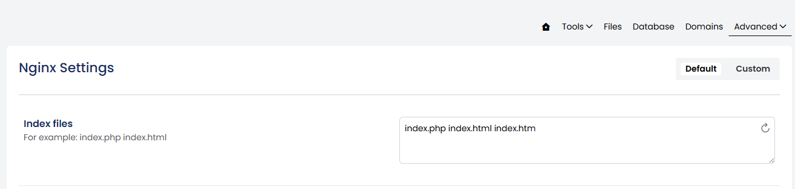

2. Static File Types

By serving static files directly, NGINX minimizes processing overhead and significantly improves response times for non-dynamic content such as images, CSS, and JavaScript files.

How to Set:

Enter file extensions in the input box, separated by the | (pipe) symbol.

You can add or remove extensions as needed.

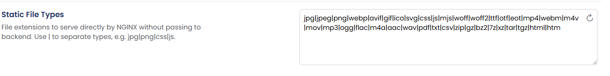

3. Cache Expiry

Instructs browsers to cache static files locally for a specified duration, helping to reduce bandwidth usage and improve load times for returning visitors.

You can choose the time unit (days, weeks, months, or minutes) from the dropdown menu and enter the desired value in the input box.

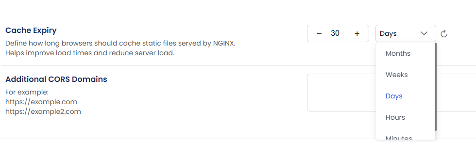

4. CORS Settings

Enables and manages Cross-Origin Resource Sharing (CORS) for APIs or shared resources. This allows your website to securely share assets such as fonts or APIs with other domains or external applications.

Simply enter the allowed domain(s) in the provided input box.

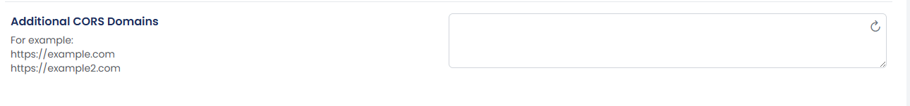

5. Additional Headers

Add custom headers to control browser behavior and enhance website security.

Common Security Headers:

- X-Frame-Options: SAMEORIGIN – Helps prevent clickjacking attacks.
- X-Content-Type-Options: nosniff – Prevents MIME type sniffing.
- Strict-Transport-Security: max-age=31536000; includeSubDomains – Enforces secure (HTTPS) connections.

How to Add a Header:

- Key field: Enter the header name (e.g., `X-Frame-Options`)
- Value field: Enter the corresponding value (e.g., `SAMEORIGIN`)
- Enter the key and value in their respective boxes in the panel.

Once saved, the header will be automatically included in the NGINX response for every HTTP request to your website.

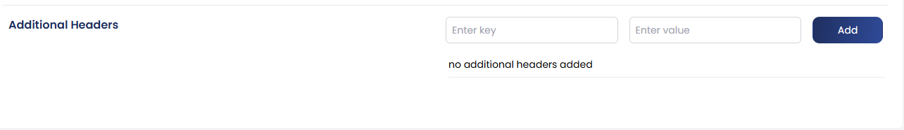

Finally, click the **Save** button to apply and store the changes.

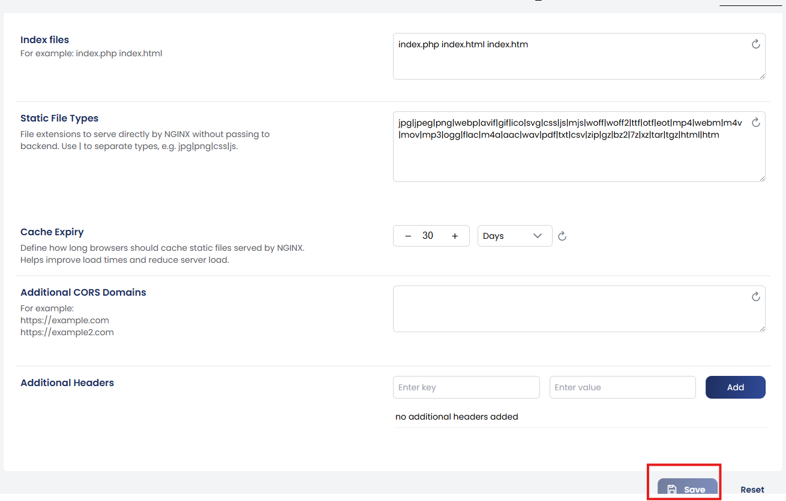

We also provide an option to add Custom Nginx Configurations based on your specific requirements.

You can insert configurations in the following sections:

- Inside the server block  
- Before closing the server block  
- Outside the server block  

Depending on the type of directive, it’s important to place the configuration in the correct section. For example, certain settings must be placed inside the server block to function properly.

Once added, click **Save** to apply the custom configuration.

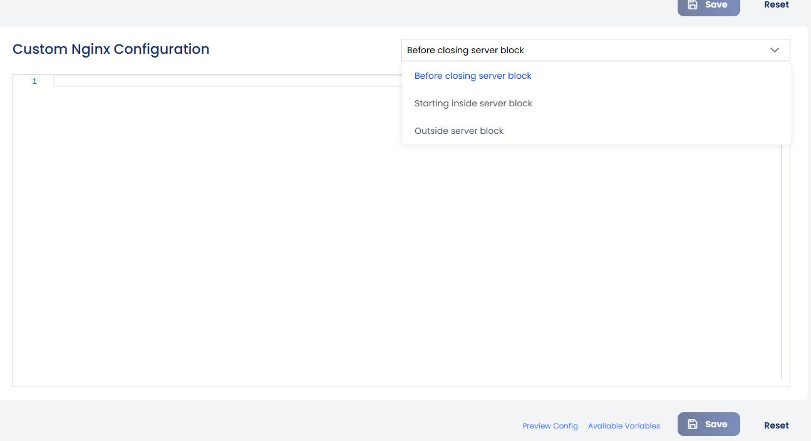

### Custom Nginx Settings

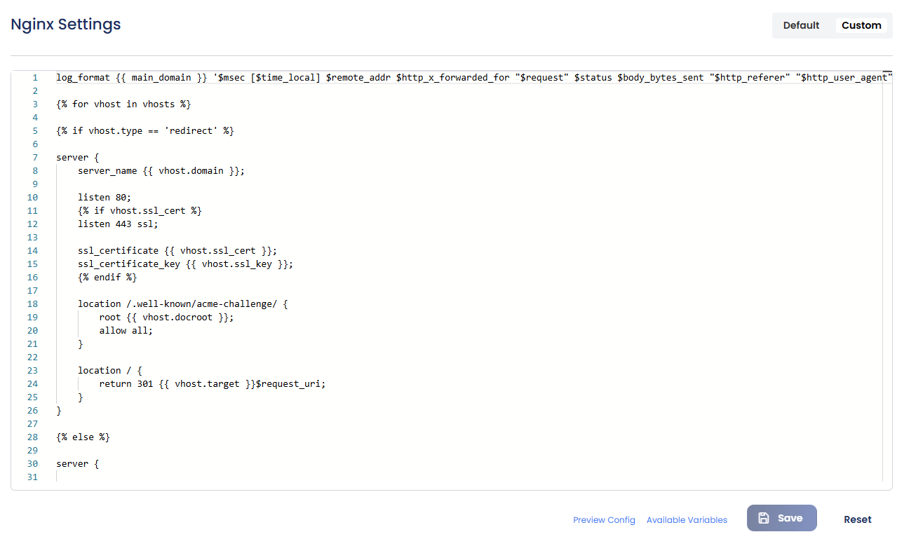

The Custom NGINX Settings section allows advanced users to write and apply their own NGINX configurations directly from the panel.

If you’re familiar with NGINX syntax, you can manually enter the necessary directives here.

The Custom NGINX Configuration section supports Twig templating, allowing you to use dynamic variables within your configuration. This makes it easier to create reusable and scalable NGINX templates tailored to each website or domain.

How It Works

Instead of hardcoding values like domain names or file paths, you can use Twig variables such as:

&#123;&#123; vhosts &#125;&#125; – Path to the vhosts directory  
&#123;&#123; home_dir &#125;&#125; – Home directory of the current domain  
&#123;&#123; main_domain &#125;&#125; – The primary domain name

These placeholders are automatically replaced with actual values when the configuration is saved.

You can view the available variables by selecting the **Available Variables** option.

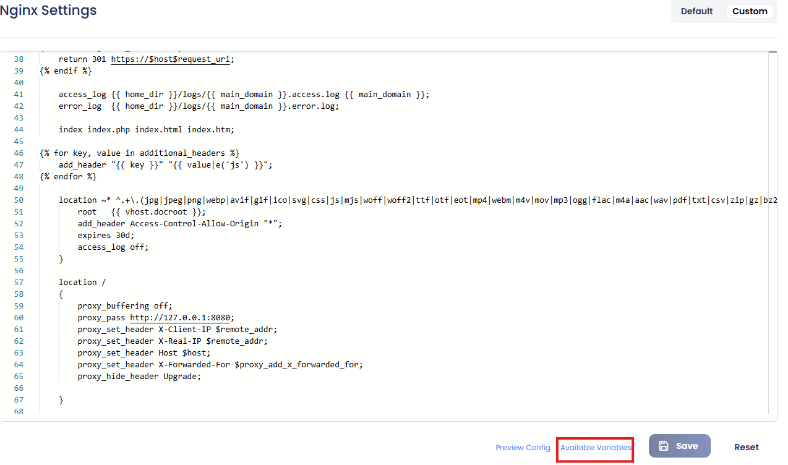

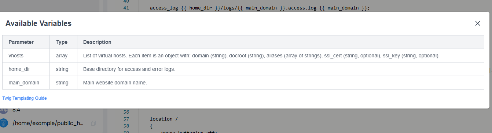

For a deeper understanding of how Twig works, refer to the Twig documentation or guide linked within the panel.

:::danger[caution]
Incorrect syntax or misconfigured directives may cause NGINX to fail.
:::

Before saving, you can use the **Preview Config** option to review the configuration and check for any errors or misconfigurations.

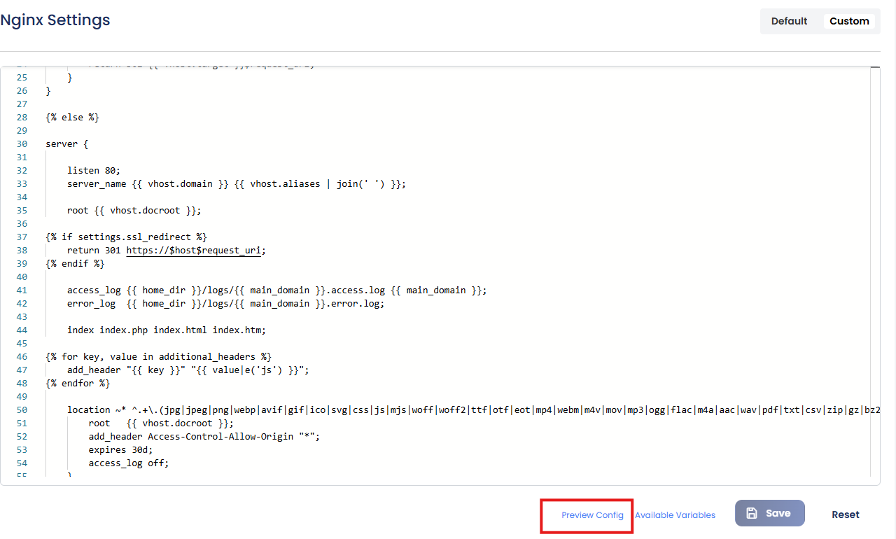

Once your configuration is entered and verified, simply click **Save** to apply the changes. This provides flexibility for specific use cases while still handling the necessary service restarts automatically.

