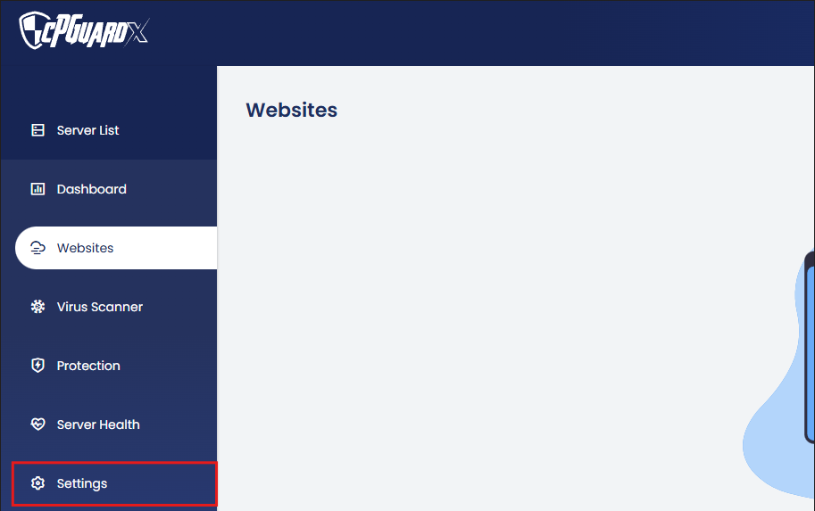
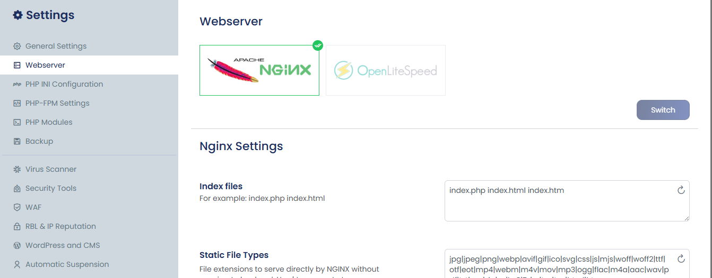
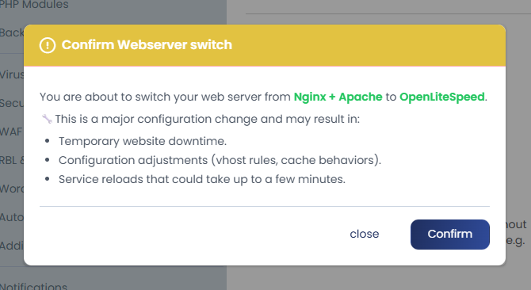
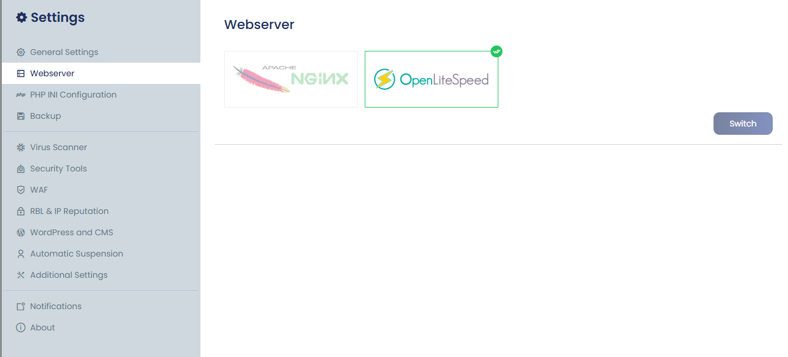

This guide explains how to switch your web server through the control panel. Screenshots are provided for each step. The process is simple, and all necessary services will restart automatically once the switch is complete.

1. Log in to the **control panel** and go to **Settings** from the left-hand menu.

2. Locate **Web Server** in the menu just below **General Settings**, and click to open it.

   The active web server is indicated by a **green tick**.  
   To change it, select the desired web server and click the **Switch** button.

3. A confirmation window will appear, displaying information about potential temporary downtime.

   Review the details and confirm to proceed.

4. The related services will restart automatically, and the web server switch will be completed.

