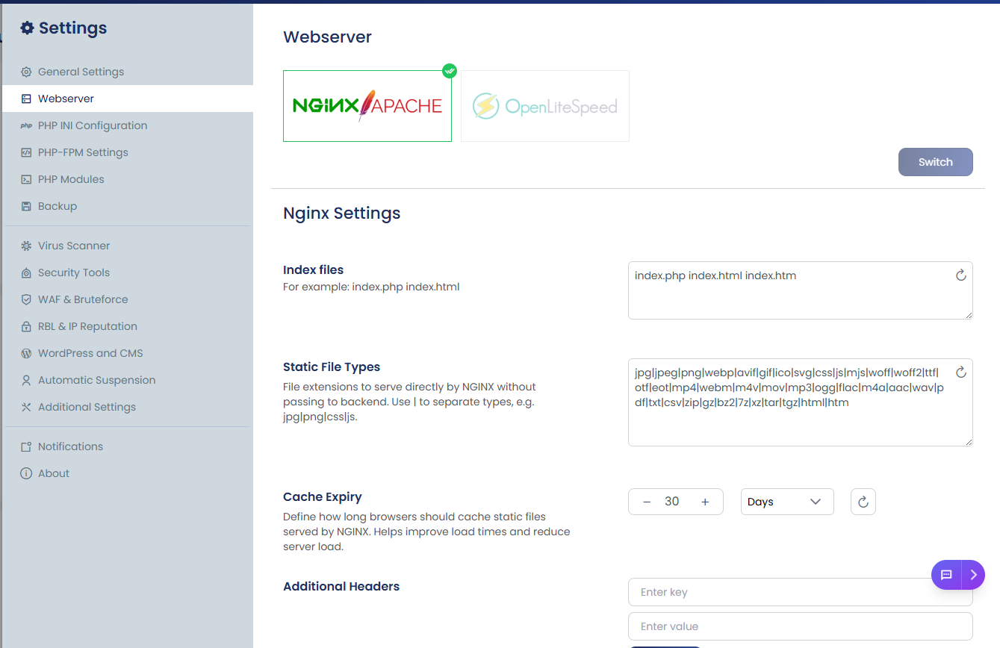

When the web server is switched to **NGINX–Apache mode**, the below settings can be configured directly from the UI.

These options control how NGINX serves content, handles default files, manages static assets, and applies browser caching. All changes made here are applied at the web server level automatically.

This eliminates the need for manual backend configuration and allows users to manage performance and request-handling behavior easily.

In addition to these global settings, per-website NGINX configuration is also available. This allows you to customize behavior individually for each site without affecting others. You can refer to the cPGuard guide here for detailed steps:[**Site-Level-Nginx-Configuration**](./Site-Level-Nginx-Configuration)

## Nginx Settings

### 1. Index Files

**UI Field:**
index.php index.html index.htm

**Description:** 
Defines the order of default files NGINX will look for when a directory is requested.

**Behavior:**
When a user accesses a directory (e.g. `/`), NGINX serves the first available file in the defined order.

**Example:**
For request:

https://domain.com/

NGINX checks in sequence:
- index.php
- index.html
- index.htm

The first matching file is served as the default landing page.

**Use Cases:**
- Ensures proper routing for PHP applications (e.g. WordPress)
- Provides fallback support for static sites

---

### 2. Static File Types 

**UI Field:**

jpg|jpeg|png|webp|avif|gif|ico|svg|css|js|mjs|woff|woff2|ttf|otf|eot|mp4|webm|m4v|mov|mp3|ogg|flac|m4a|aac|wav|pdf|txt|csv|zip|gz|bz2|7z|xz|tar|tgz|html|htm

**Description:**
Specifies file types that are served directly by NGINX without passing the request to the backend (PHP, Node, etc.).

**Behavior:**
- Requests matching these extensions are handled directly by NGINX  
- Backend processing is bypassed for these files  

**Example:**
- `https://domain.com/style.css` → served by NGINX  
- `https://domain.com/image.jpg` → served by NGINX  
- `https://domain.com/index.php` → sent to backend  

**Benefits:**
- Faster response time  
- Reduced backend load  

---

### 3. Cache Expiry (Browser Caching)

**Description:**
Defines the duration (in days) for which browsers cache static files served by NGINX.

**Behavior:**
Once a static file is loaded:
- It is stored in the browser cache  
- It will not be re-downloaded until the expiry period ends  

**Example (30 days):**
- Images, CSS, JS, and other static assets are cached for 30 days  
- Repeat visits load significantly faster  

---

### 4. Additional Headers

Headers are small pieces of information sent along with your website content to the browser. They help control things like security, caching, and how the browser handles your site.

#### How it works

You can add a Key → Value pair, and NGINX will automatically include it in all responses.

**Description:**
Allows administrators to define custom HTTP response headers that NGINX includes in every response.

**Behavior:**
Headers are automatically applied at the server level and affect all requests handled by NGINX.

#### Example Uses

- Improve security (e.g., prevent clickjacking)
- Control browser caching behavior
- Enable or restrict access from other websites (CORS)

---

#### Simple Example

X-Frame-Options → SAMEORIGIN

This tells the browser:
Only allow the page to be loaded inside a frame on the same website.

---

#### If Nothing is Added

- No extra headers are sent
- Only default server headers will be used
---

