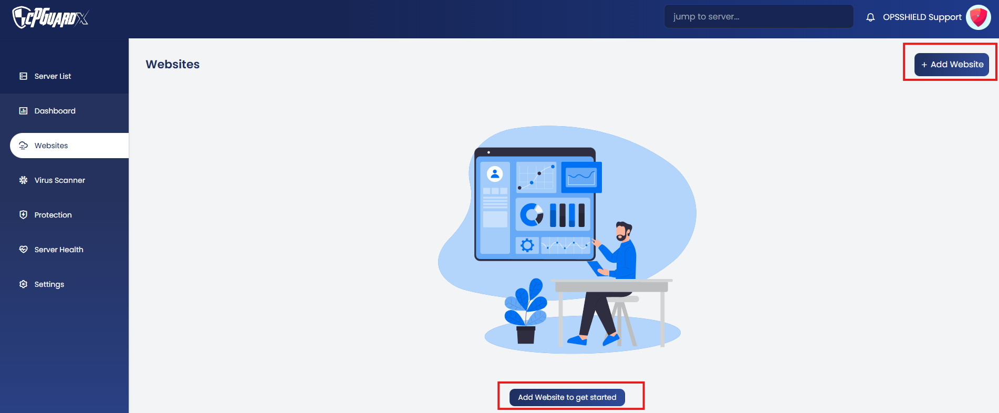
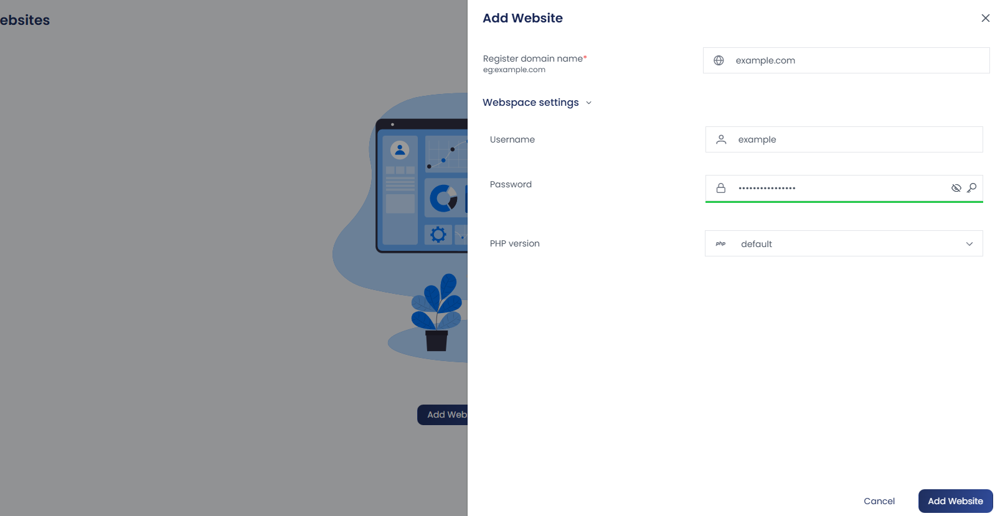
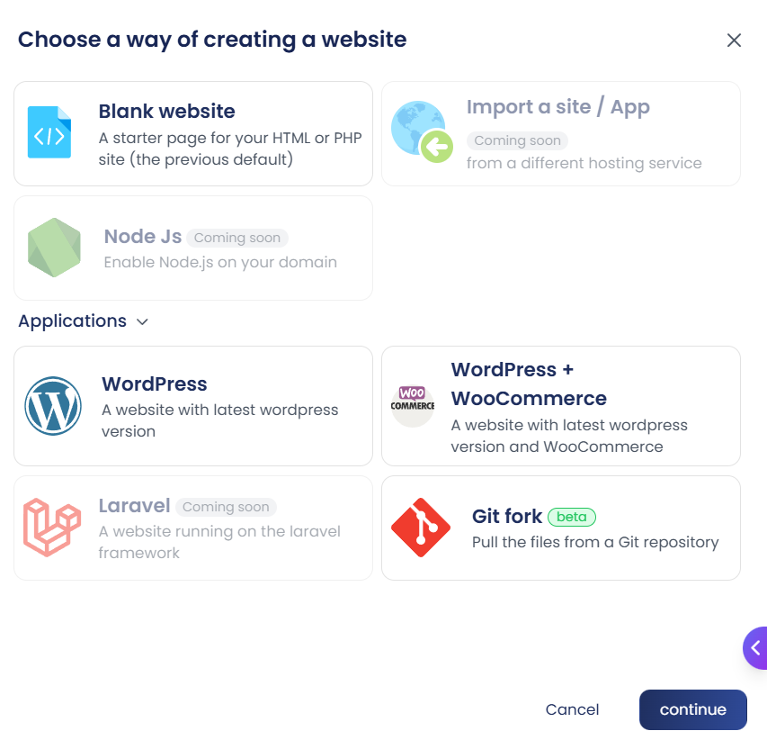
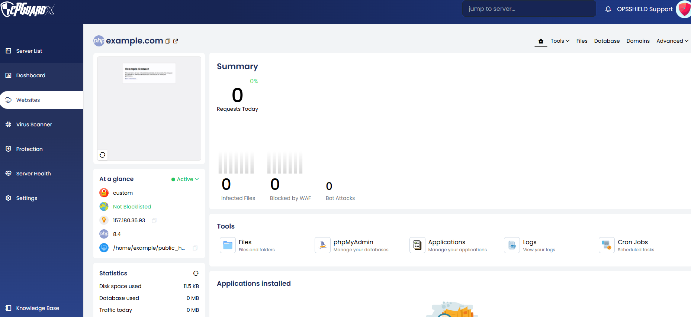
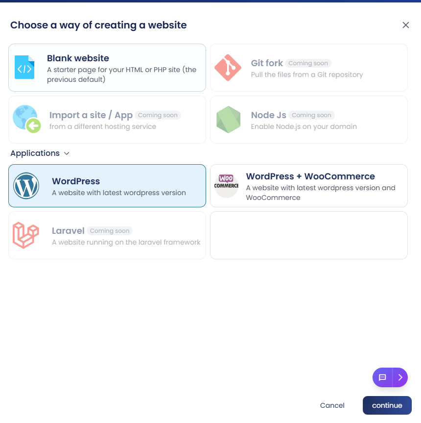
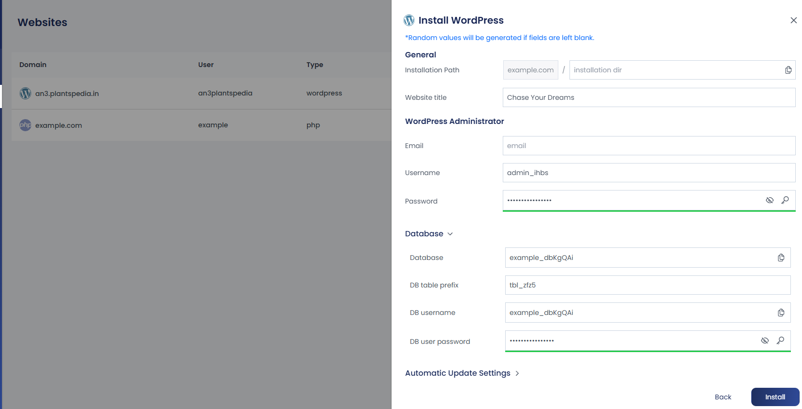
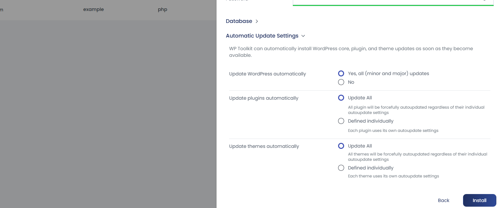
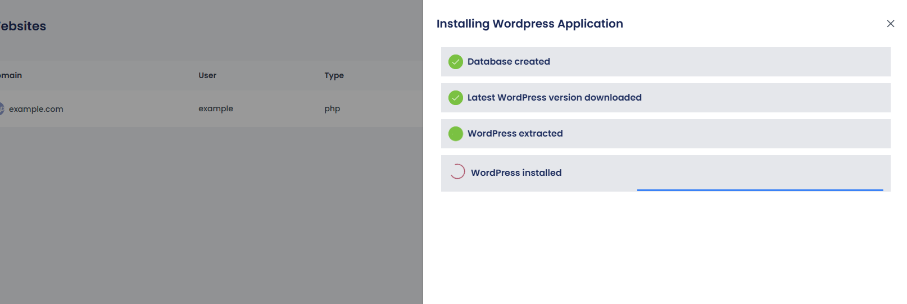
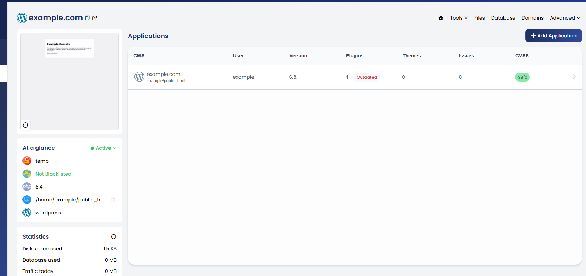
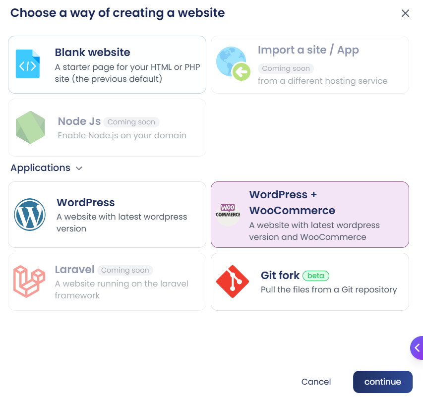

## Create a New Website

This guide walks you through the steps to create a new website using the control panel. You can choose to set up a **blank HTML/PHP site** or install **WordPress**.

Follow the steps below to get started.

### Steps

1. Log in to your control panel and Navigate to **Websites** from the left-hand menu.

2. Click on **+ Add Website** or **Add Website** to begin the website setup.

3. A new window will appear where you need to:

   - Enter a valid **domain name**.
   - Click on **Webspace Settings** to view the automatically generated username and password — you can change them if needed.
   - The **PHP version** is set to the latest available by default (based on **Nginx** or **OpenLiteSpeed**). You can change it here if needed.
   - Click **Add Website** to proceed.

4. Choose your website type:

:::info
Currently, only **Blank Website**, **WordPress**, **WordPress with WooCommerce** and **Git fork** are supported.
**Note:** Additional applications shown in the setup window are marked as **“Coming Soon”** and will be available in upcoming releases.
:::

   - **Blank Website**: Ideal for creating a simple HTML or PHP-based site.  
     Click on **Blank Website**, then click **Continue** to create it.  
     You’ll be directed to the **website management** section after creation.

  - **WordPress Website**: Click on **WordPress**, then click **Continue**. 
  
  You can fill in the following details:

  - Installation Directory
  - Website Title
  - WordPress Admin Username
  - WordPress Admin Password

  If these fields are left empty, random values will be automatically generated.
  
  

Click **Database** to view the database details.

Under **Automatic Update Settings**, choose whether to allow **auto-updates** for the following:

- WordPress Core
- Plugins
- Themes

The **WP Toolkit** can handle these updates automatically.

5. Click **Install** to begin the setup.

   Installation progress and status can be viewed directly in the panel.
   
   

Once the installation is complete, you’ll be taken to the **website management** screen.

- **WordPress with WooCommerce**: Select **WordPress with WooCommerce** and click **Continue**.

  You can then specify the following details:
  - Installation Directory
  - Website Title
  - WordPress Admin Username
  - WordPress Admin Password

:::note
If these fields are left empty, the system will **automatically generate random values**.
:::
  
    **WordPress with WooCommerce** extends WordPress to provide **e-commerce capabilities**, allowing users to create and manage an online store with:
  - Product listings
  - Payment gateways
  - Order management

  You can also configure:
  - **Database settings**
  - **Automatic update options**

  These steps are similar to those followed during the **WordPress installation** mentioned above.

  Once the configuration is complete, click **Install** to proceed with the installation.