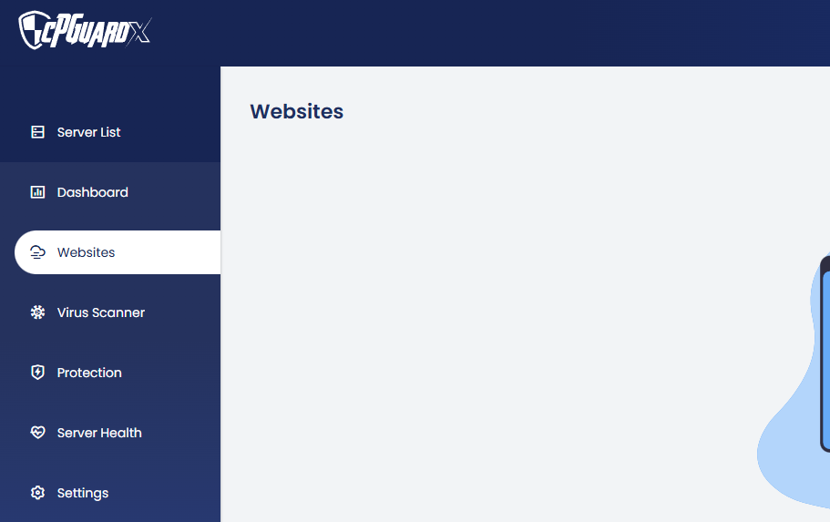
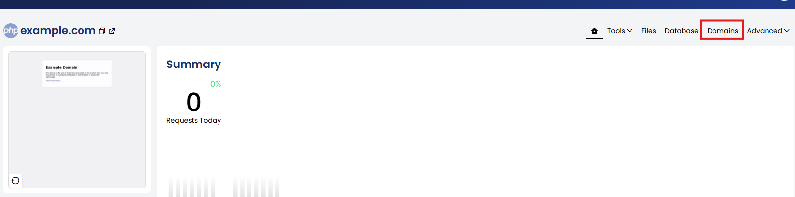
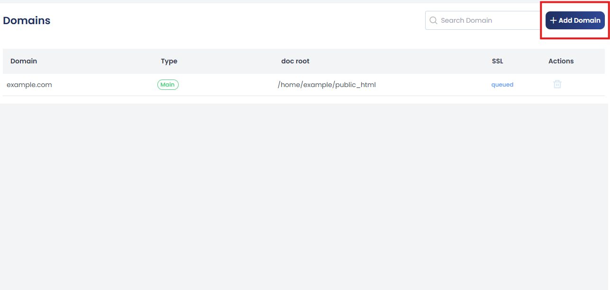
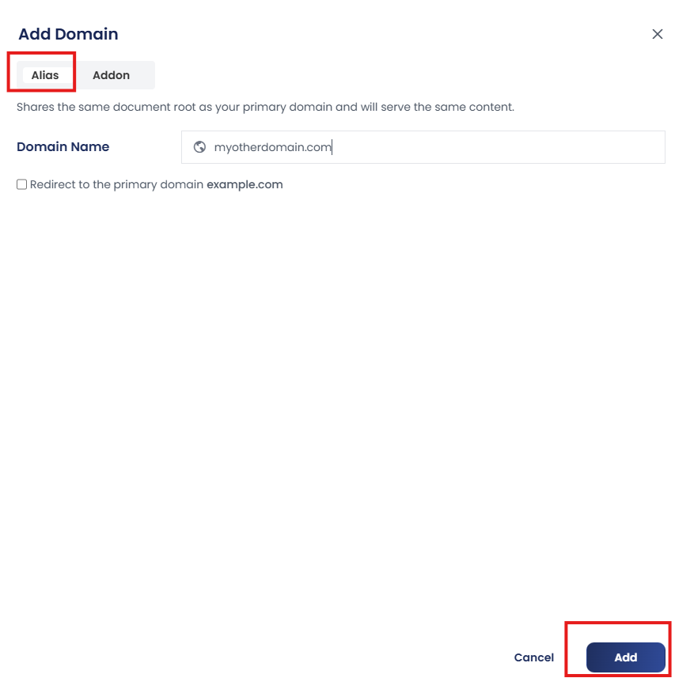
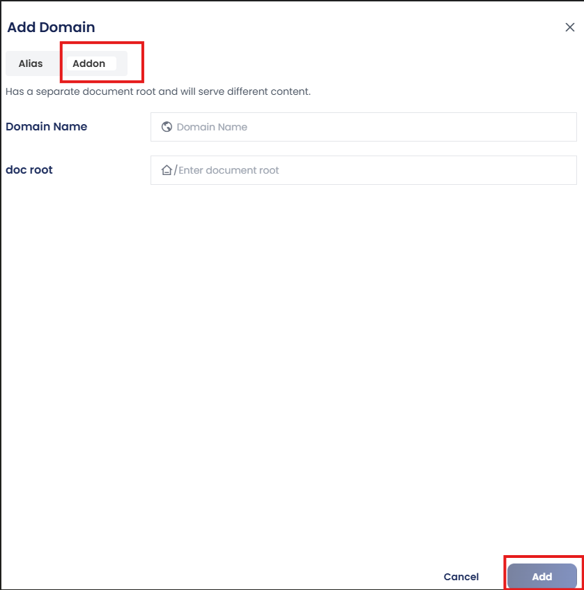
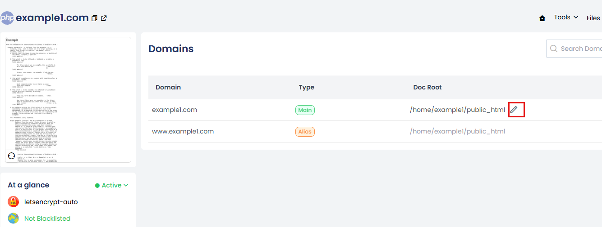
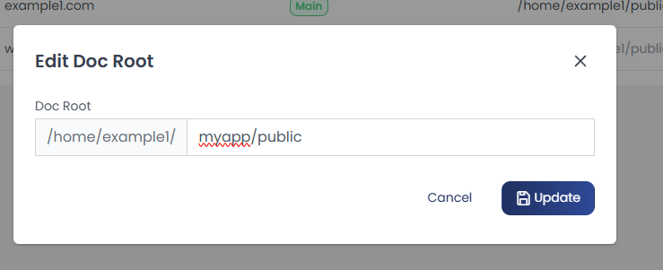

In **cPGuard X** control panel, you can enhance your website’s flexibility and reach by adding alias domains (also known as parked domains) , addon domains, and changing the document root location.  

- **Alias Domains** serve the same content as your primary website.  
- **Addon Domains** allow hosting of entirely separate websites under the same account.
- The **Document Root** is the directory from which your web server serves website files. You can change the document root to point a domain to a different directory based on your website structure or application requirements.


You can manage a websites domains and their document roots by:

1. Click on the **Websites** section from the sidebar or dashboard.



2. Select the website for which you want to manage domains.


3. Click on the **Domains** tab.



---

## Add an Alias Domain

To add an alias domain:

1. Click the **+ Add Domain** button.



2. Choose the **Alias** tab.
3. Enter the **alias domain name** (e.g., `myotherdomain.com`).
4. By default, the alias will share the same **document root** and display the same content as the primary domain.
5. To ensure the alias redirects visitors to your main domain (for SEO or branding purposes), check the **“Redirect to primary domain”** option.
6. Click **Add** to complete the setup.



Once added, the alias will appear in the **domain list** associated with the selected website.

## Add an Addon Domain

To add an addon domain:

1. Click the **+ Add Domain** button.
2. Choose the **Addon** tab.



- Enter the **new domain name** you want to add (e.g., `anotherwebsite.com`).
- Choose the **document root directory**:
  - Specify a custom path (e.g., `/home/user/anotherwebsite`)
  - Or let the system create a new root directory automatically
- Click **Add** to finalize the addon domain.

The **addon domain** will function as an independent website with its own content, even though it shares the same hosting account.

## Change Website Document Root

You can change the document root of an existing domain from the **Domains** tab.

You may need to change the document root when moving a website, deploying a new version, hosting applications like Laravel or Symfony, separating application files for security, or testing a new website version before making it live.

1. From the **Domains** tab, locate the domain for which you want to change the document root.



2. Click the **Edit (✏️)** icon next to the **Document Root** field.

3. Enter the new document root path.

Example:

```text
/home/user/public_html
```

or

```text
/home/user/myapp/public
```

4. Click **Update** to save the changes.



The web server configuration will be updated automatically.

# Verify the Change

After updating the document root:

1. Visit your website in a browser.
2. Ensure the correct content is being served.
3. Verify that the specified directory exists and contains the website files.
4. Confirm that the web server user has appropriate permissions to access the directory.

---

:::note

- Ensure the new document root path exists before updating.
- The directory should contain the website's entry file (such as `index.php` or `index.html`).
- Incorrect document root paths may result in **404 Not Found**, **403 Forbidden**, or **500 Internal Server Error** responses.
- If your application uses a framework (for example, Laravel), ensure the document root points to the framework's **public** directory rather than the project root.

:::


