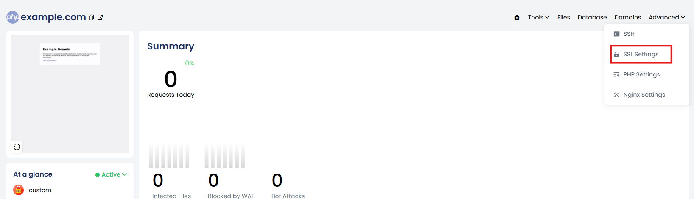
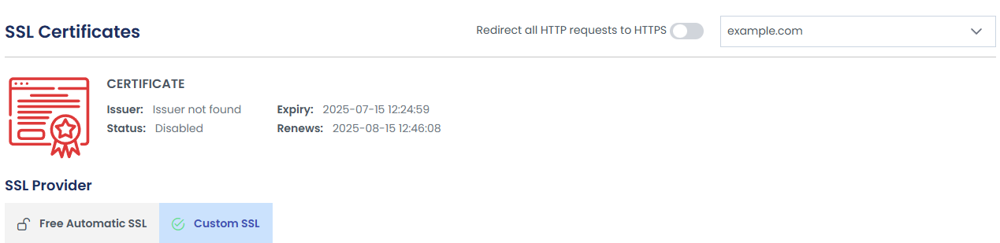

Securing your website with **HTTPS** is essential for protecting data integrity and user privacy.  By redirecting all HTTP requests to HTTPS, you establish secure connections by default.  

Follow the steps below to enforce HTTPS for your website:

1. Log into the **Control Panel** and click on **Websites**.

2. Select the website for which you want to enable **HTTPS redirection**.

3. On the website details page, click **Advanced**.

4. From the **Advanced** dropdown, click **SSL Settings**.

5. Enable the toggle option to **force all HTTP requests to be redirected to HTTPS**.

Once enabled, all visitors to your site will be automatically redirected to the **secure HTTPS version**.
