To migrate a website from another hosting panel to **cPGuard X**, follow the steps below. This guide explains how to prepare your backup, create a new site, upload files, and restore your database.

---

### Step 1: Prepare for Migration

Before starting, take a compressed backup of the following from your current hosting panel:

- The **public_html directory** (your website files)
- The **database** (usually a `.sql` file)

---

### Step 2: Create a Website in cPGuard X

Follow the official guide: [**Add Website**](./add-website)

Once your website is created:

1. Go to the **File Manager** for the newly created website.

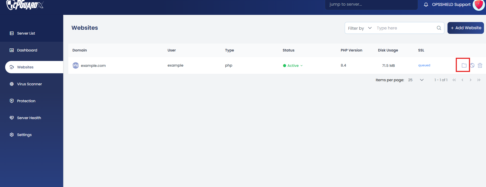

2. Inside the **public_html** folder, you will find a default `index.html` file.

   Rename or delete it to avoid conflicts with your actual website’s `index.html`.
   
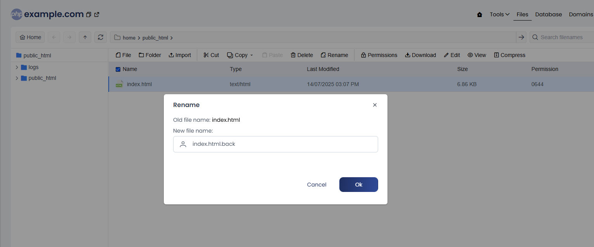

### Step 3: Upload Website Files

Click the **Import** option in the File Manager. You have two ways to upload your files:

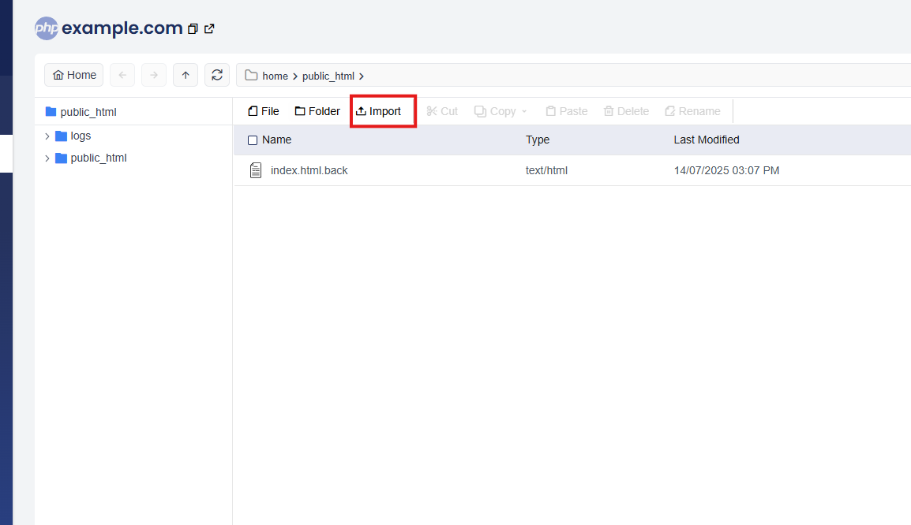

#### Option 1: Upload from Your Local Machine

- Click **Upload**, then either:
  - Drag and drop your compressed files, or
  - Click **Click to Upload**, browse, and select your file.

- Wait for the upload to complete (progress bar will reach 100%).

- Repeat the same process to upload your **database backup file**.

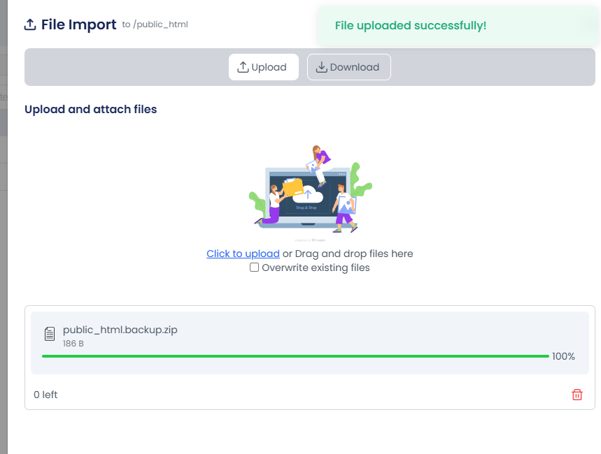

#### Option 2: Download from a URL

- Click **Download**  
- Paste the URL and click **Save**  
- Once the download reaches 100%, click **Close**

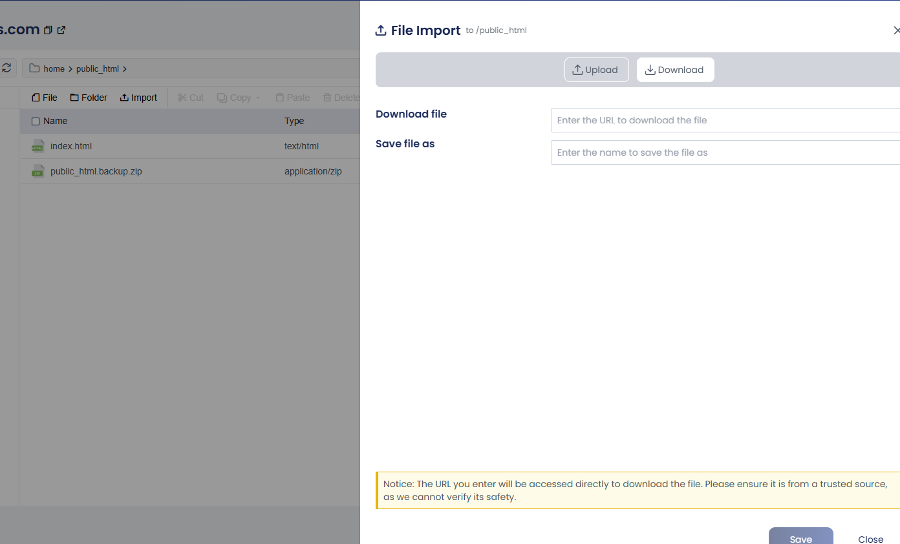

- Then extract the downloaded compressed file inside the **public_html** directory.

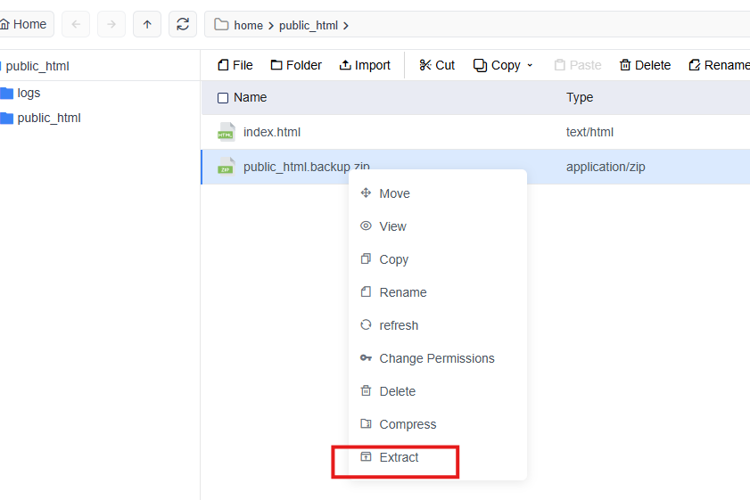

### Step 4: Import the Database

From the **cPGuard X** dashboard, click on **Website**, then go to **Database**.

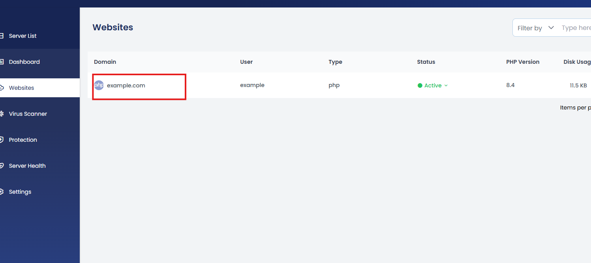

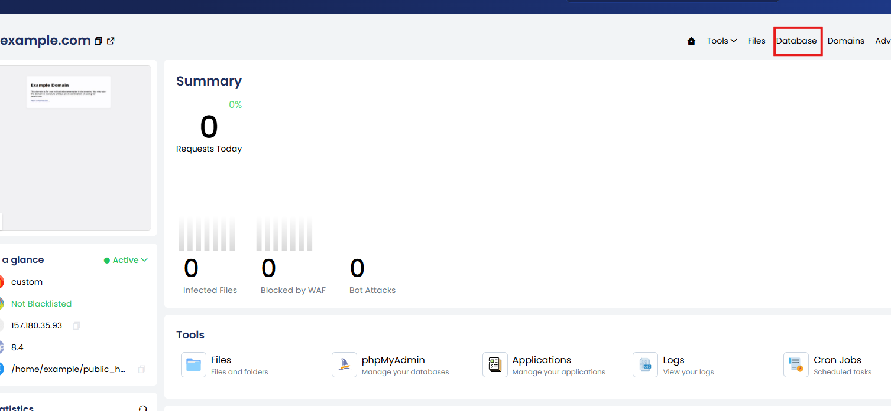

- Click on **+ Add Database** and provide the required details:
  - **Database Name**
  - **Username**
  - **Password**
  - **Privileges**

- Then click **Create**.

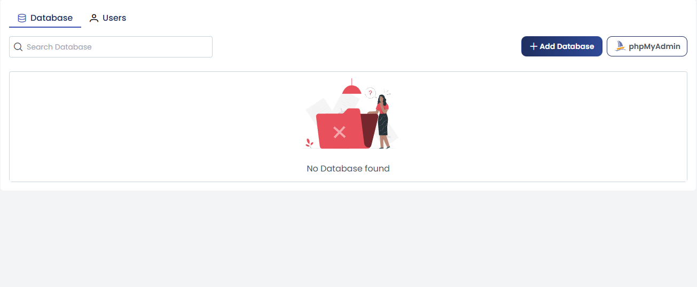

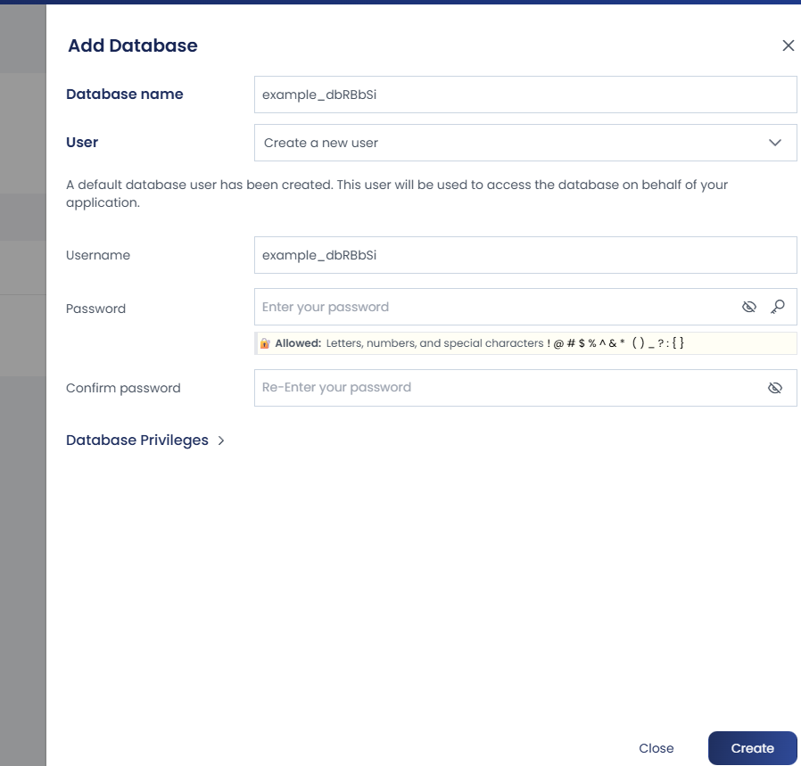

- Click **phpMyAdmin**.

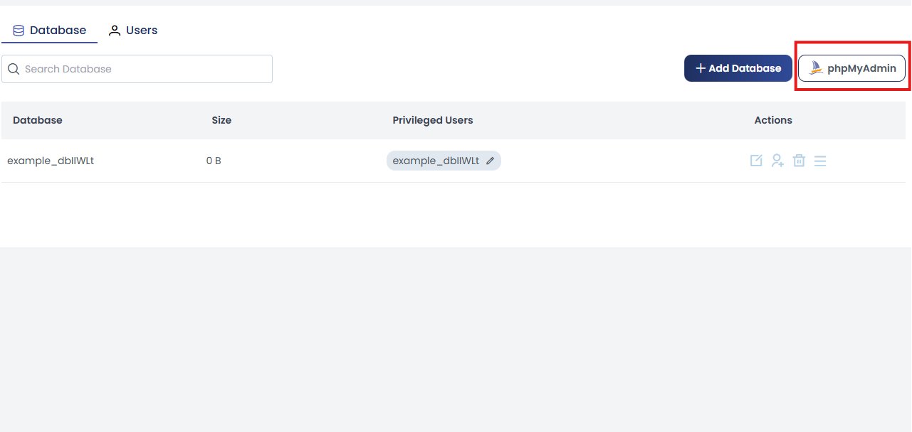

- Select the newly created **database**.

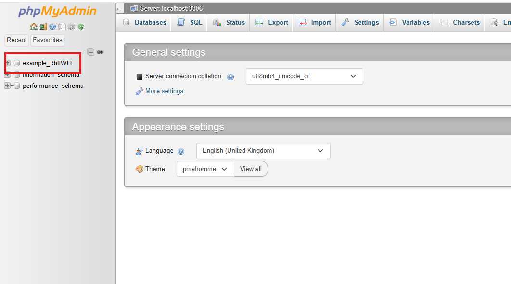

- Click the **Import** tab → browse and select your `.sql` database file → click **Go**.

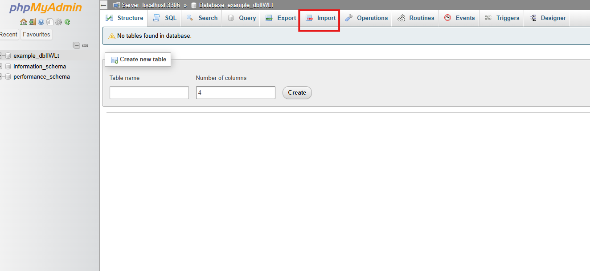

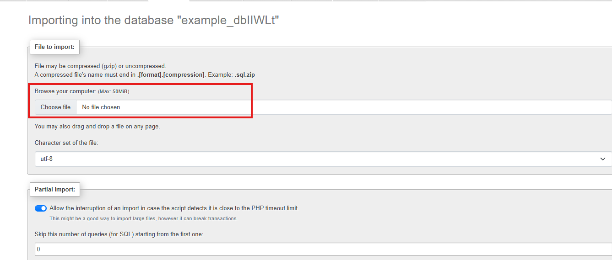

Your database is now restored.

---

### Step 5: Configure Website (e.g., WordPress)

If it’s a **WordPress** website:

- Open the `wp-config.php` file inside the **public_html** directory.
- Update the following details:
  - **Database Name**
  - **Username**
  - **Password**

Use the credentials created in **Step 4**.

For other platforms, update the relevant **PHP configuration file** that stores the database connection details.

---

### Step 6: Set Permissions

Ensure file and folder permissions are set correctly:

- **Files**: `644`
- **Folders**: `755`
- **Ownership**: `owner:www-data`

---

### Step 7: Update DNS

Update your domain’s **A record** to point to:

- **Server IP** (where the website is hosted)

Once DNS propagation is complete, verify that:

- The website loads correctly
- The **SSL certificate**

