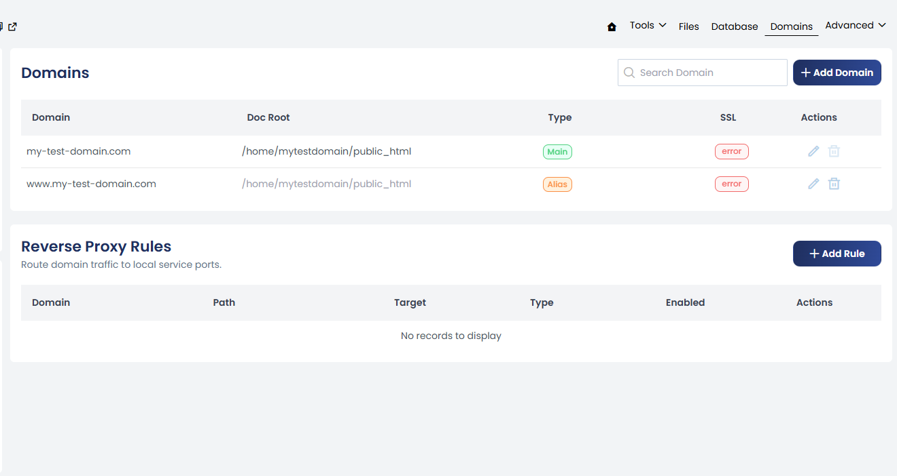
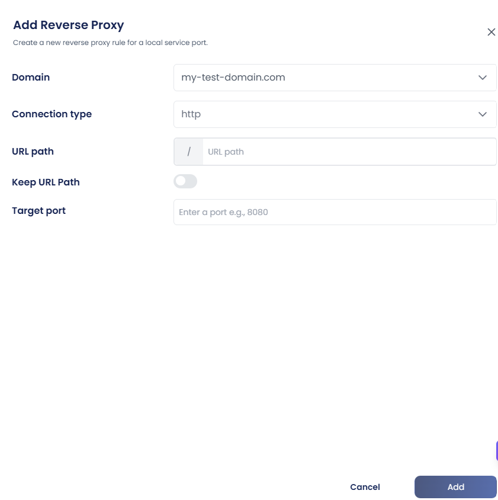

Reverse Proxy forwards public website traffic to a private service running on the server.

Use Reverse Proxy when an application listens on a private port and you want visitors to access it using a normal domain or URL path.

Reverse Proxy Rules are available from:

**Website Management → Domains → Reverse Proxy Rules**



---

### How Reverse Proxy Works

Most public websites use:

- `80` for HTTP
- `443` for HTTPS

Custom services often listen on private ports such as:

```
127.0.0.1:3000
127.0.0.1:4000
127.0.0.1:6010
```

Reverse Proxy connects the public website request to the private application service.

For example:

```
https://my-test-domain.com
        |
        | Reverse Proxy
        ↓
http://127.0.0.1:3000
```

The visitor uses the public domain while the application receives the request on its private port.

---

### Why Use Reverse Proxy?

A reverse proxy allows an application running on a private port to be accessed through a normal website domain.

Without a reverse proxy, an application may only be accessible directly through its listening port, for example:

```
http://127.0.0.1:3000
```

With a reverse proxy, visitors can access it through:

```
https://my-test-domain.com
```

The reverse proxy receives the public request and forwards it to the configured local service.

---

### Add a Reverse Proxy Rule

Open:

**Website Management → Domains → Reverse Proxy Rules**

Click **+ Add Rule**.



#### Domain

Specify the domain for which the reverse proxy should be configured.

Example:

```
my-test-domain.com
```

#### Connection Type

Select the connection type required for the connection to the target service.

#### URL Path

Specify the URL path that should be forwarded to the application.

Example:

```
/
```

Using `/` can be used to forward requests for the domain to the configured target service.

You can configure a more specific path when required by the application.

For example:

```
/api
```

#### Keep URL Path

Configure whether the original URL path should be preserved when forwarding the request to the target service.

This is useful when the application expects the original request path to be retained.

#### Target Port

Specify the local port where the application or service is listening.

For example:

```
3000
```

The target port should match the port configured for the corresponding process.

---

### Example Reverse Proxy Configuration

Suppose an application is running on:

```
127.0.0.1:3000
```

The reverse proxy can be configured as:

| Field           | Value           |
|-----------------|-----------------|
| Domain          | my-test-domain.com |
| Connection type | HTTP            |
| URL Path        | /               |
| Target port     | 3000            |

---

Once a reverse proxy rule is created, it appears in the Reverse Proxy Rules list, where the configured process can be managed by enabling, disabling, editing, or deleting the rule as required.