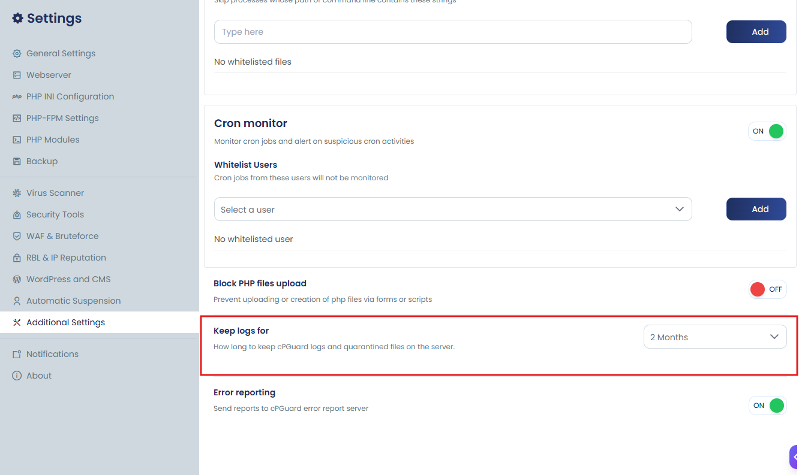

# Keep Logs For

The **Keep Logs For** setting determines how long cPGuard keeps its logs and quarantined files before removing them automatically.

You'll find this option under:

**Settings → Additional Settings → Keep Logs For**

## Choosing a Retention Period

From the dropdown, you can select how long data should be kept — either Always (logs and quarantined files are kept indefinitely, with nothing removed automatically) or a specific duration ranging from 1 to 6 months.

Once you set a specific time period, cPGuard will automatically delete any data older than that period.

This retention setting applies to four types of cPGuard data:

1. **Scan logs** – Records generated during malware and security scans.
2. **Quarantined files** – Items isolated in cPGuard's quarantine folder, located at `/etc/cpguard/quarantine`.
3. **WAF logs** – Logs produced by the Web Application Firewall.
4. **Brute-force logs** – Records related to detecting and blocking brute-force attacks.

**Example:** If you set the retention period to **3 Months**, any data older than three months is automatically deleted the next time the cleanup process runs.
