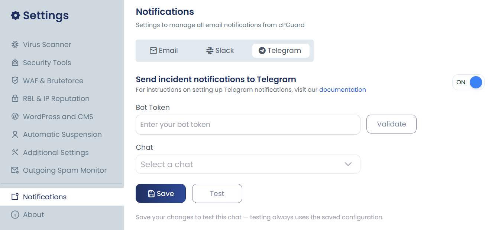
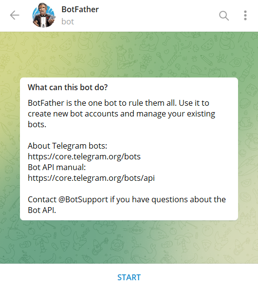

# Configuring Telegram Notifications

The **Telegram Notifications** feature allows cPGuard to send incident notifications directly to Telegram accounts or groups. Users can configure Telegram integration by creating a Telegram bot, adding the bot token, and selecting the required chat(s) where notifications should be delivered.

## Enable Telegram Notifications

To enable Telegram notifications:

1. Navigate to **Settings → Notifications → Telegram**.
2. Enable the **Send incident notifications to Telegram** option.
3. Enter the **Telegram Bot Token**.
4. Select the required **Chat(s)** from the available list.
5. Click **Save** to apply the configuration.
6. Use the **Test** option to verify that notifications are delivered successfully.




---

## Creating a Telegram Bot and Obtaining the Bot Token

Before configuring Telegram notifications, you must create a Telegram bot and obtain its API token.

1. Open the **Telegram** application.
2. Search for **@BotFather**.
3. Open the verified **BotFather** account.




4. Send the following command:

```text
/newbot
```

5. Enter a name for your bot when prompted.

Example:

```text
My Product Notifications
```

6. Enter a unique username for the bot. The username must end with **bot**.

Example:

```text
my_product_notifications_bot
```

7. Once the bot is created successfully, BotFather will provide a **Bot Token**.

Example:

```text
123456789:AAExampleBotToken
```

8. Copy the token and paste it into the **Bot Token** field in cPGuard.

:::note 
Keep the bot token private and secure. Anyone with access to the token may be able to control your Telegram bot.
:::

---

## Obtaining Telegram Chats

The **Chats** dropdown in cPGuard displays the Telegram accounts or groups where incident notifications can be delivered.

To make a chat available in the dropdown, the created Telegram bot must first receive the `/cpguard` command from the required chat.

---

## Individual Telegram Account

To receive notifications on an individual Telegram account:

1. Open **Telegram**.
2. Search for the bot you created.
3. Open the bot conversation.
4. Click **Start** or send the following command:

```text
/cpguard
```

The Telegram account will now appear in the cPGuard **Chats** dropdown.

---

## Telegram Group

To send notifications to a Telegram group:

1. Open the required Telegram group.
2. Open the group information page.
3. Select **Add Members**.
4. Search for the bot username.
5. Add the bot to the group.
6. Send the following command in the group:

```text
/cpguard
```

7. Return to cPGuard. The group will now appear in the **Chats** dropdown.

---

## Chat Availability

The available chat list is updated based on recent bot activity.

If a previously configured chat no longer appears in the **Chats** dropdown after approximately **24 hours**, send the following command again from the required Telegram account or group:

```text
/cpguard
```

The chat will then become available for selection again.

---

## Testing Telegram Notifications

After completing the Telegram configuration:

1. Select the required chat(s) from the **Chats** dropdown.
2. Click **Save** to store the configuration.
3. Click **Test** to send a test notification.
4. Verify that the notification is received successfully in the selected Telegram chat.
