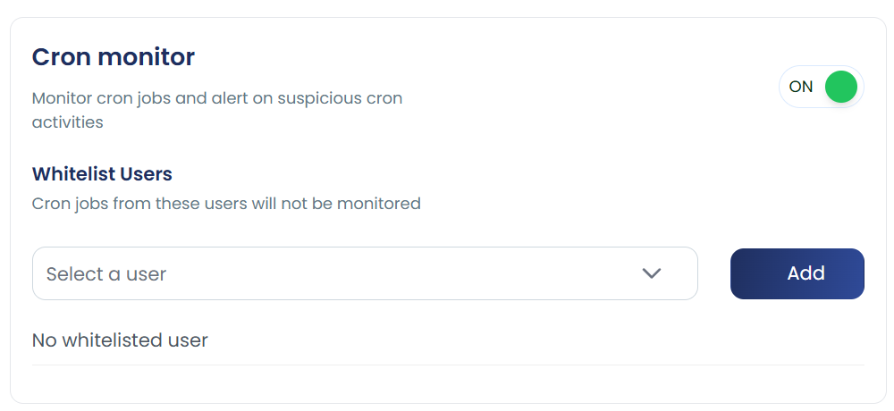

# Cron Monitor

cPGuard's **Cron Monitor** watches cron jobs across the server and alerts on suspicious cron activity.

> **UI path:** Settings > Additional Settings > Cron Monitor




---

## How It Works

A common attack pattern on compromised servers is **malware re-infection via cron jobs**. Here is how it typically happens:

1. A malicious cron job is planted on the server — often under a compromised user account.
2. The cron job runs on a schedule and **downloads and executes a malware payload** using commands like `wget` or `curl`.
3. cPGuard's **Virus Scanner detects and cleans** the infected file.
4. However, the cron job **runs again and re-downloads the same malware**, causing repeated re-infection.

This cycle continues until the malicious cron job itself is identified and removed.

The Cron Monitor breaks this cycle by **scanning cron files for known malicious patterns** and alerting the admin so the root cause (the cron job) can be eliminated, not just the payload.

cPGuard maintains a list of known malicious cron patterns and continuously identifies and removes similar threats as they are discovered, helping prevent re-infection before the virus scanner even needs to act.

---

## Enable / Disable

```bash
# Enable Cron Monitor
cpgcli cron-monitor --enable

# Disable Cron Monitor
cpgcli cron-monitor --disable
```


---

## Whitelist Users

Cron jobs belonging to whitelisted users will **not** be monitored or flagged.

```bash
# List all whitelisted users
cpgcli cron-monitor --whitelist-users --list

# Add a user to the whitelist
cpgcli cron-monitor --whitelist-users --add <username>

# Remove a user from the whitelist
cpgcli cron-monitor --whitelist-users --remove <username>
```

---


## Notes

- If a client reports **repeated malware re-infections**, a malicious cron job is very likely the cause — enable Cron Monitor and check alerts immediately.
- Whitelist trusted system or application users to reduce false positives.
- Cron Monitor works best alongside the **Virus Scanner** and **Process Monitor** for full coverage against persistent malware.

---

