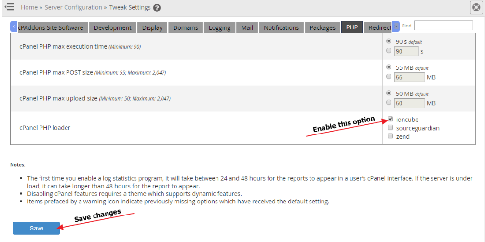

IonCube must be enabled in cPanel's PHP before installing cPGuard. If it is not installed, the WHM and cPanel plugin will not work, as the code is encoded with IonCube Loader.

## Steps to Enable IonCube in cPanel's PHP

1. Log in to WHM as the root user
2. Go to **Server Configuration** >> **Tweak Settings** >> **PHP**
3. In the **cPanel PHP Loader** section, select the **IonCube** checkbox
4. Click the **Save** button

This will enable IonCube for the 3rd party PHP binary.

