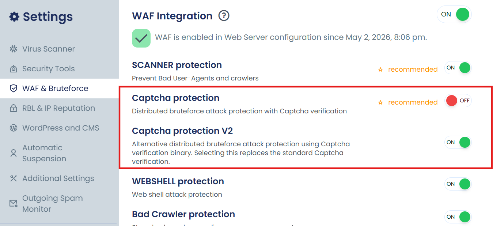

## Why Am I Stuck in a CAPTCHA Loop Even After Verification?

If you have successfully completed the CAPTCHA verification but are still being prompted again, this is a known behavior related to DNS caching on your server.

### Root Cause

cPGuard uses the **ModSecurity DNSBL (DNS-based Blocklist)** option to validate the reputation of the client's IP address. This process relies on DNS queries, and the responses are sent with a **10-second TTL (Time To Live)**.

On some systems, this TTL is not respected and the DNS response is cached for longer than expected. As a result, the reputation status takes more time to reflect, causing repeated CAPTCHA verification prompts.

---

## CAPTCHA Versions in cPGuard

cPGuard provides two CAPTCHA versions to address this issue. Understanding the difference will help you choose the right option for your environment.

### CAPTCHA V1 (Legacy) — Recommended by Default

The legacy CAPTCHA option is the **recommended default** for most users. It is:

- Lightweight and simple
- Does not require any additional components or binary execution
- Sufficient for the majority of server environments

:::tip
If your server uses reliable open name servers that respect DNS TTLs, V1 will work without any issues.
:::

### CAPTCHA V2 — Optional, for DNS Caching Issues

CAPTCHA V2 is an **advanced option** designed specifically for servers that experience DNS caching issues with V1. It works by:

- Bypassing DNS caching by sending the query through a binary
- Adding an additional verification layer to the CAPTCHA system

However, V2 comes with trade-offs:

- More resource-intensive than V1
- Involves binary execution, making it less lightweight
- Adds complexity compared to the simpler V1 ruleset

:::note
V2 is recommended **only if** you are experiencing a CAPTCHA loop with the legacy (V1) option. It is not intended as a replacement for V1 in standard environments.
:::

---

## How to Fix the CAPTCHA Loop

###  Enable CAPTCHA V2

Switch to CAPTCHA V2 to bypass the DNS caching issue.

To enable CAPTCHA V2, navigate to:

**App Portal** >> **Settings** >> **WAF & Bruteforce** >> **Captcha protection V2**

---

:::tip
If you continue to experience issues after trying both options, please contact our support team for further assistance.
:::