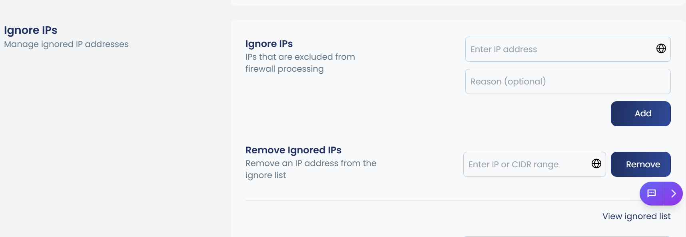

When an IP address is blocked by cPGuard's IPDB (IP Database), you have the option to prevent future blocking by adding it to the ignore list. cPGuard allows you to ignore a specific IP address or an entire country in the firewall, which will stop blocking that resource in both IPDB and the firewall.

:::note
This is the recommended approach for handling trusted IP addresses, especially for IPDB, rather than whitelisting the IP directly.
:::

## Method 1: Using the cPGuard Portal

1. Log in to the **cPGuard App Portal**
2. Navigate to **Protection** >> **Firewall** >> **Ignore IPs**
3. Click the input box and enter the IP address you want to ignore
4. Provide a reason or comment for the exception
5. Click **Add** to save the changes





The IP address will now be added to the ignore list and will no longer be blocked by IPDB or the firewall.

## Method 2: Using the CLI

You can also add an IP address to the ignore list using the cPGuard CLI with the following command:

```bash
cpgcli ip --ignore <IP> --reason 'comment'
```

Replace the following placeholders:

- `<IP>` — The IP address you want to add to the ignore list
- `'comment'` — A brief reason or description for ignoring this IP (e.g., `'Trusted office IP'`)

**Example:**

```bash
cpgcli ip --ignore 192.168.1.100 --reason 'Trusted office IP'
```

Once executed, the specified IP address will be added to the ignore list and will no longer be blocked by cPGuard's IPDB or firewall rules.

