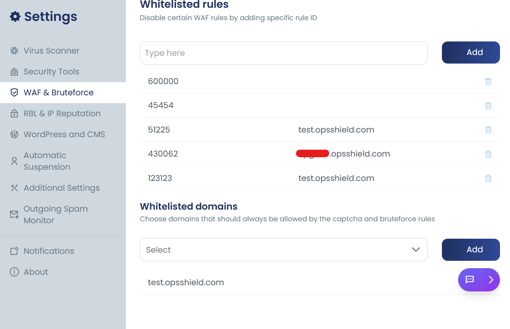

cPGuard provides an option to whitelist your domains from brute-force protection checks. We strongly recommend avoiding whitelisting unless the domain is protected using some other security means.

## How to Whitelist a Domain

Go to **App Portal cPGuard** >> **Settings** >> **WAF & Bruteforce**

Under the **Whitelisted Domains** section:

1. Click the input box
2. Select the domain name
3. Click **Add**

