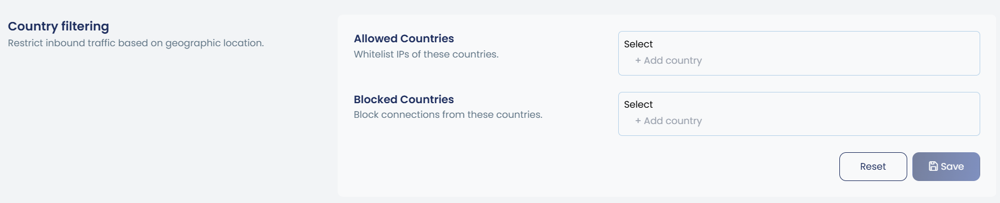

# How to Block Countries from Accessing Your Websites and Server in cPGuard

Geo-blocking is one of the most effective and low-effort ways to reduce unwanted traffic, bot activity, and attack attempts originating from regions where you have no legitimate users. cPGuard makes it simple. You can block an entire country from accessing your websites and server in under a minute, either from the **App Portal** or the **command line**.

{/* comment */}

---

## Method 1 : Block a Country via the App Portal

The App Portal provides a visual, point-and-click interface for managing the Firewall Country Blacklist.

**Steps:**

1. Log in to the **cPGuard App Portal** and open your server.
2. Navigate to **Protection → Firewall → Country filtering**.
3. In the **Blocked Countries** list, Select the country (or countries) you wish to block.
4. The block will take effect on the server within **1-2 minutes**.





To **remove** a country block, go back to the same settings page and remove the country name from the Blocked Countries list. The change propagates to the server within the same 1–2 minute window.

---

## Method 2 : Block a Country via CLI

For administrators who prefer the terminal, or need to automate geo-blocking as part of a provisioning script, cPGuard provides a clean CLI command using the `cpgcli` tool.

### Prerequisite — ISO 3166-1 Alpha-2 Country Codes

The CLI requires the **two-letter ISO 3166-1 alpha-2 country code** for the country you want to block. You can find the full list of codes on the [Wikipedia ISO 3166-1 alpha-2 page](https://en.wikipedia.org/wiki/ISO_3166-1_alpha-2#Officially_assigned_code_elements).

**Quick reference for common codes:**

| Country | Code |
|---|---|
| China | `CN` |
| Russia | `RU` |
| United States | `US` |
| United Kingdom | `GB` |
| India | `IN` |
| Germany | `DE` |
| Brazil | `BR` |
| Netherlands | `NL` |

### Add a Country Block

```bash
cpgcli fw --deny-country CODE
```

**Example — block Russia and China:**

```bash
cpgcli fw --deny-country RU
cpgcli fw --deny-country CN
```

### Remove a Country Block

```bash
cpgcli fw --deny-country --remove CODE 
```

**Example — unblock Russia:**

```bash
cpgcli fw --deny-country --remove RU
```

---


## Things to Keep in Mind

:::warning
Geo-blocking works at the **IP address level** using the cPGuard Firewall. While highly effective, it is not a guarantee against all traffic from a blocked country. VPNs and proxies can bypass geo-blocks. Combine country blocking with other cPGuard features such as the WAF and IP reputation checks for a layered defence.
:::

:::note
Changes made via the App Portal take **1–2 minutes** to propagate to the server. CLI changes are queued and applied in a similar timeframe. There may be a brief window between applying the rule and it taking effect.
:::

---

