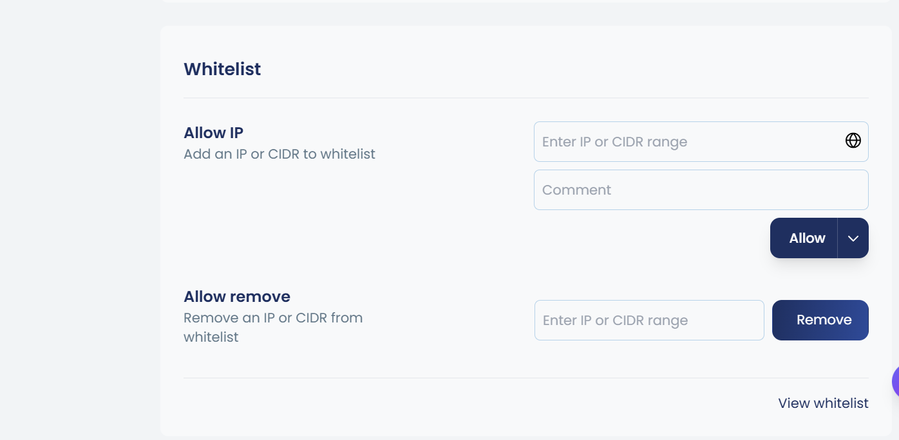
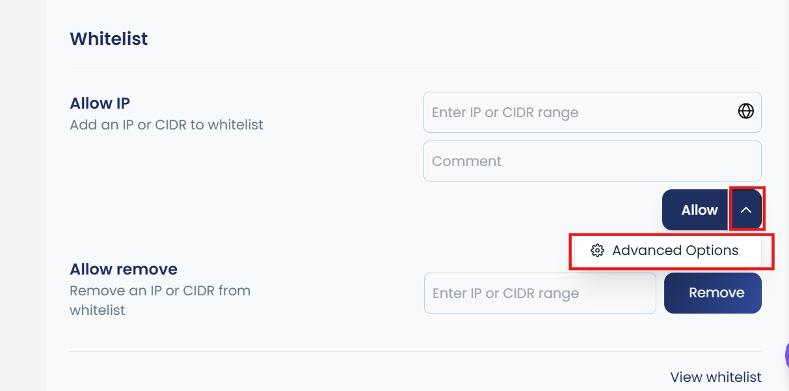
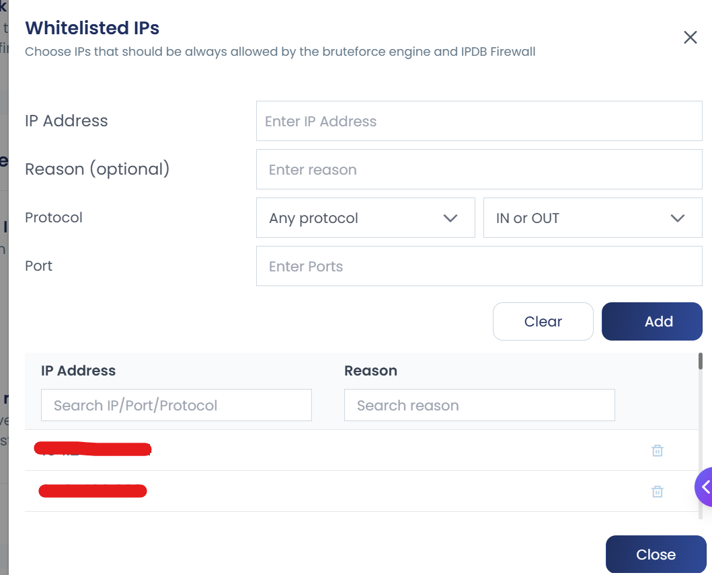
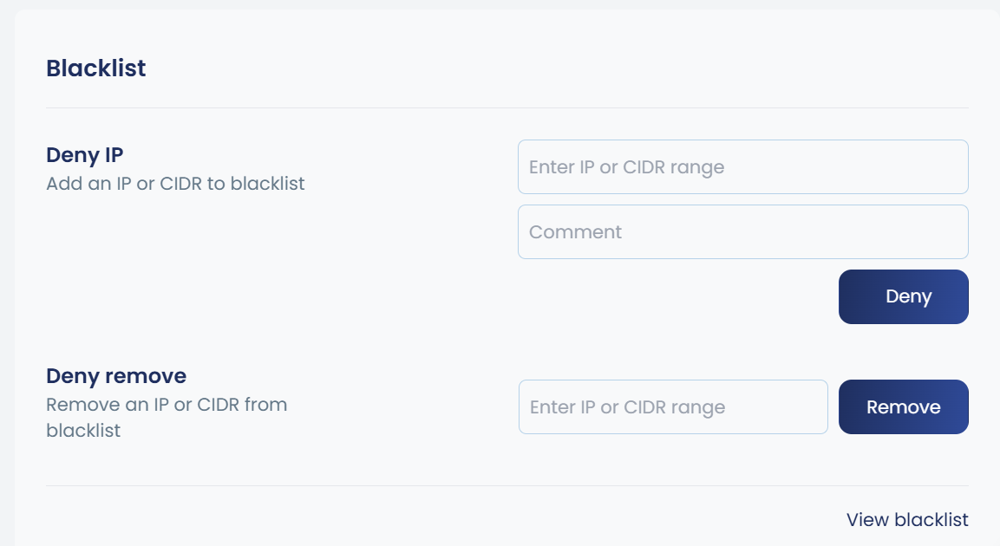

Manage access precision by defining trusted networks or blocking known offenders. Whitelist and blacklist functionality gives you fine-grained control over which IPs can access your server and which are permanently or temporarily denied.

:::note 
The WAF (Web Application Firewall) operates independently and does not respect the firewall IP whitelist. This separation maintains optimal web server performance and ensures WAF rules are consistently applied to all HTTP/HTTPS traffic.
:::

---

## Whitelisting (The "Allow" List)

Whitelisting an IP or subnet ensures it bypasses automatic blocks from DOS, IPDB and other brute-force mitigation systems. This is essential for protecting office IPs, monitoring services, payment gateways, and automated systems that might trigger false positives.

### Supported Formats

| Format | Example |
|---|---|
| Single IP | `1.1.1.1` |
| CIDR range | `1.1.1.0/24` |
| IPv6 address | `2001:db8::1` |
| IPv6 CIDR | `2001:db8::/32` |

Multiple IPs or CIDRs can be entered as comma- or space-separated values.

### Adding IPs to the Whitelist

**Via UI:**
1. Navigate to **Firewall → Whitelist**
2. Enter the IP address or CIDR range
3. Add a descriptive reason (e.g., `Office IP`, `Payment Gateway`, `Monitoring Service`)
4. Click **Allow**



**Via CLI:**
```bash
cpgcli ip --allow <IP> --reason 'reason to add'
```

**Example:**
```bash
cpgcli ip --allow 203.0.113.50 --reason 'Office IP - London'
```
Add IPs and CIDR ranges to the whitelist using space/comma-separated values or import from a file.

---

### Syntax

cpgcli ip --allow IP1 IP2 ...
cpgcli ip --allow /path/to/file.txt

---

### Examples

cpgcli ip --allow 203.0.113.5 198.51.100.0/24

**Import from file**
cpgcli ip --allow /root/allow-iplist.txt

---

### Source File Format

One IP address or CIDR range per line:


### /root/allow-iplist.txt

```
203.0.113.5
198.51.100.0/24
10.0.0.0/8
2001:db8::1
```

---

### Viewing the Whitelist

The UI provides a **View Whitelist** option that displays all whitelisted IPs along with their associated reasons. You can also add new entries directly from this view.

**Via CLI:**
```bash
cpgcli ip --allow --list
```

### Removing IPs from the Whitelist

When an IP no longer requires whitelist protection, remove it to restore normal security checks. Once removed, the IP becomes subject to all firewall rules, IPDB checks, and Fail2Ban monitoring.

**Via UI:**
1. Navigate to **Firewall → Whitelist**
2. Enter the IP in the Allow Remove field
3. Click **Remove**

**Via CLI:**
```bash
cpgcli ip --allow --remove <IP1> <IP2> ...
```

---

## Advanced Whitelisting — Port-Based Rules

Port-based whitelisting lets you whitelist an IP only for specific services or traffic types, rather than granting it unrestricted access to the server. This is useful when you want to allow an IP for SSH or HTTPS only, without opening all ports.

### Via UI

Click the **^** (up arrow) next to the **Allow** button to expand **Advanced Options**.



From here you can define:

- **Specific ports** — e.g., allow only port `22` (SSH) or `443` (HTTPS)
- **Protocol** — restrict to `TCP` or `UDP`
- **Traffic direction** — `Inbound`, `Outbound`, or `Both`



The advanced whitelist view also displays the full list of port-specific rules alongside their reasons, making it easy to audit and manage granular access.

### Via CLI

```bash
cpgcli ip --allow <IP> --port 'ports|protocol|direction' --reason 'reason or comment'
```

The `--port` flag accepts a pipe-separated string in the format `ports|protocol|direction`:

| Field | Required | Accepted Values | Example |
|---|---|---|---|
| `ports` | Yes | Single or comma-separated port numbers | `22`, `80,443` |
| `protocol` | Optional | `tcp`, `udp` | `tcp` |
| `direction` | Optional | `in`, `out`, `inout` | `in` |

**Example — Allow an IP for inbound HTTPS only:**
```bash
cpgcli ip --allow 203.0.113.50 --port '443|tcp|in' --reason 'Payment gateway HTTPS only'
```

**Example — Allow an IP for SSH and HTTPS over TCP:**
```bash
cpgcli ip --allow 203.0.113.50 --port '22,443|tcp|inout' --reason 'Office IP limited access'
```

---

## Blacklisting (The "Deny" List)

Manual blacklisting permanently or temporarily bars specific actors from accessing your server. Use this when you identify malicious IPs, repeated offenders, or sources of unwanted traffic.

### Adding IPs to the Blacklist

**Via UI:**
1. Navigate to **Firewall → Blocklist**
2. Enter the IP address or CIDR range
3. Add a reason for documentation
4. Click **Block**



**Via CLI:**
```bash
cpgcli ip --deny <IP> --reason 'reason to add'
```

**Example:**
```bash
cpgcli ip --deny 198.51.100.25 --reason 'Repeated brute-force attempts'
```

Add IPs and CIDR ranges to the blacklist using space/comma-separated values or import from a file.

---

### Syntax

cpgcli ip --deny IP1 IP2 --reason 'comment'
cpgcli ip --deny /path/to/file.txt --reason 'comment'

---

### Examples

cpgcli ip --deny 203.0.113.5 198.51.100.0/24 --reason 'malicious traffic'

**Import from file**
cpgcli ip --deny /root/deny-iplist.txt --reason 'bulk block'

---

### Source File Format

One IP address or CIDR range per line:

### /root/deny-iplist.txt

```
203.0.113.5
198.51.100.0/24
10.0.0.0/8
2001:db8::1
```
---

### Viewing the Blacklist

The UI provides a **View Blacklist** option that displays all blocked IPs along with their associated reasons. New entries can also be added directly from this view.

**Via CLI:**
```bash
cpgcli ip --deny --list
```

### Removing IPs from the Blacklist

When a block is no longer needed, remove the entry to restore normal access.

**Via UI:**
1. Navigate to **Firewall → Blacklist**
2. Enter the IP in the Deny Remove field
3. Click **Remove**

**Via CLI:**
```bash
cpgcli ip --deny --remove <IP1> <IP2> ...
```

---

## Extended Source Files

For large-scale management, you can import multiple IPs via a local file path or a remote URL. This is ideal for organizations managing hundreds or thousands of IPs, or for integrating with external threat intelligence feeds.

The firewall periodically reloads these sources to stay synchronized with changes, eliminating the need for manual updates.

**Use cases:**

* Import corporate IP ranges from centralized lists
* Subscribe to threat intelligence feeds
* Sync with CDN or cloud provider IP ranges
* Maintain partner/vendor access lists


## Whitelist / Blacklist Source Files

For managing large or frequently updated IP lists, you can import IP addresses directly from files rather than adding them individually. This is useful for centralising blocklists and allowlists that are maintained externally.

> **File format:** Each file should contain one IP address (or CIDR range) per line.

### Whitelist Source Files

| Command | Description |
|---|---|
| `cpgcli ip --allow-source <path>` | Add all IPs in the file or URL to the whitelist |
| `cpgcli ip --allow-source --remove <path>` | Remove a source file or URL from the whitelist |
| `cpgcli ip --allow-source --list` | List all whitelisted source files and URLs |

### Blacklist Source Files

| Command | Description |
|---|---|
| `cpgcli ip --deny-source <path>` | Add all IPs in the file or URL to the blacklist |
| `cpgcli ip --deny-source --remove <path>` | Remove a source file or URL from the blacklist |
| `cpgcli ip --deny-source --list` | List all blacklisted source files and URLs |

## Examples

**Import a blocklist from a local file:**
```bash
cpgcli ip --deny-source /etc/firewall/blocklist.txt
```

**Import a blocklist from a remote URL:**
```bash
cpgcli ip --deny-source https://yourdomain.com/blocklist.txt
```
**View all active blocklist source files and URLs:**
```bash
cpgcli ip --allow-source --list
```

**Import an allowlist from a remote URL:**
```bash
cpgcli ip --allow-source https://yourdomain.com/allowlist.txt
```
**Import a allowlist from a local file:**

```bash
cpgcli ip --allow-source /etc/firewall/blocklist.txt
```
**View all active whitelist source files and URLs:**
```bash
cpgcli ip --allow-source --list
```
**File format requirements:**

* One IP or CIDR range per line
* Lines starting with `#` are treated as comments
* Empty lines are ignored

**Example file (`/root/allowed-ips.txt`):**

```
# Office IPs
203.0.113.0/24
198.51.100.10

# Partner API servers
192.0.2.50
192.0.2.51
```

Attach a local file path or remote URL as a dynamic source. Unlike bulk import, extended sources are monitored and automatically reloaded at regular intervals.

**How it works:**

1. The firewall fetches the source file (locally or via HTTP/HTTPS)
2. Parses IPs and CIDR ranges (one per line)
3. Applies rules to the active firewall configuration
4. Automatically reloads periodically (default: every 6 hours)

This ensures your whitelist/blacklist stays current without manual intervention. Perfect for integrating with external systems that maintain dynamic IP lists.


