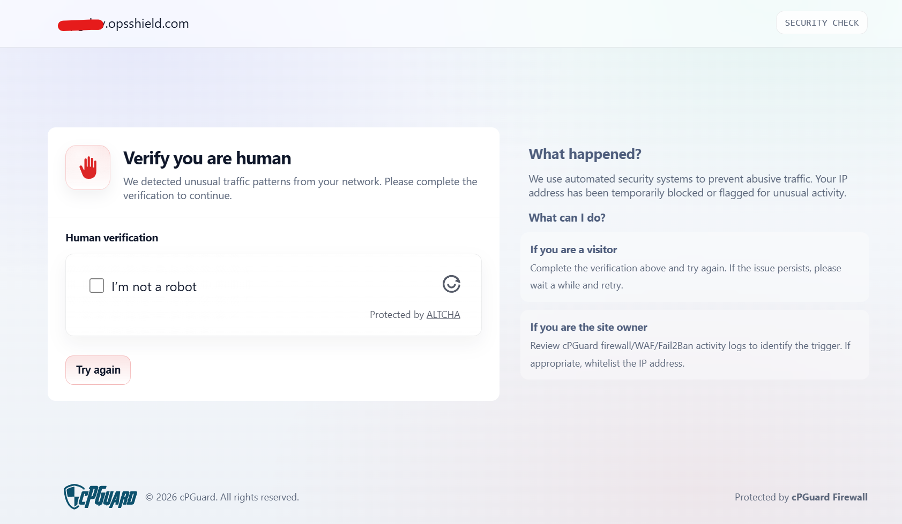
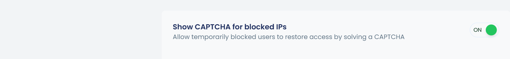

cPGuard provides an option to allow temporarily blocked users to restore their own access by solving a CAPTCHA — without requiring any manual intervention from the administrator.

### How It Works

When the **Show CAPTCHA for Blocked IPs** option is enabled, any user whose IP has been temporarily blocked — whether blocked automatically by DoS protection or manually added to the temporary ban list — will be redirected to a CAPTCHA verification page upon attempting to access the server.

Once the user successfully solves the CAPTCHA:

- The IP address is automatically removed from the temporary ban list
- The user regains access to the server immediately

### Enabling CAPTCHA for Temporarily Blocked IPs

1. Log in to the **cPGuard App Portal**
2. Navigate to **Protection** >> **Firewall** 
3. Enable the **Show CAPTCHA for Blocked IPs** toggle
4. Save the changes

:::tip
Enabling CAPTCHA for temporarily blocked IPs is a great way to reduce false positives — legitimate users can verify themselves and regain access instantly, while actual malicious actors remain blocked.
:::

---