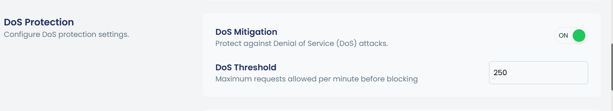

cPGuard provides multiple layers of protection against DoS (Denial of Service) attacks at the system firewall level. This article covers the available protection mechanisms and the commands to configure them.

> **Recommendation:** Use `iptables` as your firewall provider for better stability and lower overhead under high traffic.
>
> ```bash
> cpgcli fw --provider iptables
> ```

---

## 1. Connection Limit (iptables only)

Limits the number of **concurrent connections** from a single IP address to a specific TCP port. This helps stop sudden traffic spikes originating from one source.

**Use case:** An IP floods your server with simultaneous connections on a critical port (e.g., port 80 or 22).

> ⚠️ Tune the threshold carefully to avoid blocking legitimate users.

### Commands

```bash
# Set a concurrent connection limit on a port
cpgcli fw --connection-limit --dport 80 --limit 20

# Remove connection limit for a port
cpgcli fw --connection-limit --dport 80 --remove
```

---

## 2. DoS Protection 

This will help to limit the number of connections from an IP address to TCP ports 80 and 443 in 60 seconds interval and block the access temporarily if it exceeds the configured limit. This is helpful if the attacker target with limited number of concurrent connections and send traffic over  a period of time.

If an IP exceeds the configured threshold, it is temporarily blocked for **24 hours by default**.

Optionally, enabling **Captcha** allows legitimate users to verify themselves and unblock access without admin intervention.





### Commands

```bash
# Enable DoS protection
cpgcli fw --dos enable

# Disable DoS protection
cpgcli fw --dos disable

# Check DoS protection status
cpgcli fw --dos status

# Set the maximum allowed requests per minute before blocking
cpgcli fw --dos-threshold 100

# View current threshold value
cpgcli fw --dos-threshold

# Enable Captcha so blocked users can self-verify
cpgcli fw --captcha enable

# Disable Captcha
cpgcli fw --captcha disable
```

---

## 3. Web Crawler / Scanner Protection (WAF-based)

If an attack originates from a web crawler or vulnerability scanner, it will trigger **WAF (Web Application Firewall) rules**. Repeated rule violations result in the source IP being added to the **temporary block list**.

**Requirement:** WAF temporary ban must be enabled for this to work.

### Commands

```bash
# Enable WAF temporary ban
cpgcli fw --waf-ban enable

# Disable WAF temporary ban
cpgcli fw --waf-ban disable

# Enable Captcha for WAF-blocked IPs to self-verify
cpgcli fw --captcha enable
```

---

## 4. Log-Based Monitoring

We monitor website access logs and automatically block IP addresses by adding them to a temporary ban list when repeated suspicious activity is detected.

If you choose to enable CAPTCHA in the firewall settings [Show CAPTCHA for blocked IPs](../firewall/captcha/overview.md), end users will be presented with a CAPTCHA verification page. This allows legitimate users to verify themselves and regain access, while helping to effectively filter out automated or malicious traffic.

