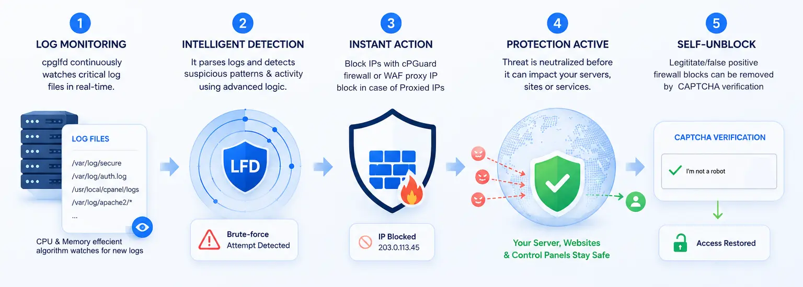
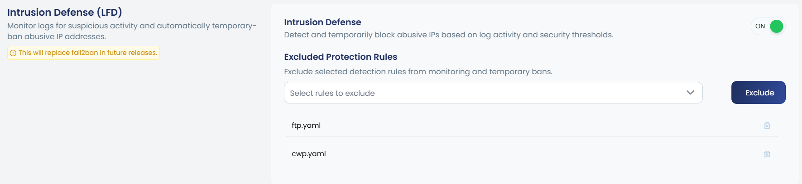
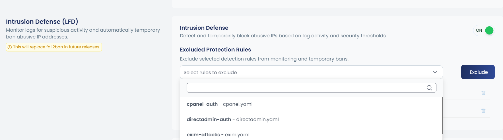

# Intrusion Defense (LFD)

## Overview

**Intrusion Defense (LFD)** monitors your server logs for suspicious activity and automatically places a temporary ban on abusive IP addresses.

LFD works by continuously scanning service logs in real time by covering SSH, FTP, mail, web, and control panel logins. When an IP address exceeds the allowed number of failed attempts within a defined time window, it is automatically and temporarily blocked before it can cause further harm. Once the ban duration expires, the IP is released automatically with no manual intervention required.
This protects your server against common attack types including:

- **Brute-force attacks** : repeated login attempts targeting SSH, FTP, or control panel access
- **Credential stuffing** : automated tools cycling through leaked username/password combinations
- **Bot-driven HTTP abuse** : bots probing web login endpoints and triggering HTTP 401 errors

Because LFD operates at the log level across multiple services simultaneously, it provides broad, coordinated protection without the need to configure separate tools for each service. All detection rules, thresholds, and ban durations are managed through a unified set of `.yaml` configuration files, giving you full control over how aggressively your server responds to threats.



---


## Enabling / Disabling Intrusion Defense

In the cPGuard app portal, navigate to **Intrusion Defense (LFD)** under Firewall Settings. Use the **ON/OFF toggle** to enable or disable the feature.




You can execute the following commands for this:

```bash
cpgcli lfd --enable
cpgcli lfd --disable
```


:::info 
When enabled, cPGuard will continuously monitor server logs and temporarily block IPs that exceed the configured security thresholds.
:::

---

## Excluded Protection Rules

The **Excluded Protection Rules** section lets you exclude specific detection rules from monitoring and temporary bans. This is useful when a particular service generates false positives or you want to manage it separately.

### How to Exclude a Rule

1. Click the **Exclude** dropdown under *Excluded Protection Rules*.
2. Select the service rule(s) you want to exclude.
3. Click the **Exclude** button to save your changes.



You can execute the following command for this. 

```bash
cpgcli lfd --ignore <jail_name>
```

Replace `<jail_name>` with availabe rule files, like:

```bash
cpgcli lfd --ignore http.yaml
```

### Available Rule Files

You can execute the following command to list the available rule files.

```bash
cpgcli lfd --list-jails
```

**Example Rule Files**

| Rule File | Service Covered |
|---|---|
| `cpanel.yaml` | cPanel & WHM login attempts |
| `directadmin.yaml` | DirectAdmin authentication |
| `exim.yaml` | Exim mail server |
| `ftp.yaml` | FTP service |
| `http.yaml` | Web / HTTP traffic |
| `mail.yaml` | General mail services |
| `ssh.yaml` | SSH login attempts |
| `webuzo.yaml` | Webuzo panel |

---

## Advanced Configuration 

LFD rule files are located at `/opt/cpguard/cpglfd/configs/jails.available/`

Each `.yaml` file controls the detection thresholds and behavior for its respective service. You can edit these files to customize:

- **Thresholds** — Number of failed attempts before an **Action** is taken
- **Rules** — Log patterns used to detect suspicious activity
- **Actions** — What happens when a threshold is breached (block/unblock commands)
- **Block duration** — How long the ban lasts

After editing, restart LFD to apply changes:

```bash
 cpgcli lfd --restart
```

:::warning
Manual changes to the default `.yaml` files will be overwritten when cPGuard updates the LFD component.
:::

So the Recommended approach is to use a custom file:

- Copy the default file and rename it. For example:

```bash
cp /opt/cpguard/cpglfd/configs/jails.available/http.yaml /opt/cpguard/cpglfd/configs/jails.available/http-custom.yaml
```

- After that, make your changes in the custom file (`/opt/cpguard/cpglfd/configs/jails.available/http-custom.yaml`).
- Exclude the default rule file (here `http.yaml`) via the **Excluded Protection Rules** section in the cPGuard app portal or via the command line.
- Include the custom file using the 

That's all. When a new cPGuard version is released, your custom file is preserved.


:::tip 
Always back up the original `.yaml` file before making any edits.
:::

---

