The cPGuard Firewall is a high-performance, system-level security layer designed to block malicious traffic before it reaches your applications. It inspects and filters both IPv4 and IPv6 traffic using unified rulesets, providing robust protection for your server environment.

cPGuard supports two underlying packet filtering providers — **iptables** and **nftables** — giving you the flexibility to choose the best option based on your server's kernel and workload requirements.

---

The firewall acts as a central hub for several security sub-modules:

**Access the Firewall:**

> App Portal → Open Server → **Protection → Firewall**


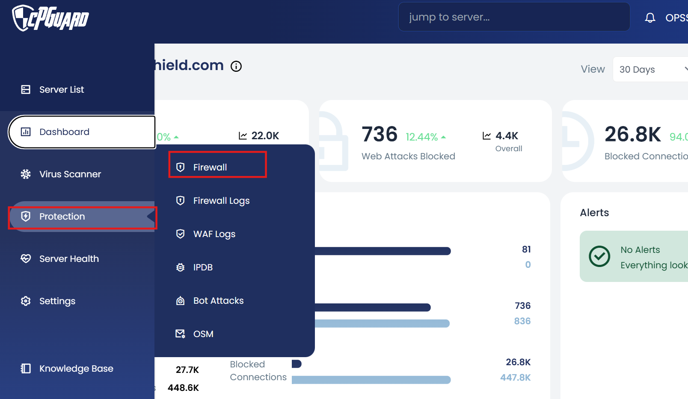

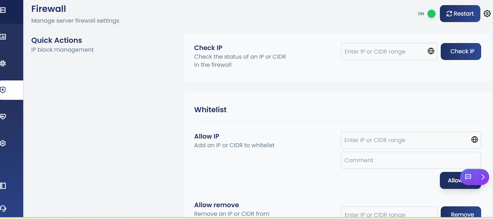


## Firewall Providers

### iptables — Recommended

iptables is the stable and reliable legacy filtering provider, proven for real-world production loads. It is the **recommended default** for most environments due to its consistency and broad kernel compatibility.

### nftables — Legacy Status

nftables is a modern, high-performance packet filtering framework. While it offers improved efficiency in theory, it may experience unpredictable loads and random failures on some kernels. It is currently marked as **legacy status** in cPGuard.

:::note
Unless you have a specific reason to use nftables, it is recommended to use iptables for a stable and reliable firewall experience.
:::

---

## How to Switch the Firewall Provider

### Using the cPGuard Portal

1. Log in to the **cPGuard App Portal**
2. Navigate to the **Firewall** page
3. Click the **Settings** button located near the **Restart** button
4. The currently enabled provider (iptables or nftables) will be displayed
5. Select the required provider and save the changes

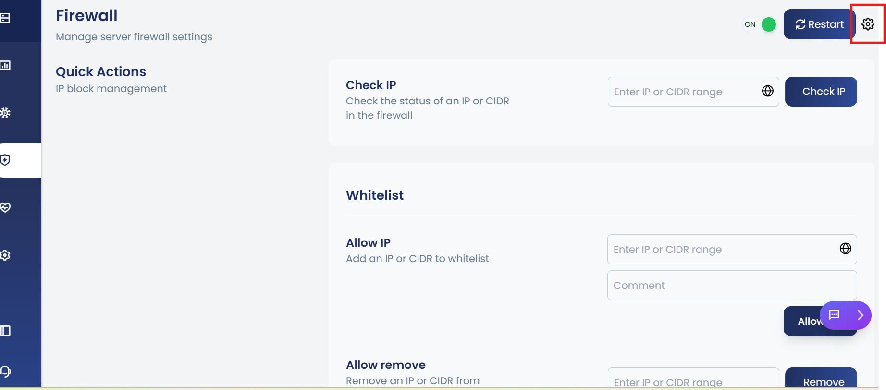

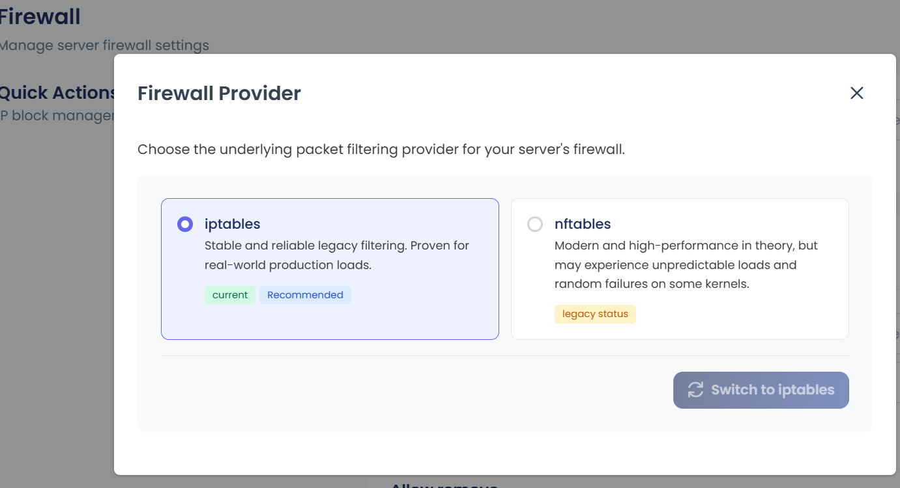

### Using the CLI

You can check the currently active firewall provider using the following command:

```bash
cpgcli fw --provider
```

This will display the currently enabled packet filtering provider on your server.

---

:::tip
If you are unsure which provider to use, stick with **iptables** for a stable and proven experience. Contact our support team if you need guidance on choosing the right provider for your environment.
:::

**Integrated Security Modules:**

* **IPDB Integration**: Proactive blocking based on global threat intelligence. IPs flagged by the IPDB are automatically denied at the firewall level.
* **Fail2Ban**: Service-level brute-force defense for SSH, FTP, SMTP, and control panel logins. Failed authentication attempts trigger automatic temporary blocks.
* **DoS & Bot Protection**: Safeguards against connection floods and aggressive AI scrapers by enforcing rate limits and behavioral analysis.
* **Port Filtering**: Granular control over inbound and outbound TCP/UDP traffic. Define exactly which ports are accessible to prevent unauthorized service exposure.

## Quick Actions: Checking an IP

The **Check IP** tool allows you to instantly verify the status of an address within the firewall. Use this to determine if an IP is currently blocked, allowed, or flagged by any security module.

**Via App Portal:**

Use the "Check IP" input at the top of the Firewall configuration page. The result displays the IP status, source of the block (if any), and expiry time for temporary bans.

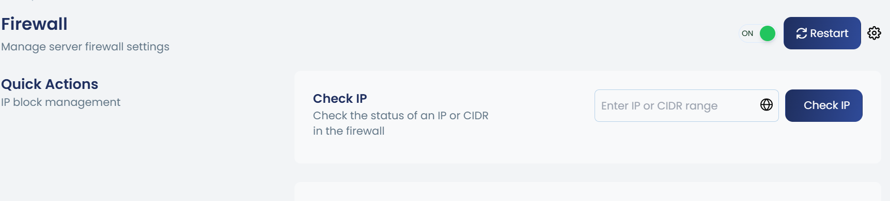

**Via CLI:**

```bash
cpgcli ip --check <IP_Address>
```

This command returns the current firewall status and active rules affecting the specified IP.

## Service Management

You can toggle the entire firewall module using the master switch in the App Portal or via CLI. Disabling the firewall removes all active rules but preserves your configuration for future use.

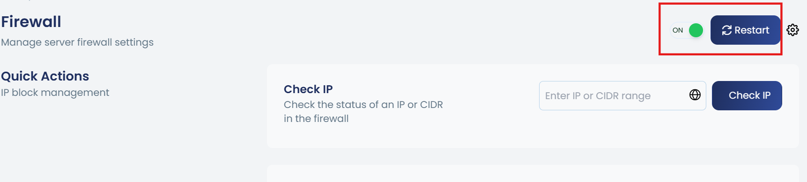

**Enable Firewall:**

```bash
cpgcli fw --enable
```

**Disable Firewall:**

```bash
cpgcli fw --disable
```

**Restart:**

```bash
cpgcli fw --restart
```

**Start firewall with extended logging ( recommended for debugging only )**


```bash
cpgcli   fw -- debug
```
	
---

For details on managing **Whitelisted and Blacklisted** IPs in the cPGuard Firewall, refer to the dedicated documentation: [Whitelisting IP addresses](whitelist-ips) and [Blacklisting IP addresses](blacklist-ips).


## Temporary Ban

The cPGuard Firewall provides a **Temporary Ban** feature that allows you to temporarily block IP addresses for a specified duration. This is useful for managing suspicious or malicious traffic without permanently blacklisting an IP address. Temporarily banned IPs are automatically unblocked once the specified duration expires.

---

## Managing Temporary Bans

### Block an IP Address Temporarily

You can temporarily block an IP address from accessing the server using the cPGuard Portal or the CLI.

#### Using the cPGuard Portal

1. Log in to the **cPGuard App Portal**
2. Navigate to **Protection** >> **Firewall** >> **Temporary Ban**
3. Enter the IP address you want to block in the **Block IP** input box
4. Specify the duration for the block
5. Click **Block**

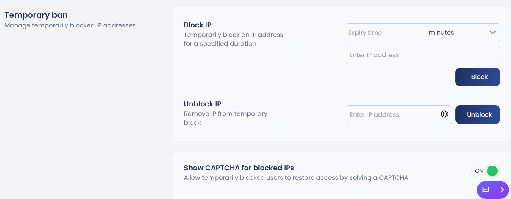

#### Using the CLI

```bash
cpgcli ip --temp-ban <IP> --expiry <value> --reason 'comment'
```

**Expiry values:**

| Value | Description |
|-------|-------------|
| `m`   | Minutes     |
| `h`   | Hours       |
| `d`   | Days        |

**Examples:**

```bash
# Block an IP for 2 hours
cpgcli ip --temp-ban 192.168.1.100 --expiry 2h --reason 'Suspicious activity'

# Block an IP for 30 minutes
cpgcli ip --temp-ban 192.168.1.100 --expiry 30m --reason 'Brute force attempt'
```

:::note
If no expiry is specified, the default block duration is **24 hours**.
:::

---

### Unblock a Temporarily Banned IP Address

#### Using the cPGuard Portal

1. Navigate to **Protection** >> **Firewall** >> **Temporary Ban**
2. Under the **Unblock IP** section, enter the IP address you want to unblock
3. Click **Unblock**

The IP address will be immediately removed from the temporary ban list and the user will regain access to the server.

#### Using the CLI

```bash
cpgcli ip --temp-ban --remove <IP>
```

**Example:**

```bash
cpgcli ip --temp-ban --remove 192.168.1.100
```

---

### List All Temporarily Banned IPs

To view all currently active temporary bans:

```bash
cpgcli ip --temp-ban --list
```

---

## WAF Temporary ban

The **WAF Temporary Ban** feature enables cPGuard to automatically and temporarily block an IP address that triggers multiple WAF (Web Application Firewall) rules within a short period of time. This helps prevent automated attacks such as vulnerability scanners, brute-force attempts, and other malicious activities, while also reducing the overall burden on your server.

---

### Managing WAF Temporary Ban Using the cPGuard Portal

1. Log in to the **cPGuard App Portal**
2. Navigate to **Protection** >> **Firewall** >> **WAF Temporary Ban**
3. Toggle the feature **On** or **Off** as required
4. Save the changes

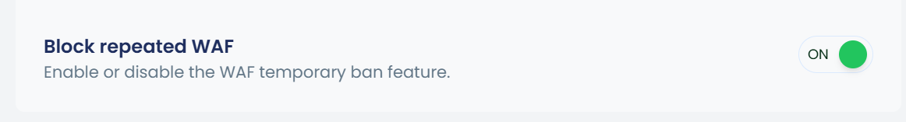

### Using the CLI

You can enable, disable, or check the status of the WAF Temporary Ban feature using the following command:

```bash
cpgcli fw --waf-ban enable|disable|status
```

---

## Temporary allow

The **Temporary Allow** feature in cPGuard allows you to grant temporary access to a specific IP address for a defined duration. This is useful for situations where an IP address needs short-term access to the server without being permanently added to the whitelist. Once the specified duration expires, the IP address is automatically removed from the temporary allow list.

---

#### Temporarily Allow an IP Address Using the cPGuard Portal

1. Log in to the **cPGuard App Portal**
2. Navigate to **Protection** >> **Firewall** >> **Temporary Allow**
3. Enter the IP address you want to allow in the **Temporary Allow IP** input box
4. Specify the duration for the allow
5. Click **Allow**

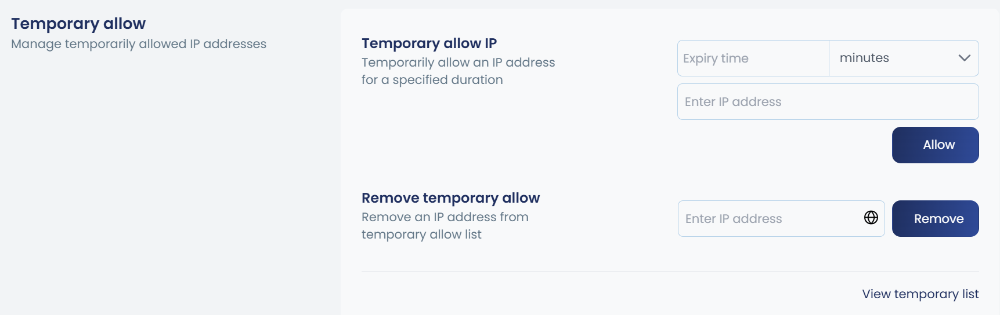

#### Using the CLI

```bash
cpgcli ip --temp-allow <IP> --expiry <value> --reason 'comment'
```

**Expiry values:**

| Value | Description |
|-------|-------------|
| `m`   | Minutes     |
| `h`   | Hours       |
| `d`   | Days        |

**Examples:**

```bash
# Allow an IP for 2 hours
cpgcli ip --temp-allow 192.168.1.100 --expiry 2h --reason 'Temporary vendor access'

# Allow an IP for 1 day
cpgcli ip --temp-allow 192.168.1.100 --expiry 1d --reason 'Scheduled maintenance'
```

:::note
If no expiry is specified, the default allow duration is **24 hours**.
:::

---

#### Remove an IP from the Temporary Allow List

1. Navigate to **Protection** >> **Firewall** >> **Temporary Allow**
2. Under the **Remove Temporary Allow** section, enter the IP address you want to remove
3. Click **Remove**

The IP address will be immediately removed from the temporary allow list.

#### Using the CLI

```bash
cpgcli ip --temp-allow --remove <IP>
```

**Example:**

```bash
cpgcli ip --temp-allow --remove 192.168.1.100
```

---

#### View the Temporary Allow List

1. Navigate to **Protection** >> **Firewall** >> **Temporary Allow**
2. The currently active temporary allow entries are displayed in the **Temporary Allow List** table

#### Using the CLI

```bash
cpgcli ip --temp-allow --list
```

This will display all IP addresses currently in the temporary allow list along with their expiry details.

---

:::tip
Use the Temporary Allow feature instead of permanently whitelisting an IP address whenever access is only required for a limited time. This ensures your server's security posture remains tight and access is automatically revoked once no longer needed.
:::


## Ignore IPs

The **Ignore IPs** feature in cPGuard allows you to exclude specific IP addresses or entire countries from firewall processing. Ignored IPs bypass firewall checks entirely, ensuring they are never blocked by any firewall rule, IPDB, or automated protection mechanism. This is particularly useful for trusted IP addresses or infrastructure that should always have unrestricted access to the server.

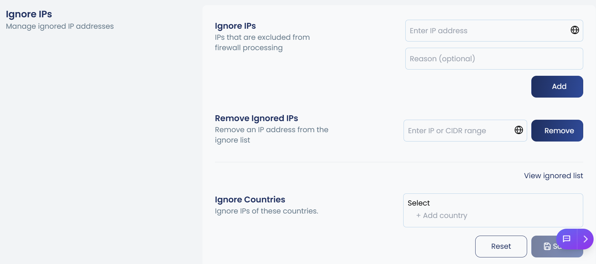

:::note
This is the recommended approach for ensuring trusted IPs are never blocked, especially for IPDB, rather than whitelisting the IP address directly.
:::

---

### Add an IP to the Ignore List

#### Using the cPGuard Portal

1. Log in to the **cPGuard App Portal**
2. Navigate to **Protection** >> **Firewall** >> **Ignore IPs**
3. Enter the IP address or CIDR range you want to ignore in the **Ignore IPs** input box
4. Click **Add**

#### Using the CLI

```bash
cpgcli ip --ignore <IP> --reason 'comment'
```

**Example:**

```bash
cpgcli ip --ignore 192.168.1.100 --reason 'Trusted office IP'
```

---

### Remove an IP from the Ignore List

#### Using the cPGuard Portal

1. Navigate to **Protection** >> **Firewall** >> **Ignore IPs**
2. Under the **Remove Ignored IPs** section, enter the IP address you want to remove
3. Click **Remove**

#### Using the CLI

```bash
cpgcli ip --ignore --remove <IP>
```

**Example:**

```bash
cpgcli ip --ignore --remove 192.168.1.100
```

---

### View the Ignore List

#### Using the cPGuard Portal

1. Navigate to **Protection** >> **Firewall** >> **Ignore IPs**
2. The currently ignored IP addresses are displayed in the **Ignored IPs** list

#### Using the CLI

```bash
cpgcli ip --ignore --list
```

This will display all IP addresses and CIDR ranges currently in the ignore list.

---

## Ignore Countries

cPGuard also allows you to ignore all IP addresses belonging to a specific country, excluding them entirely from firewall processing.

### Using the cPGuard Portal

1. Navigate to **Protection** >> **Firewall** >> **Ignore IPs**
2. Under the **Ignore Countries** section, select the country or countries you want to ignore from the dropdown
3. Click **Save**

To reset the country ignore list back to default, click **Reset**.

:::warning
Ignoring an entire country will exclude all IP addresses from that country from firewall processing. Use this option with caution and only when you are confident that traffic from the selected country is trusted.
:::

#### Using the CLI

```bash
cpgcli fw --ignore-country  --reason 'comment'
```

**Example:**

```bash
cpgcli fw --ignore-country US --reason 'Trusted country'
```

---

### Remove a Country from the Ignore List

#### Using the CLI

```bash
cpgcli fw --ignore-country --remove 
```

**Example:**

```bash
cpgcli fw --ignore-country --remove US
```

---

### View the Ignored Countries List

#### Using the CLI

```bash
cpgcli fw --ignore-country --list
```

---

For **IPDB** detailed documentation:[IPDB](../firewall/ipdb) 


For **DOS** detailed documentation:[DOS](../firewall/dos)

## AI Bots


The **AI Bots** feature in cPGuard provides firewall-level protection against malicious AI bot traffic. It works by collecting IP addresses of known AI bots based on reports generated from the **Bad Crawler Protection** WAF ruleset, and then blocking those IPs at the system firewall level.

### How It Works

cPGuard's AI bot protection operates across two distinct layers:

| Layer | Component | Description |
|-------|-----------|-------------|
| **Layer 3** | Firewall | Blocks known AI bot IPs at the network level before traffic reaches your applications |
| **Layer 7** | WAF | Detects and filters malicious bot traffic at the application level using Bad Crawler Protection rules |

The firewall module and the WAF work independently of each other. Known AI bot IPs identified through WAF's Bad Crawler Protection reports are fed into the firewall's IP blocklist, providing an additional low-level security layer that blocks malicious AI scrapers before they can even reach your web applications.

---


### Enabling AI Bot Protection Using the cPGuard Portal

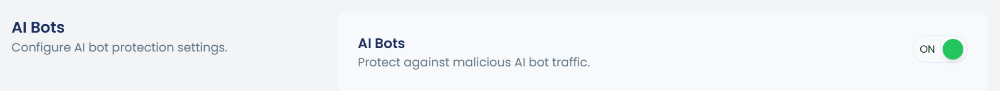

1. Log in to the **cPGuard App Portal**
2. Navigate to **Protection** >> **Firewall** >> **AI Bots**
3. Switch the toggle to **On** to enable AI bot protection
4. Save the changes

### Using the CLI

```bash
# Enable AI Bot blocking
cpgcli fw --block-ai-bots enable

# Disable AI Bot blocking
cpgcli fw --block-ai-bots disable
```

---
### Meta Bots Blocking

cPGuard also provides the ability to block **Meta Bots** specifically. Meta bot blocking works as an extension of the AI bot protection layer.

:::warning
**Meta Bots blocking requires AI Bots protection to be enabled first.** Meta bot blocking will not function unless the AI Bots feature is already active. Ensure you have enabled AI Bots protection before enabling Meta Bots blocking.
:::

### Using the CLI

```bash
# Enable Meta Bot blocking
cpgcli fw --block-meta-bots enable

# Disable Meta Bot blocking
cpgcli fw --block-meta-bots disable
```

---

:::
## Fail2ban

**Fail2Ban** protects your server against brute-force attacks by monitoring authentication logs and temporarily blocking IP addresses after repeated failed login attempts. When an offending IP is detected, Fail2Ban automatically applies a temporary block. Once the ban period expires, the IP is automatically unblocked — unless it triggers another jail violation.

cPGuard integrates Fail2Ban directly into its firewall management interface, allowing you to enable, disable, and configure Fail2Ban jails with ease — all from a single dashboard.

---

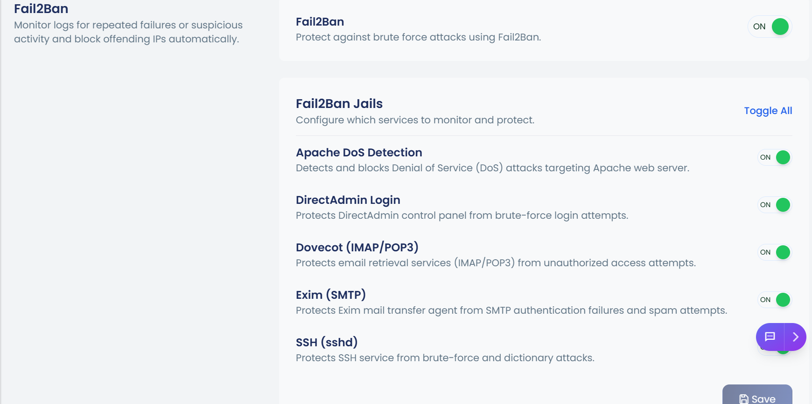


### Enabling Fail2Ban Using the cPGuard Portal

1. Log in to the **cPGuard App Portal**
2. Navigate to **Protection** >> **Firewall** >> **Fail2Ban**
3. Switch the toggle to **On** to enable Fail2Ban
4. Save the changes

### Using the CLI

```bash
# Enable Fail2Ban
cpgcli fw --fail2ban enable

# Disable Fail2Ban
cpgcli fw --fail2ban disable

# Check the current status
cpgcli fw --fail2ban status
```

---

### Supported Jails

Fail2Ban uses **jails** to monitor and protect specific services on your server. Each jail watches a particular log file or service for suspicious activity and blocks offending IPs after a configurable number of failed attempts within a defined time window. cPGuard allows you to toggle individual jails on or off based on the services running on your server.

| Service | Description |
|---------|-------------|
| **Apache DoS Detection** | Blocks IPs making excessive HTTP requests to the web server |
| **cPanel Login** | Protects control panel authentication endpoints from unauthorized access |
| **Dovecot (IMAP/POP3)** | Secures email client authentication against brute-force attempts |
| **Exim (SMTP)** | Prevents SMTP relay abuse and authentication attacks |
| **FTP** | Blocks brute-force attempts against FTP services |
| **SSH** | The most critical jail — protects the SSH daemon from password guessing attacks |

:::note
Enable only the jails relevant to the services running on your server. Enabling unnecessary jails may result in unintended blocks or increased resource usage.
:::

---

### Managing Individual Jails Using the cPGuard Portal

1. Navigate to **Protection** >> **Firewall** >> **Fail2Ban**
2. Locate the jail you want to enable or disable
3. Toggle the respective jail **On** or **Off**
4. Save the changes

### Using the CLI

```bash
# Enable a specific jail
cpgcli fw --fail2ban --enable-jail <jail-file>

# Disable a specific jail
cpgcli fw --fail2ban --disable-jail <jail-file>
```

**Examples:**

```bash
# Enable the FTP jail
cpgcli fw --fail2ban --enable-jail ftp

# Disable the Exim (EXIM) jail
cpgcli fw --fail2ban --disable-jail exim
```

:::note
Multiple jail configuration files can be enabled or disabled at once by providing a comma-separated list of file names.


## Country Filtering

Country filtering allows you to control inbound traffic based on geographic origin. You can maintain two independent lists:

- **Allowed Countries** — Only connections from these countries are permitted (whitelist).
- **Blocked Countries** — Connections from these countries are explicitly denied (blacklist).

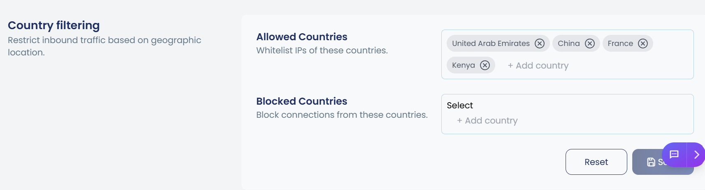


### Allowed Countries (Whitelist)

| Command | Description |
|---|---|
| `cpgcli fw --allow-country <CODE>` | Add a country to the whitelist |
| `cpgcli fw --allow-country --remove <CODE>` | Remove a country from the whitelist |
| `cpgcli fw --allow-country --list` | List all whitelisted countries |

**Example — Add United Arab Emirates to the whitelist:**
```bash
cpgcli fw --allow-country AE
```

### Blocked Countries (Blacklist)

| Command | Description |
|---|---|
| `cpgcli fw --deny-country <CODE>` | Add a country to the blacklist |
| `cpgcli fw --deny-country --remove <CODE>` | Remove a country from the blacklist |
| `cpgcli fw --deny-country --list` | List all blacklisted countries |

**Example — Block connections from China:**
```bash
cpgcli fw --deny-country CN
```

---

## Port Filter Configuration

Port filtering controls inbound and outbound traffic by defining which TCP and UDP ports are permitted.

> ⚠️ **Warning:** When port filtering is **enabled**, all TCP/UDP ports are **blocked by default**. Only ports explicitly added to the allowed list will be accessible. Enabling this feature without first configuring allowed ports may disrupt running services.

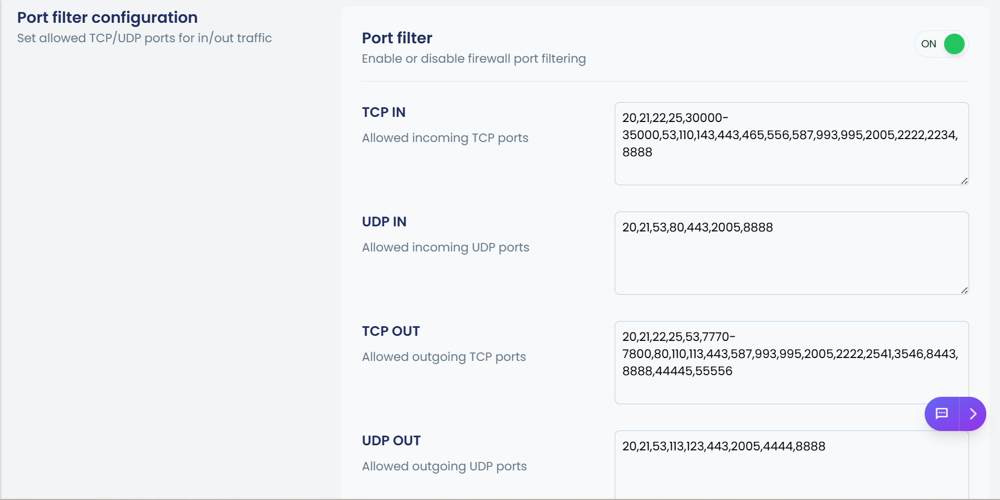

### Enabling / Disabling Port Filtering

| Command | Description |
|---|---|
| `cpgcli fw --port-filter enable` | Enable port filtering |
| `cpgcli fw --port-filter disable` | Disable port filtering |
| `cpgcli fw --port-filter status` | Check whether port filtering is active |

### Managing Allowed Ports

Each traffic direction has its own allowed ports list. Use `--add`, `--remove`, or `--list` as the action.

| Command | Description |
|---|---|
| `cpgcli fw --port tcp-in <action>` | Manage allowed inbound TCP ports |
| `cpgcli fw --port tcp-out <action>` | Manage allowed outbound TCP ports |
| `cpgcli fw --port udp-in <action>` | Manage allowed inbound UDP ports |
| `cpgcli fw --port udp-out <action>` | Manage allowed outbound UDP ports |

**Available actions:**

| Action | Syntax | Description |
|---|---|---|
| `--list` | `--list` | List currently allowed ports |
| `--add` | `--add <port>` | Add a port or range to the allowed list |
| `--remove` | `--remove <port>` | Remove a port or range from the allowed list |

### Port Range Syntax

You can specify individual ports, ranges, or a combination of both:

| Format | Example | Meaning |
|---|---|---|
| Single port | `22` | Port 22 only |
| Port range | `30000-35000` | All ports from 30000 to 35000 |
| Mixed | `22,80,443,30000-35000` | Ports 22, 80, 443, and 30000–35000 |

**Example — Allow inbound TCP on ports 22, 80, 443, and a custom range:**
```bash
cpgcli fw --port tcp-in --add 22,80,443,30000-35000
```

**Example — Remove port 80 from outbound TCP:**
```bash
cpgcli fw --port tcp-out --remove 80
```

**Example — List allowed inbound UDP ports:**
```bash
cpgcli fw --port udp-in --list
```

---

## Dynamic DNS (DDNS)


Dynamic DNS (DDNS) automatically updates the DNS record associated with a domain name whenever your public IP address changes. This is commonly used for networks or devices with dynamic IP addresses (e.g., home broadband connections, cloud instances without static IPs), ensuring that your domain name always resolves to the correct address.

> **Example:** If you add `myhome.example.com` as a DDNS entry and it currently resolves to `203.0.113.42`, that IP is automatically whitelisted. When your IP changes to `203.0.113.99`, the whitelist is updated to reflect the new address.


### DDNS Commands

| Command | Description |
|---|---|
| `cpgcli ip --ddns --list` | List all configured DDNS entries |
| `cpgcli ip --ddns <name>` | Add a new DDNS entry for the specified hostname |
| `cpgcli ip --ddns --remove <name>` | Remove a DDNS entry |

**Example — Add a DDNS entry for `myhome.example.com`:**
```bash
cpgcli ip --ddns myhome.example.com
```

**Example — Remove an existing DDNS entry:**
```bash
cpgcli ip --ddns --remove myhome.example.com
```

**Example — View all current DDNS entries:**
```bash
cpgcli ip --ddns --list
```

---
