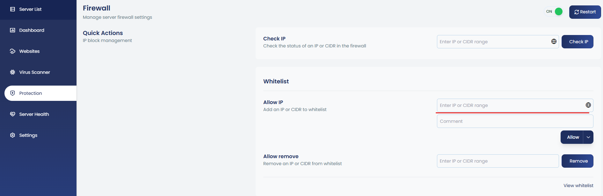
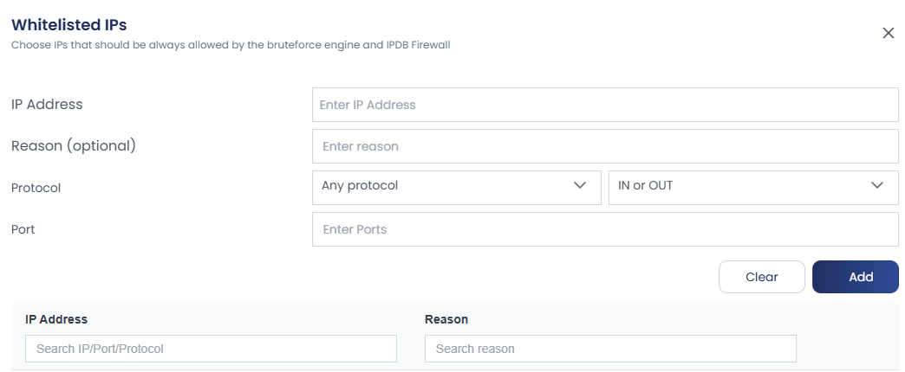
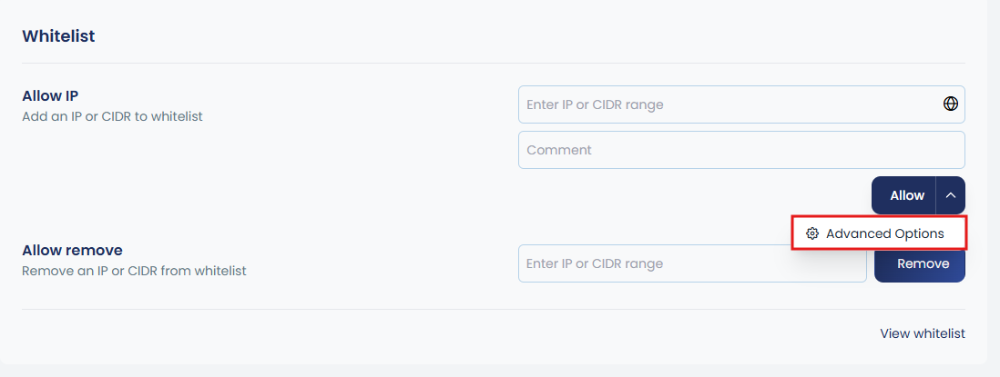
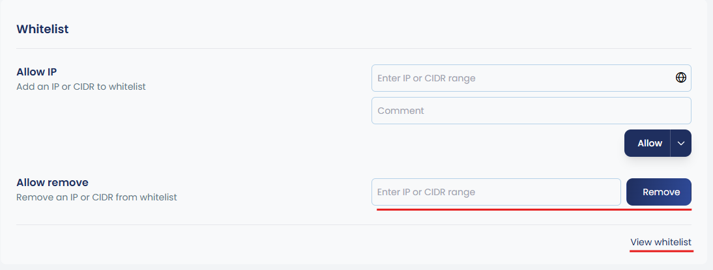

The option to whitelist an IP address or an IP segment will allow you to avoid blocking known IPs in cPGuard even if it detects abuse. The whitelist will avoid blocking IPs through the IPDB firewall and brute-force attack mitigation script. Please note that the WAF does not respect IP whitelist as it will affect the web server performance.

## How to Whitelist IP

You can whitelist a single IP address or an IP segment using App Portal or CLI. The allowed IP address format for the whitelist are given below:

- `1.1.1.1` – To whitelist single IP address
- `1.1.1.0/24` – To whitelist a network segment

To whitelist an IP address from the App Portal, navigate to **Server → Protection → Firewall → Whitelist**. Enter the IP address in the provided input field, optionally add a comment as the reason, and then click **Allow**.



To whitelist using CLI, you can use the following command:

```bash
cpgcli ip --allow IP --reason 'reason to add'
```

Add IPs and ranges to the whitelist (comma or space-separated).

You can import multiple IPs or IP ranges into the whitelist. This is a one-time import operation, useful when you need to whitelist many IPs or IP ranges at the same time.

```bash
cpgcli ip --allow path_to_file
```

> `path_to_file` = Source file with one entry per line to import IPs/ranges.

## Whitelist IPs for Specific Ports (Advanced)

You can whitelist IPs for specific ports by optionally defining the protocol and direction. To do this, click on the `^` symbol next to Allow to expand the advanced options, then configure the required settings.




```bash
cpgcli ip --allow IP1 --port 'ports|protocol|direction'
```


## Remove IPs from Whitelist

You can remove IPs from the whitelist by entering the IP address in the **Allow → Remove** input field and then clicking **Remove**. The CLI option is also mentioned below.

```bash
cpgcli ip --allow --remove IP1 IP2..
```

You can view whitelisted entries by clicking **View Whitelist** as shown in the image.



Alternatively, through the CLI, use the command:

```bash
cpgcli ip --allow --list
```

## Whitelist IP from Source File

You can manage extended whitelists by importing IPs directly from files. This allows you to add, remove, or list multiple IP addresses in a centralized way, making it easier to maintain large or frequently updated whitelists. The available CLI options are:

```bash
# Add IPs from source file to whitelist
cpgcli ip --allow-source path_to_file

# Remove source file from whitelist
cpgcli ip --allow-source --remove path_to_file

# List all whitelisted source files
cpgcli ip --allow-source --list
```

> `path_to_file` — The path can be a local file or a URL.

This option periodically reloads a set of IPs from the specified source. The source file must always be available. It is useful when you need to maintain a centralized or local whitelist that stays updated automatically.
