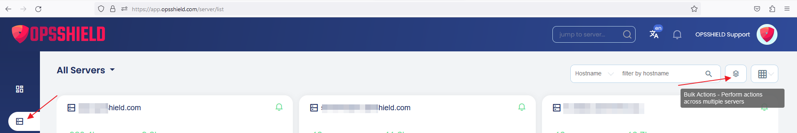
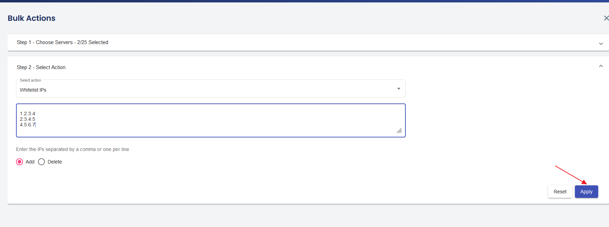

# Bulk Actions – Run Changes Across Multiple Servers at Once in cPGuard

Managing a single server is straightforward, but what about applying the same security change across dozens of servers at once? The **Bulk Action** feature in the cPGuard App Portal eliminates the need to repeat the same steps server by server, letting you push changes to multiple servers in a single operation.

{/* comment */}

## What Is the Bulk Action Feature?

The cPGuard App Portal is designed to give administrators a centralised view and control of all their servers from one interface. The **Bulk Action** menu extends this by allowing you to apply a specific action — such as blocking an IP address or a country — to any number of servers simultaneously.

This is especially useful when:

- Responding to a security incident that affects multiple servers
- Rolling out consistent firewall rules across your entire fleet
- Applying the same configuration change to a group of servers at once

---

## How to Use Bulk Actions

### Step 1 :  Open the Bulk Actions Menu

Navigate to the **Server List** page in the cPGuard App Portal. The **Bulk Actions** menu is available directly on this page.

### Step 2 : Select Your Target Servers

After opening the bulk action interface, choose the servers you want to apply the change to. You can:

- Select **specific servers** from the list
- Select **all servers** to apply the action fleet-wide

### Step 3 : Choose an Action

From the predefined **actions dropdown**, select the action you want to run. Available actions cover common security and firewall operations such as blocking IPs, managing countries, and more.

### Step 4 : Provide Required Input

Depending on the action chosen, you may need to supply additional input — for example:

- An **IP address** for IP-based actions
- A **country name** for geo-blocking rules

### Step 5 : Apply and Monitor

Click the **Apply** button to start executing the action across your selected servers. You can then monitor the **real-time progress** of the operation and view a **final report** once it completes.

:::tip
Use [server tags](/cpguard-tagging-servers) to pre-group your servers by environment or region, making it faster to select the right set of servers when running bulk actions.
:::

---

## Summary

| Step | What To Do |
|---|---|
| 1. Open Bulk Actions | Go to Server List → Bulk Actions menu |
| 2. Select Servers | Pick specific servers or select all |
| 3. Choose Action | Select from the predefined actions dropdown |
| 4. Provide Input | Enter IP address, country name, or other required values |
| 5. Apply | Click Apply and monitor the progress report |

---
