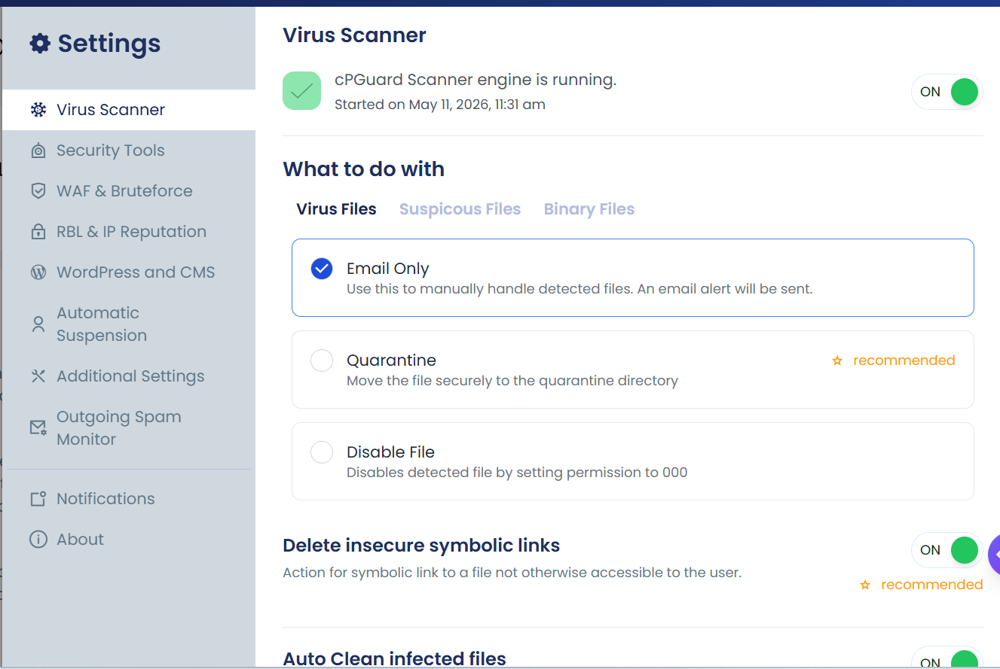
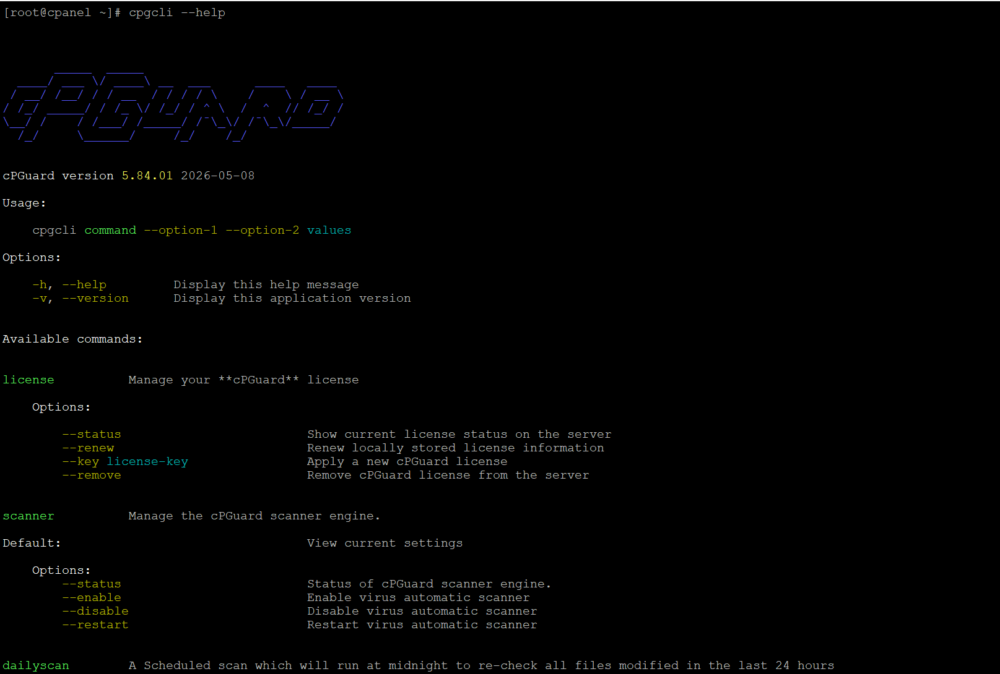

After completing the installation, turn on the recommended modules based on your server's needs.

:::tip[Recommended features]
Recommended features are marked with **☆ recommended** in the settings page on the App Portal. Using our recommendations is highly encouraged for maximum protection of your server.
:::

---

## Configuring via UI

You can easily configure cPGuard using the UI from the App Portal:

1. Open the **App Portal** and locate your server from the server list
2. Click on the server to open it
3. Navigate to **Settings** from the left side main navigation



---

## Configuring via Command Line

cPGuard provides many command line options to quickly apply various settings.



---

## Exporting & Importing Configuration

If you need to install and configure cPGuard on multiple servers, exporting and importing configuration from the command line is the easiest approach.

**Export configuration:**

```bash
cpgcli config --export
cpgcli config --export=filename
```

If no filename is provided, the configuration keys and values are displayed on screen, which can be used to create a configuration file manually.

**Import configuration on destination server:**

```bash
cpgcli config --import="filename or url"
```

Copy the exported file to a public location or directly to the destination server, then run the import command to apply all settings at once.