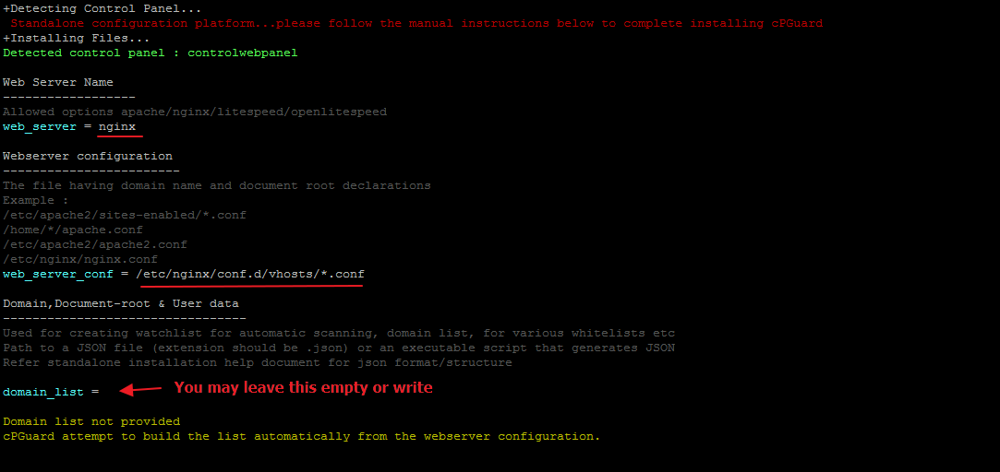
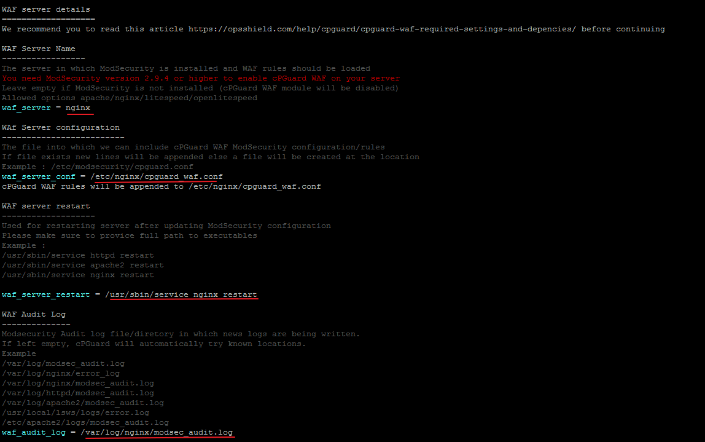
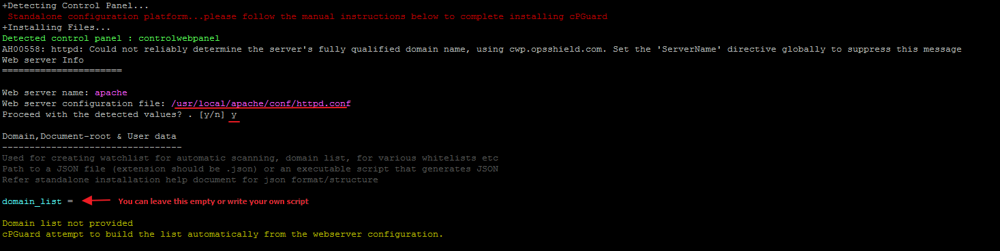
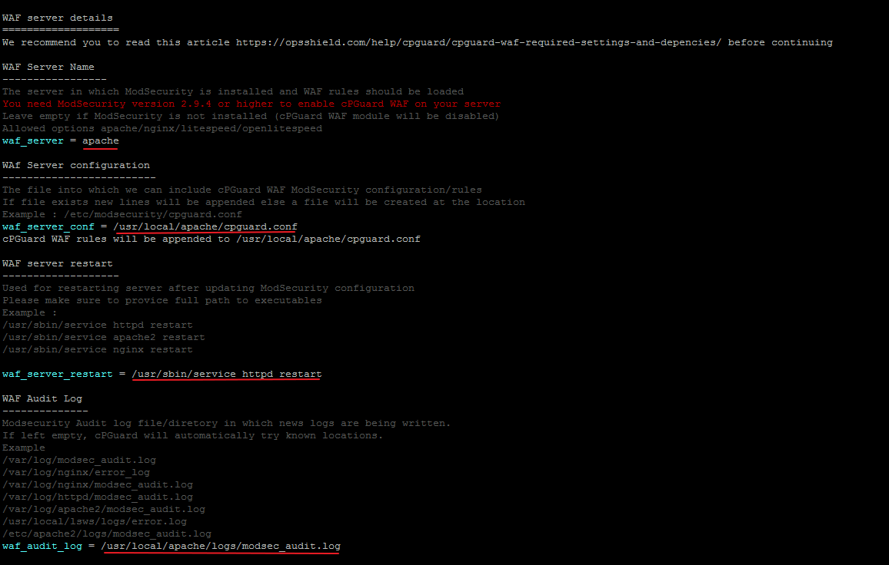

# Install on Control Web Panel (CWP)

**Control Web Panel (CWP)** formerly known as CentOS Web Panel is a feature-rich, community-driven hosting control panel for RHEL-based Linux distributions and its derivatives including CentOS, Rocky Linux, and AlmaLinux. Its flexible hosting stack options, modern UI, and free/pro tiers make it a popular choice for VPS and dedicated server hosting. But flexibility in stack choice also means security configuration needs to account for which web server you're running.

This guide walks through installing cPGuard on a CWP server and configuring it correctly for both **Nginx** and **Apache**-based stacks.

{/* comment */}

---

## How cPGuard Protects CWP Servers

As a **Web Security Suite**, cPGuard integrates with CWP through the **Standalone** configuration pathway. Its protection modules operate across multiple layers:

- **Malware Scanner** : monitors all website files for threats
- **Web Application Firewall (WAF)** : blocks web attacks via ModSecurity rules
- **IP Reputation & Country Blocking** : filters known-bad traffic by IP or region
- **Automatic File Cleanup** : removes malicious code injected into PHP and JS files
- **User Suspend Hook** : integrates with CWP's user management for account-level control

---

## Step 1 : Install cPGuard

Run the following command on your CWP server as root to download and execute the cPGuard installer:

```bash
cd /usr/local/src && rm -f cpguard_install.sh && curl -o cpguard_install.sh -L https://downloads.opsshield.com/cpguard/cpguard_install.sh && bash cpguard_install.sh LICENCE-KEY
```

Replace `LICENCE-KEY` with your actual cPGuard license key from OPSSHIELD.

**What the installer does:**

1. Downloads the latest cPGuard installer script
2. Installs all required dependency packages for your OS
3. Applies the license and binds the server to your **cPGuard App Portal** account

After the dependency packages are installed, you will be guided through the **Standalone Configuration** steps for CWP.

:::note
The license key is **mandatory**. Without it, the server cannot be bound to the App Portal and cPGuard will not be fully activated.
:::

---

## Step 2 : Standalone Configuration

The cPGuard Standalone configuration has two main sections that must be completed after installation:

1. **Web Server Configuration** : tells cPGuard where your virtual host config files are
2. **WAF Configuration** : connects cPGuard's WAF rules to ModSecurity on your web server

The settings for each section differ depending on your CWP web server stack. Follow the section below that matches your setup.

---

## Configuration for Nginx-Only or Nginx & Varnish

### Web Server Configuration (Nginx)

Set the web server type to **Nginx** and point cPGuard to your Nginx virtual host configuration directory.

The recommended configuration path for CWP Nginx virtual hosts is:

```
/etc/nginx/conf.d/vhosts/*.conf
```



### WAF Configuration (Nginx)

:::warning
By default, CWP does **not** compile LibModSecurity with Nginx. Before configuring the WAF for an Nginx stack, you must first manually install ModSecurity for Nginx.

Follow the dedicated guide: [Install ModSecurity with Nginx on CentOS / Rocky Linux / AlmaLinux](../../waf/install-modsec/nginx-centos.md)
:::

Once ModSecurity is installed and verified, configure the cPGuard WAF settings to point to the correct ModSecurity include path for Nginx on CWP.




---

## Configuration for Apache-Only, LiteSpeed Enterprise, Nginx & Apache, or Nginx & Varnish & Apache

### Web Server Configuration (Apache)

Set the web server type to **Apache** and point cPGuard to your Apache virtual host configuration directory.

The recommended configuration path for CWP Apache virtual hosts is:

```
/usr/local/apache/conf.d/vhosts/*.conf
```




:::tip
If cPGuard does not automatically detect the correct path, you can manually enter `/usr/local/apache/conf.d/vhosts/*.conf` in the web server configuration field.
:::

### WAF Configuration (Apache)

Before configuring WAF for Apache, verify that ModSecurity is properly installed and configured on your CWP server. Refer to the prerequisites guide:

[cPGuard WAF Panel-Specific Steps](../../waf/panel-specific-steps)

Once ModSecurity is confirmed working, configure the cPGuard WAF settings for Apache and then **enable WAF from the Settings page**.



---

## Stack Configuration Reference

| CWP Web Server Stack | Web Server Config Path | WAF Prerequisite |
|---|---|---|
| Nginx Only | `/etc/nginx/conf.d/vhosts/*.conf` | Install ModSec for Nginx manually |
| Nginx & Varnish | `/etc/nginx/conf.d/vhosts/*.conf` | Install ModSec for Nginx manually |
| Apache Only | `/usr/local/apache/conf.d/vhosts/*.conf` | Verify ModSec via WAF requirements guide |
| LiteSpeed Enterprise | `/usr/local/apache/conf.d/vhosts/*.conf` | Verify ModSec via WAF requirements guide |
| Nginx & Apache | `/usr/local/apache/conf.d/vhosts/*.conf` | Verify ModSec via WAF requirements guide |
| Nginx & Varnish & Apache | `/usr/local/apache/conf.d/vhosts/*.conf` | Verify ModSec via WAF requirements guide |

---

## Step 3 : User List and Suspend Script

During Standalone configuration, cPGuard will prompt for a **user list** source and a **suspend hook** script. For CWP, you can safely accept the **default recommendations** — pre-made scripts specifically designed for the CWP control panel are included and will be applied automatically.

These scripts allow cPGuard to:
- Retrieve the list of hosting users on the server
- Trigger user-level suspension actions when needed

---

## Step 4 : Complete Installation

Once the configuration is complete, wait for cPGuard to finish the installation process. After successful installation, your server will appear in the [cPGuard App Portal](https://app.opsshield.com) where you can manage all security settings, view scan results, configure WAF rules, and more.

---

## Free Installation Assistance

OPSSHIELD offers **free installation assistance** for cPGuard on CWP servers. If you'd prefer to have the OPSSHIELD team handle the installation and configuration on your behalf, simply reach out to their support team.

:::note
Free installation assistance **does not include** ModSecurity installation for Nginx stacks — this must be completed separately before requesting assistance.
:::

---

## Installation Checklist

| Step | Task | Status |
|---|---|---|
| 1 | Run the cPGuard installer with your license key | ☐ |
| 2 | Confirm dependency installation completes successfully | ☐ |
| 3 | Complete Web Server Configuration for your stack | ☐ |
| 4 | Install ModSecurity (Nginx stacks) or verify it (Apache stacks) | ☐ |
| 5 | Complete WAF Configuration | ☐ |
| 6 | Accept default user list and suspend hook for CWP | ☐ |
| 7 | Wait for cPGuard installation to finish | ☐ |
| 8 | Open App Portal and verify the server appears | ☐ |

---
